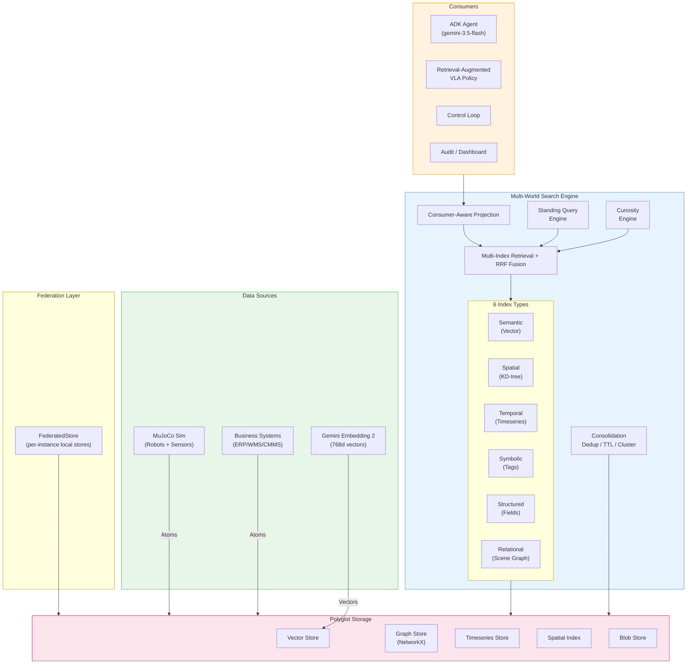
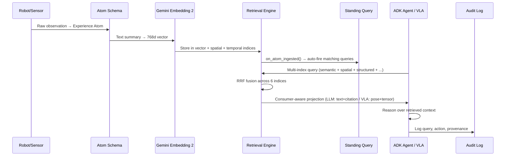

# Multi-World Search (MWS)

Collective memory for embodied AI swarms — a cross-modal retrieval system that
unifies physical observations (MuJoCo), business data (synthetic ERP/CMMS/WMS),
documents, and skill demonstrations into a shared searchable memory.

## Quickstart

```bash
# One command: set up the env, initialize a clean Elasticsearch cluster, run
# the scenario acceptance tests, then run all 7 scenarios end-to-end on the ES
# vector backend. Needs Docker (for ES); embeddings are mock unless live.
make scenario-all

# View run artifacts
cat runs/maintenance_handoff-0-*/metrics.json
```

> Scenario **runs** use the Elasticsearch vector backend (the default for
> `mws scenario run`); `make scenario-all` / `scenario-multi-seed-all`
> initialize a clean cluster first via docker-compose. The **test suite**
> always uses the in-memory backend, so `uv run pytest` stays offline and
> needs no Docker.

Prefer the individual steps?

```bash
uv sync --extra dev                                                # install
uv run pytest                                                      # all tests (mock)
uv run python -m mws.cli scenario run --name maintenance_handoff --seed 0  # one scenario
uv run python -m mws.cli scenario list                            # list scenarios
```

## Scenarios

All 7 scenarios run out of the box with no cloud keys (`MWS_CLOUD_MODE=mock`).

| # | Name | CLI key | Hypotheses | What it tests |
|---|------|---------|------------|---------------|
| 1 | Maintenance Handoff | `maintenance_handoff` | H1,H3,H8 | Cross-modal fusion, skill transfer, audit |
| 2 | Physical-Record Reconciliation | `physical_record_reconciliation` | H4,H9 | Multi-observer fusion > single, write-back |
| 3 | Collective Weak Signal | `collective_weak_signal` | H5 | Consolidation surfaces lot patterns |
| 4 | New SKU Rampup | `new_sku_rampup` | H1 | Transfer gain: demo → swarm reuse |
| 5 | Incident Response | `incident_response` | H6,H2 | Standing query, curiosity loop, coordination |
| 6 | Counterfactual Safety | `counterfactual_safety` | H6 | Sim fork/rollout → avoid unsafe action |
| 7 | Order to Fulfillment | `order_to_fulfillment` | H4,H8 | Ghost inventory detection, cross-system E2E |

Run any scenario:
```bash
uv run python -m mws.cli scenario run --name <key> --seed 0
```

Run all scenarios:
```bash
for s in $(uv run python -m mws.cli scenario list); do
  uv run python -m mws.cli scenario run --name "$s" --seed 0
done
```

Each run produces `runs/<RUN_ID>/`:
- `manifest.json` — config, git SHA, seed, embedding space, cloud mode
- `metrics.json` — retrieval (Recall/MRR/nDCG), task, system metrics
- `audit.jsonl` — every query, action, and write-back with provenance

## Architecture

### System Overview



### Data Flow: Ingest → Search → Act



### Module Layout

```
mws/
├── core/          # Atom schema, types, config, clock, logging, provenance
├── worldmodel/    # 4D scene graph (entities + relations)
├── storage/       # Polyglot stores: vector, graph, timeseries, spatial, blob
├── embedding/     # Single model: Gemini gemini-embedding-2 (mock stand-in offline)
├── retrieval/     # Multi-index search, RRF fusion, consumer-aware projection
├── agents/        # ADK agent (live) / Mock agent (default)
├── vla/           # Retrieval-augmented policy, skill atoms
├── sim/           # MuJoCo world wrapper, sensor → atom extraction
├── business/      # Synthetic CMMS/WMS/SOP data generation
├── scenarios/     # 7 verification scenarios (BaseScenario lifecycle)
├── eval/          # Metrics, labels, latency, cost, bandwidth, ablation
├── federation/    # FederatedStore, QoR router
├── reactive/      # Standing queries, curiosity engine
├── consolidation/ # Dedup, TTL pruning, clustering
└── configs/       # YAML configs for worlds, indices, scenarios
```

## Cloud Mode

Everything runs offline by default (`MWS_CLOUD_MODE=mock`).

To use live Gemini, copy `.env.example` to `.env` and set:
```bash
MWS_CLOUD_MODE=live
GOOGLE_API_KEY=your-key
```

Only `mws/embedding/` and `mws/agents/` (LLM) make Gemini calls.

## Vector backends

The semantic index has three interchangeable backends (same interface).
Scenario runs default to **Elasticsearch**; the **pytest suite** is forced to
**in-memory** so tests stay offline and deterministic (`MWS_VECTOR_BACKEND`
overrides the default):

| `vector_backend` | What | Used by |
|---|---|---|
| `elasticsearch` (scenario default) | `dense_vector` + kNN (docker-compose) | `mws scenario run`, `make scenario-all` |
| `memory` (test default) | brute-force cosine | the pytest suite, small corpora |
| `lancedb` | embedded ANN on disk | larger local corpora |

Each scenario run/store gets its own ES index (isolation) and drops it on
teardown; `make scenario-all` initializes a clean cluster first (`es-reset`).

### Elasticsearch (optional)

```bash
make es-up                 # start Elasticsearch via docker-compose (waits for health)
uv sync --extra es         # install the elasticsearch client
make test-es               # run the ES integration tests (-m elasticsearch)
make es-down               # stop + remove

# Build the offline index on Elasticsearch:
uv run python -m mws.cli index build --config mws/configs/index/elasticsearch.yaml
```

The ES tests are marked `elasticsearch` and **deselected by default** (they
skip cleanly if the server is unreachable), so the standard suite never needs
Docker. Index names are namespaced by embedding space + dims (space discipline).

## Eval

```bash
# After a scenario run, view the report:
uv run python -m mws.cli eval run --run-id maintenance_handoff-0-XXXXXXXX
```

## Development

```bash
uv run ruff format mws/ tests/    # Format
uv run ruff check mws/ tests/     # Lint
uv run pyright mws/               # Type check
uv run pytest                     # Test (275 tests, mock, deterministic, <25s)
uv run pytest -m live             # Test with live cloud (requires key)
```

## Key Design Decisions

- **BaseScenario lifecycle**: 8 phases (setup → seed_memory → inject → perceive → index → act → evaluate → teardown), all deterministic under fixed seed.
- **Dependency direction**: core ← worldmodel ← storage ← embedding ← retrieval. No upward imports.
- **Cloud boundary**: Only embedding/ and agents/ may call Gemini. Everything else is local.
- **Embedding space discipline**: Every vector tagged with model+dims+version. Never mix spaces.
- **Seed everything**: All randomness is seeded. Runs produce deterministic results.
- **Ground-truth labels**: Derived from MuJoCo entity IDs + business data links. No human annotation.
- **Run manifests**: Every run saves config + git SHA + seed + metrics to `runs/<RUN_ID>/`.

See [PROJECT.md](PROJECT.md) for the full project definition, [CLAUDE.md](CLAUDE.md) for development conventions, and [SCENARIOS.md](SCENARIOS.md) for detailed scenario specifications.
