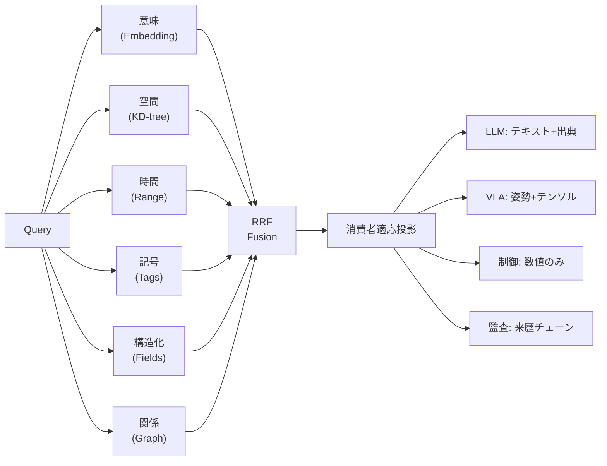
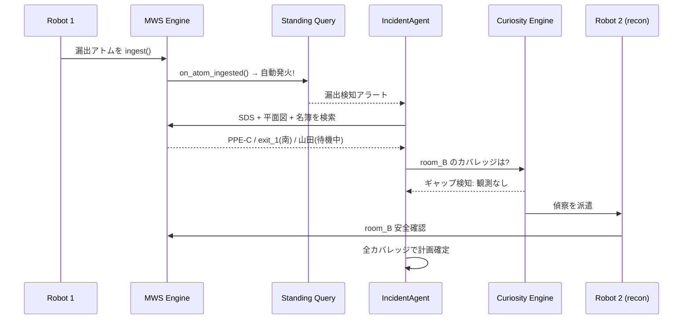

# 検索を“共通プロトコル”にする ― ロボット・AIエージェント・業務システムをつなぐ Multi-World Search

**これは RAG の話ではありません。** 複数のロボットと AI エージェント、そして業務システムが「同じ記憶」を共有し、直接通信せずに協調し、情報の空白を自ら検知して埋める——そのための**検索基盤を“共通プロトコル”として設計できるか**、という話です。

本記事は概念実証（PoC）の報告です。検証の焦点は規模やスループットではなく、**ロボティクスの物理観測・AI エージェントの推論・業務システムのレコードという異種データの横断検索が成立するか**、そして**その検証が「落ちうる実験」として誠実に設計され、数値が「ログと突き合わせ可能」な形で計測されているか**にあります。

---

## なぜ「共通プロトコル」が必要なのか

AI エージェントが業務の一部を担い、ロボティクスが物理世界で作業し、ERP や WMS がバックエンドで動く——そんな現場が現実味を帯びてきました。このとき見落とされがちな問題があります。

**各プレイヤーは、まったく異なる「データの言葉」を話している**、ということです。

- ロボティクスは、ミリ秒〜秒スケールで点群・RGB-D・姿勢・接触力・テレメトリを吐き出します。
- VLA（Vision-Language-Action）は、秒〜分スケールで行動軌跡やスキルを生み出します。
- 業務システム（ERP/WMS/CMMS/MES）は、時〜月スケールの構造化レコードを持ちます。
- 文書知識（SOP・マニュアル・SDS）は、ほぼ静的なテキストです。

データ形式が違うだけではありません。**「在庫数」という同じ概念でも、WMS の記録とロボットの物理観測では意味（鮮度・信頼度・粒度）が違います。** そして今後、ロボットの種類もエージェントの数も増えていきます。プレイヤーが N 個に増えれば、ペアワイズに繋ぐコストは N² で膨らみます。

ここに**共通プロトコル**が要ります。本記事の提案は、そのプロトコルを **LLM と Embedding を活用した検索システム**として実装する、というものです。各システムは互いの内部仕様を知る必要はなく、**検索システムに「適切なデータをクエリして取得する」だけ**でよい。ロボティクスも、AI エージェントも、業務システムも、同じ検索レイヤーを共有します。

このアイデアを **Multi-World Search（MWS）** として実装し、7 つの業務シナリオで検証しました。

> LLM（gemini-3.5-flash）と Embedding（gemini-embedding-2, 768 次元）は**実際の Gemini API** を呼んでいます。ロボット・センサー・業務システムは MuJoCo シミュレーション／合成データです（正解ラベルを自動生成して定量評価するため）。本記事の数値は `MWS_CLOUD_MODE=live`・seed=0 の実走から取得しています。詳細は [REPORT.md](REPORT.md)。

---

## まず、ひとつの場面をご覧ください

ポンプの振動センサーが異常値を検知しました。巡回ロボットがその場にいます。AI エージェント（Gemini ADK 経由の gemini-3.5-flash）が検索基盤 MWS にクエリを投げると、以下が**一括で**返ってきます。

- **CMMS**（保全管理システム）の過去修理履歴
- **SOP 手順書**のトルク仕様「**45 Nm**」、ベアリング振れ閾値「**0.05 mm**」、指定グリス「**リチウム EP2**」
- **ERP** の部品在庫（ベアリング 3 個、シールキット 5 個）
- **別のロボットが過去に教示したスキル実演**（弁を緩める行動軌跡）
- **技師のシフト表**（山田さんが待機中）

LLM はこれらの検索結果をもとに 7 ステップの保全計画を生成しました。ケーシングの取り外し手順には「SOP-PUMP-07 に従い、トルク仕様 **45 Nm** に注意」と記載されています。

ここで重要なのは、45 Nm もリチウム EP2 も、**我々が業務データとして与えた SOP の値を LLM が取り違えずに引用した**という点です。LLM が訓練データから「知っていた」のではなく、**検索された根拠に基づいて推論した**結果です。これがまさに、検索を共通プロトコルにしたときに起きてほしいことです。エージェントは業務知識を内蔵せず、検索レイヤーから取得します。

---

## なぜ「全部ベクトル DB に入れて RAG」ではダメなのか

「共通プロトコルが検索なら、全部ベクトル DB に入れて RAG すればいいのでは？」という発想は、3 つの理由で破綻します。

**1. 時間スケールが桁違いです。** 振動センサーの高頻度データと、半年前に書かれた SOP マニュアルを同じインデックスに入れると、時間的な文脈が失われます。

**2. クエリの種類が多様すぎます。** `equipment_id = pump_07` という完全一致、「3 m 以内の設備」という空間近接、「過去 1 時間の観測」という時間範囲——これらはベクトル類似度だけでは**原理的に**表現できません。

**3. 消費者ごとに必要な形式が違います。** 同じ「ポンプの異常」でも、LLM には「テキスト＋出典」、VLA には「姿勢＋テンソル」、制御ループには「低遅延の数値」、監査には「来歴チェーン」が必要です。

つまり、共通プロトコルとしての検索は、単一のベクトル検索ではなく、**多様なクエリと多様な消費者を 1 つのインターフェースで吸収する**ものでなければなりません。

---

## MWS のアプローチ

### 記憶アトム：データの統一表現

すべてのデータを「記憶アトム」という統一フォーマットに変換します。**封筒**（時空間座標・来歴・モダリティ・信頼度・鮮度・埋め込みベクトル）＋**ペイロード**（モダリティ固有データ）という構造です。ロボットのセンサー値も、ERP の在庫レコードも、SOP マニュアルも、VLA のスキル実演も、すべてこの形式に正規化されます。これが「共通の言葉」の最小単位になります。

### 多重インデックス融合検索

単一のベクトル検索ではなく、6 種類のインデックスを並立させ、**RRF**（Reciprocal Rank Fusion: 各ランキングの順位の逆数 `1/(k+rank)` を重み付きで合算する手法）で融合します。



クエリの内容（テキスト・座標・時間範囲・タグ・構造化フィルタ）に応じて発火するインデックスが切り替わり、結果は RRF で 1 本のランキングに統合されます。最後に、**消費者適応投影**が同じアトムを消費者ごとに違う形で返します。これで「多様なクエリ」も「多様な消費者」も 1 つの検索 API で吸収できます。

### 埋め込みは「文書」と「クエリ」で非対称に

意味インデックスの埋め込みには gemini-embedding-2 を、**公式ドキュメントが定める非対称スキーム**で使っています。索引する文書には `title: none | text: {内容}`、検索クエリには `task: search result | query: {内容}` という**タスク指示の接頭辞**を付けてから埋め込むのです（このモデルは `task_type` パラメータの代わりにプロンプト接頭辞で検索の非対称性を表現します）。

効果は事前登録 A/B で測定しました。同一コーパス・同一クエリで、接頭辞あり/なしの Recall@5 は **0.944 → 1.000（+0.056）**。「API を仕様どおり使う」だけで取れる品質を取りこぼさない、という地味ですが大事なポイントです。なお接頭辞は埋め込み座標の意味を変えるため、ベクトル空間タグを `gemini2-768-v1` → `v2` に上げ、新旧ベクトルの混在を型レベルで遮断しています。

---

## 検証の姿勢①：すべてを「落ちうる実験」にした

ここからが本記事でいちばん強調したい点です。

PoC の検証では、「シナリオが全部成功しました」という報告ほど信用できないものはありません。なぜなら、**成功を作り込むことは簡単**だからです。観測値を都合のいい定数にする、成功フラグを無条件に `True` にする——それだけで、どんな仮説も「確証」できてしまいます。それは実験ではなく、演出です。

そこで MWS では、**各シナリオの成功/失敗判定を、必ずパイプラインの出力でゲートする**という原則を徹底しました。

- 観測値はハードコードせず、真値＋seed 付きノイズから**生成**する。
- リスクスコアは定数にせず、SOP 上限との比較から**計算**する。
- 在庫の上書きは無条件にせず、検索結果の**鮮度比較**で駆動する。
- スキル転移の成否は「検索がヒットしたか」ではなく、**実行が制約を満たしたか**で判定する。

そして、**それぞれに「入力を変えると仮説が崩れる」反証可能性テストを付けました。** 物理観測を古くすれば在庫上書きは起きない。SOP 上限を緩めれば危険操作が「実行可」に反転する。ノイズを増やせばパターン発見は失敗する。把持力の上限を下げれば、スキルを思い出しても作業は失敗する——これらが実際にテストとして緑になることを確認しています（mock モードで全 276 テストがパス）。

**落ちうる実験だからこそ、成功に意味がある。** 以下のシナリオ結果は、この前提のもとで読んでください。

---

## 検証の姿勢②：計測は「ログと突き合わせて」初めて真実になる

もう一つの姿勢が、**計測値そのものを第三者検証可能にする**ことです。

「クラウド呼び出しは 64 回でした」という数値は、どうやって信じればよいでしょうか。MWS では、実際のクラウド呼び出しが必ずログに 1 行のマーカーを残すようにし、**実走ログのマーカー行・metrics のカウンタ・応答記録ファイルという独立生成された3つのソースを突き合わせる監査ツール**（`mws eval reconcile`）を常設しました。差分が 1 件でもあれば非ゼロ終了します。本記事の実走では:

```
actual : embedding_requests=64  llm_calls_real=17  llm_calls_recorded=17
counted: embedding_requests=64  llm_calls_real=17  llm_calls_recorded=17
delta  : 0 / 0 / 0  →  reconciled: true
```

つまり、**metrics に計上されていないクラウド呼び出しは存在しません**。LLM のトークン数も推定値ではなく、API が返す usage_metadata の**実測値**です（17 呼すべて。応答本文も `llm_calls.jsonl` として各実走の成果物に記録されます。ちなみに実測導入時、従来の「文字数 ÷ 4」推定が入力トークンを約 2.6 倍過大評価していたことが判明し、コストを下方修正しました）。

この監査は飾りではありません。**実際にバグを捕まえました。** 埋め込みスキームを v2 に上げた直後の実走で、監査が「実呼び出し 132 vs 計上 123」の差分 9 件を検出。追跡すると、ストアの空間タグ設定が古い環境変数とずれて埋め込みの再利用が外れ、連合ストアが**計上されない再埋め込み**を行っていたことがわかりました。ストアの空間/次元の情報源を embedder に一本化して修正し、ゼロ差分を回復——「計測は真実を語る」を仕組みで守ると、この種の見えない欠陥が表に出てきます。

応答記録も、早速役に立ちました。live の LLM は同じ seed でも揺らぎます。実際、ある実走では保全計画が 8 ステップ、次の実走では 7 ステップになりました。従来ならこの変動は「そういうこともある」で終わりですが、今回は `llm_calls.jsonl` に**計画の本文がそのまま残っている**ため、「今回の 7 ステップはこの応答だ」と成果物から逐語的に確認できます（実際に確認しました）。

さらに、各実走の `manifest.json` には git SHA とその**ダーティ/未追跡状態**、モデル ID、埋め込みバッチサイズ、主要依存のバージョンが記録されます。本記事の実走は `git_dirty=false` — つまり**「どのコードで・どのモデルで・どの設定で走ったか」が manifest 単体から一意に特定できる**状態で取得した数値です。

---

## アブレーション：ベクトル検索だけで本当に足りないのか

シナリオ 1（設備保全）の代表クエリで、インデックスを 1 つずつ追加しながら Recall@10 を測定しました（実 Gemini 768 次元）。

```
意味のみ        ████████░░  0.80
＋空間          ████████░░  0.80
＋構造化        ███████░░░  0.70  ← 一時的に低下
＋記号（タグ）   █████████░  0.90  ← 回復・改善
全6種           █████████░  0.90
                               （正解10件 / 全25件）
```

注目すべきは「＋構造化」で 0.80 → **0.70 に下がった**点です。構造化インデックスが返す `equipment_id` 一致のヒットが RRF の順位を撹乱し、意味検索の良いヒットを押し下げました。しかし記号インデックス（タグマッチ）を加えると 0.90 に回復しています。**融合は万能ではなく、何を足すか・どう重み付けるかの設計が要る**——これは作り込みでは出てこない、正直な実挙動です。

なお Recall@5 は 0.50 で頭打ちに見えますが、後の重みスイープで判明したとおり、これは正解アトムが 10 件あるため **5 件枠の構造上限（5/10 = 0.50）に既に到達している**値です。

それでも多重インデックス融合の本質的な価値は、Recall の数値だけではありません。構造化クエリ（`equipment_id=pump_07`）や空間クエリ（「3 m 以内」）は**ベクトル類似度では原理的に表現できない**ため、「クエリタイプの被覆」という利点はコーパス規模やクエリに依らず構造的に成立します。共通プロトコルには、この被覆こそが必要です。

---

## 7 つのシナリオと検証結果

各シナリオを「**何を検証し / どう成功をゲートし / 結果 / どう壊せるか**」の観点で紹介します。

### S1：設備保全の多主体引き継ぎ — 根拠に基づく推論

冒頭の場面です。Recall@10 = 0.90。LLM が我々の注入した SOP 文書の数値仕様（45 Nm, 0.05 mm, リチウム EP2）を取り違えず引用しました。最後は異形態のマニピュレータが、過去に別ロボットが教示したスキル実演を検索し、共有の検索拡張 VLA ポリシー経由で再生します（スキル転移成功・信頼度 0.88）。

**ゲート方法**: 計画の各ステップの「完了」は、**そのステップが必要とする根拠アトムが検索に出てきたか**で判定します。たとえば「SOP 取得」ステップは、SOP アトムが検索結果に含まれて初めて完了になります。今回の実走では LLM が 7 ステップの計画を生成し（計画本文は `llm_calls.jsonl` に記録）、7/7 がエビデンスゲートを通過しました。**壊し方**: SOP アトムを記憶から外すと、当該ステップは未完了になり `all_steps_complete` が False に落ちます（テスト済み）。エージェントの“やったふり”は通りません。

### S2：物理と原本記録の調停 — 信頼度重み付き融合の統計的検証

WMS が在庫 50 個と記録している棚を、ノイズ特性の異なる 2 台のロボットが観測します。観測値は**真値 30 ＋ seed 付きガウスノイズから生成**され、**逆分散重み**（精度の高いセンサーほど重い）で融合します。

このシードでの融合推定は **30.048（絶対誤差 0.048）**、最良の単一観測者の誤差は 0.126 でした。さらに重要なのは統計的判定です。**1,024 回の試行で平均誤差を比べると、融合 0.726 < 最良単一 0.822** となり、融合が単一観測者を上回りました。**壊し方（＝対照実験）**: 同じ試行を**等重み**で行うと平均誤差 0.869 となり、**単一観測者に勝てません**。つまり「融合が勝つ」のは逆分散重みが効いているからであって、定数の産物ではありません。最後に WMS を 50 → 30 に自動修正し（書き戻し誤差 0）、差異チケットを起票しました。

### S3：群れによる弱信号の集合的発見 — ノイズの中のスティグマジー

3 台のロボットが別々の時刻に、別々のオブジェクトの微小欠陥（いずれも閾値以下）を検知します。ただし今回は、**無相関なノイズ欠陥を他ロット（lot_M / lot_N）にも混入**させてあります。

結果、欠陥カウントは lot_L:3 / lot_M:1 / lot_N:1。Consolidation エンジンが **lot_L を「他ロットを厳密に上回る（margin 2）」パターンとして発見**しました。シグナル純度は 0.60（＝3/5、混入ノイズを反映して 1.0 ではない）、lot_L のリコールは 1.0。さらに、タスク計画に基づく**予測プリフェッチ**を有効にすると、各ロボットがローカルストアだけで群れ全体（3 観測者分）の欠陥情報に即答できるようになります（無効だと 1 観測者分に低下することも反証テストで確認）。

**ここが共通プロトコルの核心です。** 各ロボットは独立したローカルストア（FederatedStore）にデータを格納し、**直接通信は一切していません**。それでも検索の統合層を通じて、群れ全体のパターンを発見できました。**壊し方**: ノイズを 6 件（各ロット 3 件）まで増やすと lot_L と並んで margin が 0 になり、**発見は失敗します**（テスト済み）。つまり「群れが弱信号から強い結論に至る」のは、信号がノイズを実際に上回っているからです。これはスティグマジー（環境＝共有記憶を介した間接協調）のデジタル実装です。

> **スティグマジー**: 生物学の概念。個体が共有環境（巣の構造、フェロモン）を介して間接的に協調する現象。MWS では「共有検索レイヤー」がその環境にあたります。

このシナリオでは記憶の「代謝」も計測しました。consolidation（クラスタ要約）→ 重複排除 → TTL 剪定でストアを **25.8% 圧縮**しても、lot_L の検索リコールは **1.00 のまま保持**されます（H5）。

### S4：新規 SKU の即時立ち上げ — 実行でゲートしたスキル転移

1 台が実演したスキル（把持の行動軌跡と校正された把持力）を MWS に格納します。未経験の 2 台が検索して再利用し、ピッキングを試みます。

**ゲート方法**: 成功は「スキルを検索できたか」ではなく、**再生した把持力が製品マスタの上限（壊れやすい部品なので 5 N）以内に収まったか**で判定します。スキルを思い出した群れは校正済みの安全な力（4.04 N）で把持し成功（成功率 **1.0**）。スキルが無い群れは未校正の力（8.25 N / 7.74 N）で握り、上限超過で**失敗（成功率 0.0）**。転移ゲイン = **1.0**。

**壊し方**: 把持力の上限を校正値より下げると、**スキルを思い出しても**握りつぶして失敗します。つまり検索ヒットは必要条件であって十分条件ではない——「思い出す」と「できる」を分けて測っています。

### S5：インシデント対応 — 検索が「能動的インフラ」になる瞬間

このシナリオのイベント連鎖を時系列で追ってください。



検索システムが「聞かれたら答える」受動的な DB から、**データ取り込み時に自動発火し、情報の空白を自ら検知して埋める能動的インフラ**に変わっています。Recall@10 = 1.00。Standing Query は手動呼び出しではなく、`engine.ingest()` の内部で pub/sub により自動発火しています。対応の 8 ステップは実 ADK（gemini-3.5-flash）が live で実行しました。

**ゲート方法**: 「計画が SDS / 退避経路 / 名簿を使ったか」は、**それらのアトムが実際に検索で surface したか**から計算します。**壊し方**: SDS アトムを記憶から外すと `plan_uses_sds` が False に落ち、「SDS 取得」ステップも未完了になります（テスト済み）。

### S6：反実仮想に基づく安全判断 — リスクを“計算”する

3 段積みの荷（SOP 制限 2 段）と加圧弁（120 PSI、SOP 制限 100 PSI）に対し、**SOP 上限の超過度からリスクスコアをルールエンジンで計算**します。荷は 0.80、弁は 0.615 と算出され、いずれも閾値 0.5 を超えたため危険操作を回避しました。

**ゲート方法**: リスクは定数ではなく、検索で引いた SOP 上限と観測値の比較から計算され、`AVOID / PROCEED` の判定はリスクと閾値の比較から導かれます。**壊し方**: SOP 上限を観測値より緩める（例：積載上限を 5 段に）と、計算リスクが閾値を下回り、判定が **PROCEED に反転**します（テスト済み）。

このシナリオのもう一つの意義は、**判定結果がアトムとして MWS に格納される**点です。過去の観測だけでなく、シミュレートした「起こりうる未来」も検索可能な記憶になります（今回の実走でも反実仮想アトム 2 件が想起可能になっています）。次にこの設備で作業するロボットは、過去の反実仮想結果を検索してリスクを事前に知ることができます。

> リスクスコアは SOP 上限との比較によるルールベースの計算値です（Monte-Carlo のロールアウト頻度ではありません）。

### S7：注文から充足までのエンドツーエンド — 鮮度が真実を決める

WMS が在庫 5 個と記録しているのに棚が空（幽霊在庫）。**ゲート方法**: 「幽霊在庫検知」は、検索で引いた WMS レコードと物理観測を**鮮度で突き合わせ**、「より新しい物理観測の数が記録を下回る」ときだけ True になります。これを満たしたので物理観測が WMS を上書きし、調達再発注・顧客通知（通知文は実 ADK が生成）・ERP クローズを自動実行しました。Recall@10 = 1.00、E2E 成功率 1.00。

**壊し方**: 物理観測のタイムスタンプを WMS より古くすると、上書きは**起きず**、E2E は 1.0 になりません（テスト済み）。「物理が真実、記録は記録」という H4 の主張は、鮮度比較によって初めて成立します。

---

## 検索品質とコストのサマリー（live・seed 0）

| シナリオ | n_relevant | n_total | Recall@5 | Recall@10 | MRR | nDCG@10 |
|---------|-----------|---------|----------|-----------|-----|---------|
| S1 設備保全 | 10 | 25 | 0.50 | 0.90 | 1.00 | 0.931 |
| S3 弱信号 | 13 | 31 | 0.385 | 0.692 | 1.00 | 0.936 |
| S5 インシデント | 7 | 17 | 0.571 | 1.00 | 1.00 | 0.973 |
| S7 受注充足 | 9 | 21 | 0.556 | 1.00 | 1.00 | 1.00 |

> 17〜31 件の小規模コーパスでの値です。MRR = 1.00 は「最も関連性の高い結果が常に 1 位」を意味しますが、この規模では容易に達成されます。**より示唆的なのは Recall@5（0.39〜0.57）**で、上位 5 件に関連アトムが半分程度しか入っておらず、ランキング精度に改善余地があります。

**システムメトリクス**（7 シナリオ合計）も実測しました。

| 項目 | 値 |
|------|----|
| Gemini Embedding（768d・非対称タスク指示） | **64 リクエスト / 163 テキスト**（マルチ Content バッチ化でリクエスト -61%） |
| gemini-3.5-flash 呼び出し（ADK） | **実 17**（全件実測トークン・全応答を llm_calls.jsonl に記録）＋コストモデル計上 11 |
| 推定クラウドコスト | **約 $0.0046**（実測トークン基準） |
| エッジ↔クラウド帯域（実/仮想） | 890 KB / 166 KB |
| 監査ログ件数 | 99 |

この数値は前述のとおり**実走ログとの突き合わせ監査でゼロ差分**（64/64・17/17）を確認したものです。

注目したいのは、**コストもレイテンシも LLM 推論が支配的**だという点です。レイテンシ分解の実測では、ローカル ANN 検索が **0.04 ミリ秒**、Gemini 埋め込みが p50 **約 370〜410 ミリ秒**、Gemini 推論が p50 **2.8〜4.2 秒**（p95 は最大 6.8 秒）。S1 の `act` フェーズは独立ステップの並列実行（既定 4 並列）で約 12 秒です（逐次実行時は約 36 秒）。一方、取り込み側は複数テキストを 1 リクエストにまとめるバッチ埋め込みを全シナリオに適用し、知覚フェーズは **3.7〜6.7 秒 → 0.4〜0.9 秒**（最大 -92%）に短縮されています。共通プロトコルのボトルネックは検索そのものではなく、クラウド LLM の往復にあります。

---

## ホットパス問題への二つの解：教師-生徒と「仕様どおりに使う」

Gemini Embedding 2 のクラウド呼び出しは実測 p50 で約 400 ミリ秒です。これは高頻度の制御ループには間に合いません。

**一つ目の解が教師-生徒構成（H7）です。** クラウドの Gemini Embedding 2（高品質・高遅延）を**教師**としてオフライン索引化に使い、ローカルの小型モデルを**生徒**としてホットパスのクエリに使います。**判定基準は実行前に事前登録**（生徒の p50 が教師の 1/5 以下、かつ生徒の Recall@5 が教師の 0.8 倍以上なら「支持」）した上で、同一コーパス（20 文書）・同一パラフレーズクエリ（6 本）で A/B 測定しました。

| ティア | 埋め込み p50 / p95 | Recall@5 | MRR |
|--------|-------------------|----------|-----|
| 生徒（ローカル MiniLM-384） | **14.5 ms** / 83 ms | **1.00** | 1.00 |
| 教師（Gemini 768d） | 397.5 ms / 1,203 ms | 0.944 | 1.00 |

**結果: H7 支持 — レイテンシ 27.4 倍の高速化、検索品質は維持**（この小規模コーパスでは生徒が教師をわずかに上回りました）。なお本来の生徒である EmbeddingGemma は Hugging Face のゲート制限でダウンロードできなかったため、同じアーキテクチャ枠に MiniLM-384 を置いた検証です。生徒のベクトル空間は教師空間と厳密に分離しており、空間をまたぐ比較は行っていません。

**二つ目の解が、教師側を仕様どおりに使い切ることです。** 前述の非対称タスク指示（A/B で Recall@5 +0.056）に加え、取り込みは複数テキストを 1 リクエストにまとめるバッチ埋め込み（リクエスト -61%・知覚フェーズ最大 -92%）、オフラインの再索引は **Batch API**（標準価格の 50%・非同期ジョブ・中断再開可能）に逃がしています。Batch API の実ジョブも投入から取り込みまで完走させ、得られたベクトルが同期経路と一致することを確認済みです。

---

## うまくいかなかったこと・まだ測れていないこと

PoC として誠実に、限界も記します。

- **「Recall@5 が低い」は大部分が計測上限のアーティファクトでした。** 事前登録した 12 候補の重みスイープでは全候補が完全に同値（採用なし＝現行重み確定）。原因を調べると、R@5 には構造上限 5/n_relevant があり、4 シナリオ中 3 つは**既に上限に張り付いていました**（平均で上限の 93%）。真の改善余地は S5 の 1 アトムのみで、重みでは動きません。
- **アブレーションで「＋構造化」が逆効果**でした。インデックスを足せば必ず良くなるわけではありません。
- **LLM 推論が支配的なボトルネック**です（per-call p50 3.7〜3.9 秒）。独立ステップの並列実行で act フェーズの壁時計は S1 35.6→12.4 秒（-65%）・S5 35.1→9.9 秒（-72%）に短縮しましたが、1 呼あたりの往復時間そのものは残ります。
- **知覚税（H3）は小さいが存在します。** 真値オラクル検索器との差分は Recall@10 で 0.10。知覚・記述・埋め込みの劣化で上位 10 件から関連アトムが 1 件こぼれています。
- **live の LLM は揺らぎます。** 同じ seed でも計画が 7 ステップの走と 8 ステップの走がありました（エビデンスゲートはどちらも全数通過）。現在は全ての実 LLM 応答を `runs/<RUN_ID>/llm_calls.jsonl` に記録しており、計画の変動は記録された応答本文から事後検証できます。
- **H7 の生徒モデルは EmbeddingGemma ではありません。** HF のゲート制限のため、MiniLM-384 での検証です。
- **多シードの揺らぎは小さいものでした。** live 3 シード（v2 スキームで再計測）では検索品質・知覚税・転移ゲインの CI 幅がゼロ、統計的融合（H9）も CI 分離を維持しました（0.717 [0.687, 0.746] < 0.807 [0.764, 0.850]）。
- **応答記録そのものも監査対象になりました。** 突き合わせ監査は「ログ↔metrics↔記録ファイル」の3点照合で、記録の欠落も過剰も非ゼロ差分として検出されます（反証テスト付き）。さらに記録した応答は `MWS_LLM_REPLAY` で決定的に再生でき、S1 をリプレイすると **LLM 呼び出しゼロで全タスクゲートが同一結果**になることを確認しています。
- **全シナリオ成功は「成功基準をシミュレーションで達成可能に設計した」結果**でもあります。ただし前述のとおり、各シナリオは入力を変えれば失敗する反証可能な実験にしてあります。

---

## アーキテクチャの決断

**クラウド境界**: LLM 推論と embedding 生成のみクラウド。検索エンジン本体はすべてローカルです。MacBook 1 台で動作し、**276 件のテスト**で品質を担保しています。`MWS_CLOUD_MODE=mock` なら API キー不要・オフラインでも全シナリオを完走できます（決定的）。

**ポリグロット永続化**: ベクトルは LanceDB、時系列は DuckDB、グラフは NetworkX、空間は scipy KD-tree、blob はファイルシステム——用途別の実バックエンドを用意し、プロトタイプ既定はインメモリ、スケール時に実 DB へ切り替えられるようにしています。

**embedding 空間の分離**: 異なるモデル・次元・スキームのベクトルを同じインデックスに混在させない規律。各ベクトルに `embedding_space`（モデル＋次元＋バージョン）タグを付与して管理します。非対称接頭辞の導入時はこのタグを v2 に上げて再索引しました——「モデルやスキームの更新＝座標空間の更新＝再索引」を型で強制する仕組みです。

---

## まとめ：検証から言えること

AI エージェントの時代にロボティクスが本番業務に入ると、各コンポーネント・各インスタンスが多様なデータを生成・利用します。しかし業務システム・AI エージェント・ロボティクスが同じ「言葉」で話すとは限らず、プレイヤーが増えるほど**共通プロトコル**が要ります。本記事は、そのプロトコルを **LLM と Embedding を活用した検索システム**として実装し、各システムが検索を通じて適切なデータをクエリ取得する、というアプローチを検証しました。

7 つの業務シナリオでの検証（しかも各々を反証可能な実験として設計し、計測をログと突き合わせた上）から、以下のことが言えます。

- **異種データ（物理観測・推論・業務レコード・スキル）の横断検索は成立します。** 多重インデックス融合は、ベクトル検索だけでは原理的に扱えないクエリタイプを 1 つのインターフェースで吸収します。ただしインデックス追加は常に精度を上げるわけではなく、RRF 重みの設計が要ります。
- **LLM は、検索された業務データの具体的な数値仕様を取り違えず引用できます。** エージェントは業務知識を内蔵せず、検索プロトコルから取得すればよい——ハルシネーションではなく根拠に基づく推論です。
- **3 台のロボットが弱い信号しか持たず、直接通信もしないのに、検索レイヤーだけで「ロット L に品質問題がある」という強い結論に到達できます。** しかもノイズを混ぜても成立し、ノイズを増やせば崩れます。共通の検索プロトコルがスティグマジーの環境として機能しました。
- **Standing Query と Curiosity ループにより、検索は能動的インフラになります。** データ取り込み時に自動発火し、情報の空白を自律的に検知・充足します。
- **クラウド埋め込みのレイテンシ問題には設計で答えられます。** ローカル生徒で 27.4 倍の高速化（品質維持）、API を仕様どおり使う非対称埋め込みで品質 +0.056、バッチ化で取込最大 -92%。ボトルネックとして残るのは LLM 推論の往復です。
- **そして何より、これらの数値は「作り込み」ではなく検証可能なものです。** 入力を変えれば在庫上書きも・安全判断も・スキル転移も・パターン発見も失敗しますし、クラウド呼び出し数は実走ログとの突き合わせでゼロ差分が確認されています。この監査は実際に未計上の呼び出し 9 件というバグを捕まえ、修正に繋がりました。

ロボティクスと AI エージェントの協調は、突き詰めれば「各システムをどうつなぐか」というインテグレーションの問題です。MWS は、その接続層に**検索**を据え、プレイヤーが増えても拡張可能な共通プロトコルを提供する試みです。

---

## 再現方法

```bash
git clone <repository-url>
cd MultiWorldSearch
uv sync --extra dev --extra live

# API キーありで全シナリオ実行（実際の Gemini API を使用）
export GOOGLE_API_KEY=your-key
make scenario-all 2> run.log

# クラウド呼び出しのゼロ差分監査（ログ vs metrics）
uv run python -m mws.cli eval reconcile --log run.log --runs <run IDs>

# API キーなし（モック）でも全シナリオ完走可能（決定的）
MWS_CLOUD_MODE=mock make scenario-all

# 複数 seed で信頼区間付き集計
make scenario-multi-seed-all

# テスト + リント + 型チェック
make check
```

---

*本記事の検証は MuJoCo シミュレーション環境で実施。LLM（gemini-3.5-flash）と embedding（gemini-embedding-2, 768d, 非対称タスク指示・v2 空間）は実際の Gemini API、それ以外はシミュレーション／合成データ。シナリオ数値は seed=0 の live 実走（git 9e895f0・manifest が dirty=false/モデル/依存を記録）から取得し、クラウド呼び出し数は実走ログとの突き合わせ監査でゼロ差分（embedding 64/64・実 LLM 17/17）。アブレーションは S1 の代表クエリに対するもの。各シナリオは入力を変えると仮説が崩れる反証可能性テストを伴う。詳細は [REPORT.md](REPORT.md)、未解決の計測課題は [IMPROVEMENT.md](IMPROVEMENT.md) を参照。*
