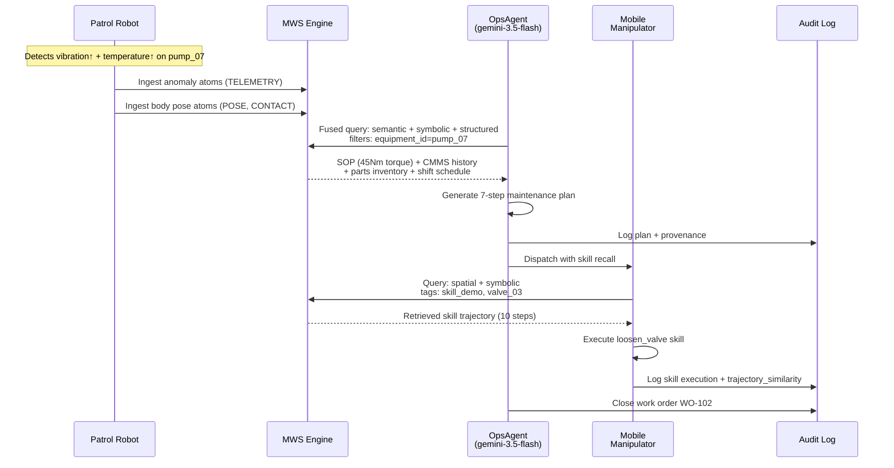

# Scenario 1: Equipment Maintenance Multi-Actor Handoff

**CLI key**: `maintenance_handoff`
**Status**: Flagship scenario — full vertical slice through MWS.
**Source**: `mws/scenarios/s1_maintenance_handoff/`

## Scenario Flow



## Purpose

Demonstrate that MWS can reduce Mean Time To Repair (MTTR) by enabling
cross-modal retrieval across sensor observations, maintenance records, manuals,
parts inventory, and personnel schedules. A patrol robot detects an anomaly, an
operations agent orchestrates the response by fusing information from multiple
sources, and a morphologically different manipulator executes the repair by
recalling a skill demonstration taught by another robot in the past.

This scenario exercises the core MWS value proposition: heterogeneous data
sources and heterogeneous consumers sharing a collective memory, with full audit
trail.

## Hypotheses Under Test

- **H1 (Transfer)**: Shared memory improves task performance for unexperienced
  instances. The mobile manipulator has never performed this task but succeeds by
  retrieving a skill demonstration from the patrol robot's past experience.
- **H3 (Perception Tax)**: The gap between oracle retrieval (using ground-truth
  entity IDs) and the real pipeline can be measured and quantified.
- **H8 (Consumer-Aware Projection)**: The same atoms are projected differently
  for the OpsAgent (text + provenance) and the Manipulator (pose + tensor).

## MuJoCo World

A single-room maintenance workshop containing:

| Entity | Type | Position | Description |
|--------|------|----------|-------------|
| `pump_07` | Equipment | (2, 1, 0.4) | Centrifugal pump with vibration and temperature diagnostic channels |
| `valve_03` | Equipment | (2.5, 1, 0.3) | Isolation valve adjacent to pump (hinge joint for VLA skill) |
| `workbench` | Furniture | (0, 2, 0.5) | Tool and part storage area |
| `patrol_robot` | Agent | (-1, 0, 0.2) | Mobile sensor platform (2-DOF slide joints) |
| `mobile_manipulator` | Agent | (3, -1, 0.3) | Mobile manipulator with arm (2 slide + 1 hinge joint) |

Sensors: `pump_vibration_pos`, `pump_vibration_vel`, `valve_handle_pos`.

## Business Data (seed_memory phase)

| Source | Atoms | Content |
|--------|-------|---------|
| CMMS | 2 | WO-101 (bearing replacement, pump_07) and WO-098 (preventive maintenance) |
| ERP Inventory | 2 | Bearing P-BEAR-07 (3 units, shelf-C2) and Seal kit SK-07 (5 units) |
| SOP | 1 | SOP-PUMP-07: 7-step procedure including torque spec (45 Nm), valve_03 isolation |
| Shift Schedule | 1 | T-Yamada on call 08:00-20:00, T-Tanaka backup |
| Skill Demo | 1 | "Loosen valve_03" — 10-step 6-DOF trajectory, taught by patrol_robot |

**Total seed atoms**: 7

## Injected Condition

A deterministic compound anomaly on `pump_07`:

- **Vibration**: 4.2 mm/s RMS (threshold 3.0, severity 3). Bearing wear suspected.
- **Temperature**: 92 C (threshold 75 C, severity 3). Overheating correlated with vibration.

Both atoms are generated by the patrol robot's sensors and linked to entity `pump_07`.

## Perception

MuJoCo simulation runs for 100 steps. Body position atoms are generated for all
entities (pump_07, valve_03, workbench, patrol_robot, mobile_manipulator, arm_link1,
world body), each tagged with entity_id and provenance.

## Actors and Queries

### OpsAgent (ADK mock — 7-step plan)

**Query**: Semantic + symbolic + structured + temporal indices, filtered by
`equipment_id=pump_07`, projected as text + provenance.

**Plan steps**:
1. `assess_situation` — Confirm compound anomaly on pump_07
2. `retrieve_sop` — Retrieve SOP-PUMP-07 procedure
3. `check_inventory` — Verify bearing P-BEAR-07 and seal SK-07 availability
4. `verify_personnel` — Confirm T-Yamada on call and certified
5. `dispatch_manipulator` — Send mobile manipulator with skill recall
6. `monitor_repair` — Monitor VLA execution
7. `close_work_order` — Create and close WO-102

Each step tracks LLM cost and bandwidth for the hypothetical cloud round-trip.

### MobileManipulator (VLA — retrieval-augmented policy)

**Query**: Spatial (near valve_03 at 2.5, 1.0, 0.3) + semantic + symbolic indices,
filtered by `skill_demo` and `valve_03` tags, projected as pose + tensor.

Retrieves the "loosen valve_03" skill demonstration and executes it. Confidence is
0.88 when the skill demo is found, 0.45 when absent — demonstrating transfer (H1).

## Metrics

### Retrieval Metrics (ground-truth from entity IDs)
- Recall@5, Recall@10 — fraction of relevant atoms retrieved
- MRR — reciprocal rank of first relevant hit
- nDCG@10 — normalized discounted cumulative gain

### Task Metrics
- `ops_steps_completed` / `ops_steps_total` — plan completion rate
- `all_steps_complete` — boolean
- `skill_transfer_success` — did the manipulator succeed using a recalled skill?
- `vla_confidence` — confidence of the VLA action

### System Metrics
- Latency decomposition (p50/p95 per lifecycle phase)
- Embedding call count and token usage
- LLM call count and cost estimate
- Virtual edge-cloud bandwidth (upload/download bytes)
- Embedding cache size and hit rate

### Audit
- 15 entries in `audit.jsonl` covering all phases from setup through skill execution
- Each entry records: phase, actor, operation, target entity, indices used, projection type

## Success Criteria

1. Fused retrieval returns the SOP, CMMS history, and skill demo together (Recall@10 > 0.5).
2. Mobile manipulator retrieves the recalled skill and succeeds (skill_transfer_success = True).
3. All 7 OpsAgent plan steps complete.
4. `audit.jsonl` records the full handoff chain with provenance.
5. Results are deterministic under the same seed.

## Acceptance Tests

| Test | Assertion |
|------|-----------|
| `test_s1_completes_mock_no_key` | Run completes in mock mode |
| `test_s1_retrieval_metrics` | Recall@10 >= 0.5, MRR > 0 |
| `test_s1_skill_transfer` | `skill_transfer_success` is True, VLA confidence > 0.5 |
| `test_s1_ops_plan_complete` | All ops steps complete |
| `test_s1_audit_completeness` | >= 10 audit entries |
| `test_s1_deterministic` | Same seed produces identical retrieval metrics |
| `test_s1_system_instrumentation` | Embedding calls > 0, bandwidth > 0 |

## Running

```bash
uv run python -m mws.cli scenario run --name maintenance_handoff --seed 0
```
