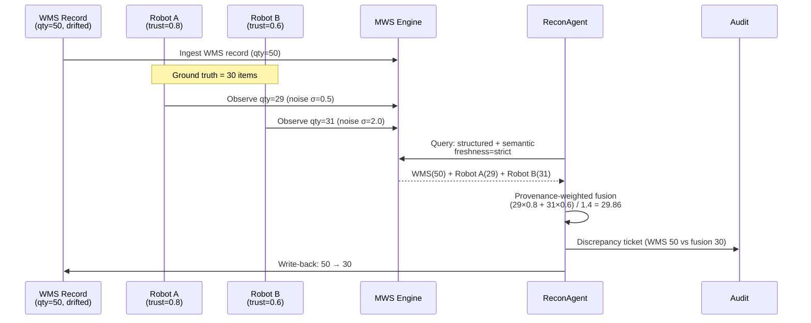

# Scenario 2: Physical vs Record Reconciliation

**CLI key**: `physical_record_reconciliation`
**Source**: `mws/scenarios/s2_physical_record_reconciliation/`

## Scenario Flow



## Purpose

Demonstrate that MWS can detect and resolve discrepancies between the physical
world (what robots observe) and the digital record of truth (what the WMS/ERP
says). In real warehouses, inventory records drift due to human error, theft,
damage, and system lag — creating "ghost inventory" (records say items exist but
they don't) or untracked assets. This scenario proves that multi-observer
robotic observations, fused with provenance-weighted trust, produce more
accurate estimates than any single data source, and that MWS can automatically
write corrections back to business systems.

## Hypotheses Under Test

- **H4 (Freshness)**: World changes cause stale hits; freshness scoring, trust
  weighting, and re-observation can recover accuracy.
- **H9 (Multi-Observer Fusion)**: Provenance-weighted fusion of multiple
  observers' estimates is more accurate than any single observer alone.

## MuJoCo World

A warehouse with inventory shelves and two inventory robots:

| Entity | Type | Position | Description |
|--------|------|----------|-------------|
| `shelf_A` | Storage | (2, 0, 1) | Primary inventory shelf (ground-truth count = 30) |
| `shelf_B` | Storage | (4, 0, 1) | Secondary shelf |
| `shelf_C` | Storage | (6, 0, 1) | Additional shelf |
| `forklift_12` | Asset | (3, 3, 0.3) | On the floor — registry says "in maintenance" |
| `robot_A` | Agent | (0, 2, 0.2) | Low-noise observer (trust = 0.8) |
| `robot_B` | Agent | (0, -2, 0.2) | Higher-noise observer (trust = 0.6) |

## Business Data (seed_memory phase)

| Source | Content |
|--------|---------|
| WMS Record | SKU-WIDGET-A on shelf_A: recorded count = **50** (drifted from truth of 30) |
| Asset Registry | forklift_12: status = `in_maintenance`, expected location = `maintenance_bay` |

## Injected Condition

1. **Observation noise**: Robot A observes count = 29 (noise sigma = 0.5,
   trust = 0.8). Robot B observes count = 31 (noise sigma = 2.0, trust = 0.6).
   Ground truth = 30.
2. **Asset status mismatch**: Robot A observes forklift_12 on the warehouse
   floor at (3, 3, 0.3), contradicting the registry status of "in_maintenance".

## Actors and Queries

### ReconAgent (ADK mock)

**Query 1 — Inventory reconciliation**: Structured + semantic + temporal indices,
filtered by `entity_id=shelf_A`, freshness = strict, projection = text + provenance.

The agent performs **provenance-weighted multi-observer fusion**:
- Weight by trust: Robot A (trust 0.8) contributes more than Robot B (trust 0.6).
- Fused estimate: `(29 * 0.8 + 31 * 0.6) / (0.8 + 0.6)` = **29.857**, rounded to **30**.
- Compares with WMS record (50): discrepancy of 20 units detected.

**Actions taken**:
1. Generate discrepancy ticket (WMS says 50, fusion says ~30, gap = 20).
2. Write back corrected count to WMS (50 → 30).
3. Generate discrepancy ticket for forklift_12 (registry says maintenance, physical says on floor).

## Metrics

### Reconciliation Accuracy
- `fusion_estimate`: The fused count from multi-observer estimates (~29.86)
- `fusion_error`: |fusion_estimate - ground_truth| = 0.14
- `best_single_error`: min(|29-30|, |31-30|) = 1.0
- `fusion_beats_single`: True (0.14 < 1.0) — **H9 confirmed**

### Write-Back
- `write_back_applied`: True
- `write_back_new_count`: 30 (matches ground truth)
- `write_back_error`: 0

### Discrepancy Detection
- `ticket_generated`: True
- `ticket_discrepancy`: 20 (WMS 50 vs physical 30)
- `n_discrepancy_tickets`: 2 (inventory + forklift)

## Success Criteria

1. Multi-observer fusion error < best single-observer error (H9).
2. Discrepancy ticket generated with correct gap value.
3. WMS write-back corrects the recorded count from 50 to 30.
4. Forklift status mismatch detected and ticketed.
5. Deterministic under the same seed.

## Acceptance Tests

| Test | Assertion |
|------|-----------|
| `test_s2_completes_mock` | Run completes in mock mode |
| `test_s2_fusion_beats_single_observer` | fusion_error < best_single_error |
| `test_s2_discrepancy_ticket_generated` | Ticket exists with discrepancy > 15 |
| `test_s2_write_back_correct` | WMS corrected from 50 to 30 |
| `test_s2_deterministic` | Same seed produces identical metrics |

## Running

```bash
uv run python -m mws.cli scenario run --name physical_record_reconciliation --seed 0
```
