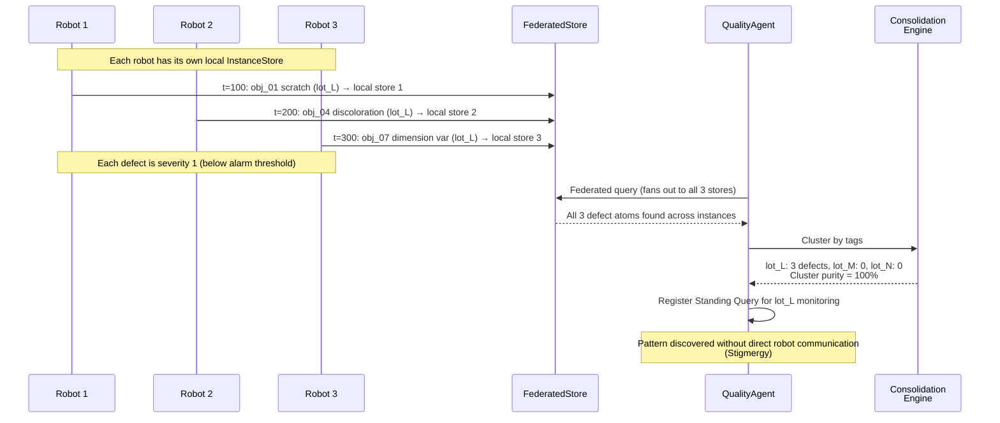

# Scenario 3: Collective Weak Signal Discovery

**CLI key**: `collective_weak_signal`
**Source**: `mws/scenarios/s3_collective_weak_signal/`

## Scenario Flow



## Purpose

Demonstrate that MWS can detect patterns that no individual robot or observation
can see on its own. In manufacturing, micro-defects on individual items appear
harmless in isolation, but when aggregated across a swarm of robots observing
different items at different times, a systemic pattern emerges — for example, a
bad lot from a specific supplier. This scenario validates MWS's ability to
consolidate episodic observations into semantic memory, correlate with business
data (MES lot records), and proactively register standing queries for ongoing
surveillance.

## Hypotheses Under Test

- **H5 (Consolidation)**: Memory consolidation (episodic-to-semantic distillation)
  preserves task-relevant recall while compressing the store. Consolidation
  surfaces patterns that individual observations miss.

## MuJoCo World

An inspection floor with 10 objects on a conveyor and 3 patrol robots:

| Entity | Type | Lot | Defective? | Position |
|--------|------|-----|------------|----------|
| `obj_01` | Object | lot_L | Yes (micro_defect) | (1, 0, 0.15) |
| `obj_02` | Object | lot_M | No | (2, 0, 0.15) |
| `obj_03` | Object | lot_N | No | (3, 0, 0.15) |
| `obj_04` | Object | lot_L | Yes (micro_defect) | (4, 0, 0.15) |
| `obj_05` | Object | lot_M | No | (5, 0, 0.15) |
| `obj_06` | Object | lot_N | No | (6, 0, 0.15) |
| `obj_07` | Object | lot_L | Yes (micro_defect) | (7, 0, 0.15) |
| `obj_08` | Object | lot_M | No | (8, 0, 0.15) |
| `obj_09` | Object | lot_N | No | (9, 0, 0.15) |
| `obj_10` | Object | lot_L | Yes (micro_defect) | (10, 0, 0.15) |
| `robot_1` | Agent | — | — | (-1, 2, 0.2) |
| `robot_2` | Agent | — | — | (5, 2, 0.2) |
| `robot_3` | Agent | — | — | (11, 2, 0.2) |

Key pattern: **All 4 defective objects belong to lot_L** (supplier_A). Lots M
and N (supplier_B) have no defects.

## Business Data (seed_memory phase)

| Source | Atoms | Content |
|--------|-------|---------|
| MES Lot Records | 10 | Each object mapped to its lot (lot_L, lot_M, or lot_N) with station and timestamp |
| Supplier Registry | 2 | supplier_A supplies lot_L; supplier_B supplies lots M and N |

**Total seed atoms**: 12

## Injected Condition

Three weak signals scattered across time and observers — each individually minor
(severity 1), but collectively revealing a systemic lot defect:

| Time | Robot | Object | Defect Type | Severity |
|------|-------|--------|-------------|----------|
| t=100 | robot_1 | obj_01 | surface_scratch | 1 |
| t=200 | robot_2 | obj_04 | discoloration | 1 |
| t=300 | robot_3 | obj_07 | dimension_variation | 1 |

No single observation triggers an alert. The pattern is only visible when
observations are consolidated across the swarm and correlated with MES data.

## Actors and Queries

### QualityAgent (ADK mock)

**Query**: Semantic + temporal + symbolic + structured indices, tags = `["defect",
"micro_defect", "quality"]`, top_k = 20, projection = aggregate.

The agent performs **lot correlation analysis**:
1. Retrieves all defect-related atoms.
2. Looks up the lot assignment for each defective object.
3. Counts defects per lot: `{lot_L: 3, lot_M: 0, lot_N: 0}`.
4. Identifies lot_L as the dominant lot (100% of defects).
5. Cross-references with supplier registry: lot_L comes from supplier_A.

**Action**: Registers a **standing query** for continuous monitoring of lot_L:
```
standing_query = {
    type: "continuous",
    target_lot: "lot_L",
    alert_threshold: 2,
    notify: "quality_team"
}
```

## Metrics

### Consolidation Quality
- `cluster_purity`: Fraction of defect observations belonging to lot_L = **1.0**
  (all 3 injected defects are lot_L).
- `lot_l_discovered`: Boolean — was lot_L identified as the dominant defect lot?
- `lot_l_recall`: What fraction of lot_L defects were retrieved?

### Retrieval Metrics
- Recall@5, Recall@10, MRR, nDCG@10 (ground-truth: atoms with entity_id in lot_L
  objects or tags matching `defect`/`micro_defect`).

### Reactive
- `standing_query_registered`: Boolean — did the agent register ongoing surveillance?

## Success Criteria

1. Consolidation surfaces lot_L as the dominant defect source (cluster purity = 1.0).
2. QualityAgent registers a standing query for lot_L monitoring.
3. Retrieval metrics show relevant defect atoms are found.
4. Deterministic under the same seed.

## Acceptance Tests

| Test | Assertion |
|------|-----------|
| `test_s3_completes_mock` | Run completes in mock mode |
| `test_s3_lot_pattern_discovered` | lot_L discovered, cluster purity = 1.0 |
| `test_s3_standing_query_registered` | Standing query registered for lot_L |
| `test_s3_deterministic` | Same seed produces identical metrics |

## Running

```bash
uv run python -m mws.cli scenario run --name collective_weak_signal --seed 0
```
