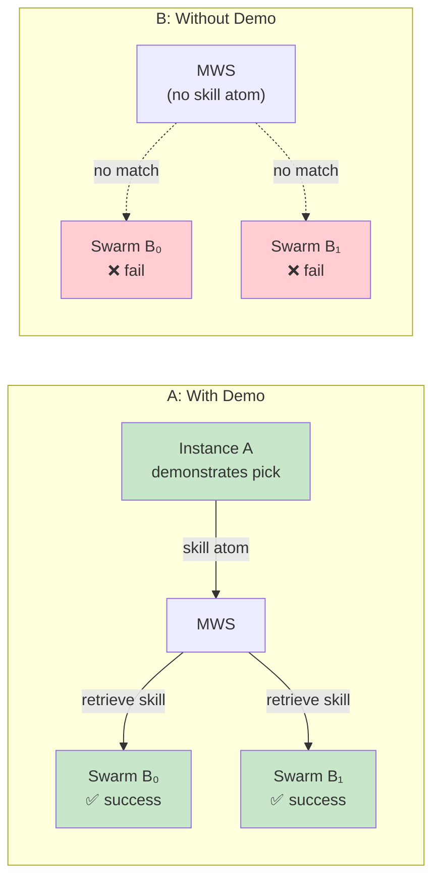

# Scenario 4: New SKU / New Site Immediate Rampup via Transfer

**CLI key**: `new_sku_rampup`
**Source**: `mws/scenarios/s4_new_sku_rampup/`

## Scenario Flow



## Purpose

Demonstrate that a single robot's skill demonstration can be immediately reused
by the entire swarm through MWS's shared memory. When a new SKU class or a new
site is introduced, the traditional approach requires each robot to be
individually programmed or taught. With MWS, one instance demonstrates the skill
once, and every other instance retrieves and reuses it — amortizing the teaching
cost across the fleet.

This scenario uses an A/B experimental design: the independent variable is
whether the skill demonstration atom is present in shared memory. Transfer gain
is the difference in success rate between the two conditions.

## Hypotheses Under Test

- **H1 (Transfer)**: Shared memory improves task performance for unexperienced
  instances. Swarm members that have never encountered sku_X100 can handle it
  successfully by retrieving a skill demo from another instance.

## MuJoCo World

A simple pick-and-place station:

| Entity | Type | Position | Description |
|--------|------|----------|-------------|
| `pick_station_A` | Station | (0, 0, 0.5) | Where items are picked from |
| `drop_station_B` | Station | (3, 0, 0.5) | Destination for sku_X100 |
| `instance_A` | Agent | (-1, 1, 0.2) | Demonstrator robot — teaches the skill |
| `swarm_B_0` | Agent | (-1, -1, 0.2) | Swarm member 0 — never seen sku_X100 |
| `swarm_B_1` | Agent | (-1, -2, 0.2) | Swarm member 1 — never seen sku_X100 |

## Business Data (seed_memory phase)

| Source | Content |
|--------|---------|
| Product Master | sku_X100: class = fragile_electronics, destination = drop_station_B, max grip force = 5N, orientation = upright |

## Injected Condition (A/B Design)

The scenario accepts a `with_demo` configuration parameter (default: True):

- **Condition A (with_demo=True)**: Instance_A's skill demonstration atom is
  ingested into MWS. The atom contains an 8-step, 6-DOF action trajectory for
  picking sku_X100, with metadata including grip force, orientation constraints,
  and destination.

- **Condition B (with_demo=False)**: No skill demonstration is available. Swarm
  members must attempt the task with no prior experience.

The `run_ab_experiment()` class method runs both conditions and computes the
transfer gain.

## Actors and Queries

### SwarmB Members (VLA — retrieval-augmented policy)

Each swarm member queries MWS independently:

**Query**: Semantic + symbolic indices, tags = `["skill_demo", "sku_X100",
"fragile_electronics"]`, top_k = 5, projection = pose + tensor.

**Outcome by condition**:
- **With demo**: Skill demo retrieved, confidence = 0.9, success = True.
- **Without demo**: No relevant skill found, confidence = 0.3, success = False.

## Metrics

### Transfer Metrics
- `success_rate_with_demo`: Fraction of swarm members succeeding with shared
  memory (expected: 1.0 — both swarm_B_0 and swarm_B_1 succeed).
- `success_rate_without_demo`: Fraction succeeding without (expected: 0.0).
- `transfer_gain`: `rate_with - rate_without` (expected: 1.0).
- `h1_confirmed`: Boolean — is transfer_gain > 0?

### Per-Condition Metrics
- `avg_confidence`: Mean VLA confidence across swarm members.
- `n_skills_retrieved`: Number of skill demos found per query.

## Success Criteria

1. Transfer gain > 0 (H1 confirmed).
2. With-demo success rate significantly higher than without-demo.
3. Swarm members retrieve and use the skill demo from instance_A.
4. Deterministic under the same seed.

## Acceptance Tests

| Test | Assertion |
|------|-----------|
| `test_s4_completes_mock` | Both conditions complete in mock mode |
| `test_s4_transfer_gain_positive` | transfer_gain > 0, with_demo_rate = 1.0, without = 0.0 |
| `test_s4_deterministic` | Same seed produces identical metrics for both conditions |

## Running

```bash
# Run with demo (default)
uv run python -m mws.cli scenario run --name new_sku_rampup --seed 0

# The scenario automatically runs both A/B conditions internally
# and reports transfer_gain in the metrics
```
