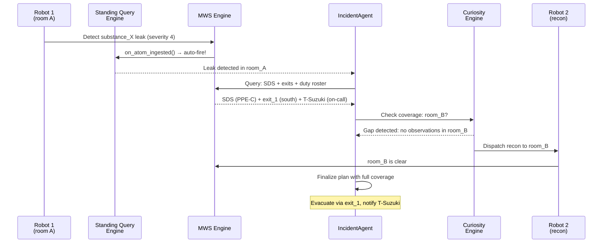

# Scenario 5: Real-Time Incident Response Coordination

**CLI key**: `incident_response`
**Source**: `mws/scenarios/s5_incident_response/`

## Scenario Flow



## Purpose

Demonstrate that MWS enables rapid, coordinated incident response by fusing
safety data sheets, building floor plans, personnel rosters, and real-time robot
observations. When a hazardous substance leak is detected, the system must
instantly retrieve critical safety information, identify the nearest exit,
determine who is on call, and coordinate multiple robots — including dispatching
a reconnaissance robot to clear an occluded area before finalizing the
evacuation plan.

This scenario exercises three key MWS mechanisms: standing queries (reactive
fire-on-condition), the curiosity loop (detecting and filling observation gaps),
and multi-instance coordination (assigning roles to the nearest available robots).

## Hypotheses Under Test

- **H6 (Curiosity Loop)**: The curiosity loop — detecting that an area has no
  recent observations and dispatching a robot to fill the gap — reduces plan
  failure rate by ensuring decisions are based on complete information.
- **H2 (Stigmergy)**: Robots coordinate indirectly through the shared memory
  store without direct communication.

## MuJoCo World

A two-room facility with exits, a chemical leak, and three robots:

| Entity | Type | Position | Description |
|--------|------|----------|-------------|
| `room_A` | Zone | (2, 2, 1.5) | Main room — leak location |
| `room_B` | Zone | (8, 2, 1.5) | Adjacent room — **occluded** by partition |
| `partition` | Obstacle | (5, 2, 1.5) | Wall separating rooms A and B |
| `leak_source` | Hazard | (2, 2, 0.3) | Substance_X container — leaking |
| `exit_1` | Exit | (0, -5, 1.2) | South exit |
| `exit_2` | Exit | (8, 0, 1.2) | East exit |
| `robot_1` | Agent | (1, 1, 0.2) | In room_A — detects the leak |
| `robot_2` | Agent | (4, 4, 0.2) | Standby — dispatched for recon |
| `robot_3` | Agent | (0, -3, 0.2) | Perimeter — monitors exit |

## Business Data (seed_memory phase)

| Source | Atoms | Content |
|--------|-------|---------|
| SDS | 1 | Substance_X: toxic, requires ventilation, PPE level C, evacuate immediately |
| Safety SOP | 1 | Chemical leak response: 8-step procedure (detect → isolate → ventilate → evacuate → decontaminate → report → investigate → resume) |
| Floor Plan | 1 | Building layout with exit_1 at (0, -5) and exit_2 at (8, 0), room_A and room_B marked |
| Duty Roster | 1 | T-Suzuki on call (08:00-20:00), T-Nakamura backup |

**Total seed atoms**: 4

## Injected Condition

1. **Leak event**: Substance_X detected in room_A. Concentration 150 ppm
   (threshold 50 ppm), severity 4. Detected by robot_1.
2. **Occluded region**: Room_B is marked as having no sensor coverage — no recent
   telemetry observations exist for this zone.

## Actors and Queries

### Standing Query (reactive trigger)

A pre-registered standing query fires when any robot detects a substance leak:
```
condition: "substance leak detected by any instance"
action: alert IncidentAgent
```

When robot_1 observes the leak, the standing query fires immediately.

### IncidentAgent (ADK mock — 8-step plan)

**Query**: Semantic + spatial + structured indices, filtered by `substance_id=
substance_X` and `region=room_A`, freshness = strict, max latency = low,
projection = text + provenance.

**Plan steps**:
1. `alert_received` — Standing query fired, leak confirmed
2. `retrieve_sds` — Get Safety Data Sheet for substance_X
3. `retrieve_exits` — Get floor plan with exit locations
4. `retrieve_roster` — Get on-call personnel (T-Suzuki)
5. `assess_coverage` — Check if all zones have recent observations
6. `dispatch_recon` — **Curiosity loop**: room_B has no coverage → dispatch robot_2
7. `recon_complete` — Robot_2 reports room_B is clear
8. `finalize_plan` — Evacuate via exit_1, notify T-Suzuki, robot_3 monitors perimeter

### Curiosity Loop (gap detection → exploration)

During step 5, the agent detects that room_B has no telemetry atoms (no recent
sensor observations). This triggers the curiosity mechanism:

1. **Gap detection**: Query for room_B observations returns empty.
2. **Exploration dispatch**: Robot_2 is sent to room_B for reconnaissance.
3. **Gap filling**: Robot_2's observation ("room_B clear, no contamination") is
   ingested as a new atom.
4. **Plan refinement**: The evacuation plan is finalized with confidence that
   room_B is safe.

## Metrics

### Reactive
- `standing_query_fired`: True — leak triggered the standing query
- `response_steps_completed`: 8/8

### Curiosity Loop
- `recon_dispatched`: True — robot_2 sent to fill room_B gap
- `gap_filled`: True — room_B observation obtained

### Plan Quality
- `plan_uses_sds`: True — evacuation plan references SDS for substance_X
- `plan_uses_exit`: True — plan identifies exit_1 as the evacuation route
- `plan_uses_roster`: True — plan notifies T-Suzuki (on-call)

### Retrieval Metrics
- Recall@5, Recall@10, MRR, nDCG@10 (ground-truth: SDS, floor plan, roster atoms)

## Success Criteria

1. Standing query fires on leak detection.
2. Curiosity loop dispatches robot_2 to the occluded room_B.
3. Final evacuation plan uses all three critical sources (SDS + exit + roster).
4. All 8 agent steps complete.
5. Deterministic under the same seed.

## Acceptance Tests

| Test | Assertion |
|------|-----------|
| `test_s5_completes_mock` | Run completes in mock mode |
| `test_s5_standing_query_fires` | standing_query_fired is True |
| `test_s5_recon_dispatched_for_gap` | recon_dispatched is True (curiosity loop) |
| `test_s5_plan_uses_all_sources` | plan_uses_sds, plan_uses_exit, plan_uses_roster all True |
| `test_s5_deterministic` | Same seed produces identical metrics |

## Running

```bash
uv run python -m mws.cli scenario run --name incident_response --seed 0
```
