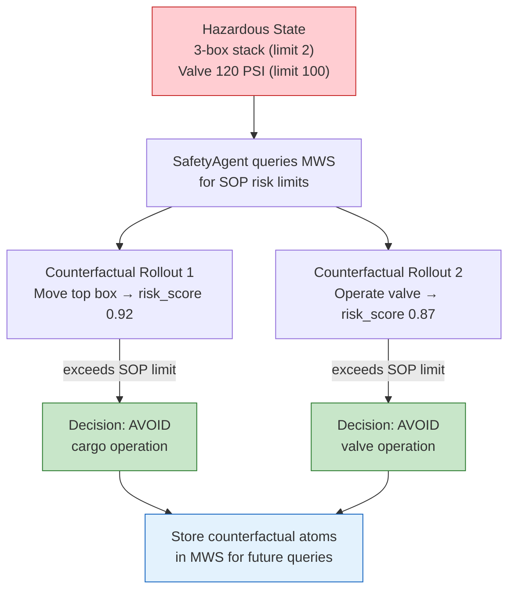

# Scenario 6: Counterfactual Simulation for Safety Decisions

**CLI key**: `counterfactual_safety`
**Source**: `mws/scenarios/s6_counterfactual_safety/`

## Scenario Flow



## Purpose

Demonstrate that MWS can prevent accidents by simulating the consequences of
proposed actions before executing them. When a robot faces a hazardous situation
(e.g., unstable stacked cargo, an over-pressurized valve), it queries MWS with
"is this operation safe?" MWS forks the MuJoCo digital twin, rolls out the
proposed action, and stores the result as a counterfactual atom. If the rollout
predicts a failure (collapse, pressure release), the robot avoids the unsafe
action. The counterfactual result atoms are stored back into MWS so that future
queries can retrieve them — the system learns from imagined futures.

This scenario demonstrates MuJoCo as a "counterfactual search backend": the
simulator doesn't just provide ground truth for evaluation, it actively
participates in the retrieval pipeline by generating "what-if" results.

## Hypotheses Under Test

- **H6 (Curiosity / Active Safety)**: The curiosity loop, extended to
  counterfactual simulation, reduces task failure rate by proactively exploring
  risky actions in simulation before committing to them.

## MuJoCo World

A hazardous workspace with two unsafe configurations:

| Entity | Type | Position | Description |
|--------|------|----------|-------------|
| `cargo_box_1` | Object | (2, 0, 0.25) | Bottom of stack (stable) |
| `cargo_box_2` | Object | (2, 0, 0.75) | Middle of stack |
| `cargo_box_3` | Object | (2, 0, 1.25) | **Top of stack — exceeds 2-box safe limit** |
| `pressurized_valve` | Equipment | (5, 0, 0.5) | Valve at **120 PSI — exceeds 100 PSI limit** |
| `safety_agent` | Agent | (0, 0, 0.2) | Mobile robot performing safety assessments |

## Business Data (seed_memory phase)

| Source | Atoms | Content |
|--------|-------|---------|
| SOP — Cargo Stacking | 1 | SOP-CARGO-STACK: Max safe stack height = 2 boxes. Exceeding causes topple hazard. |
| SOP — Valve Pressure | 1 | SOP-VALVE-PRESSURE: Max safe operating pressure = 100 PSI. Overpressure causes burst/release hazard. |
| Equipment Spec — Cargo | 1 | Cargo boxes: 5 kg each, standard dimensions |
| Equipment Spec — Valve | 1 | Pressurized valve: rated to 200 PSI (burst), safe operating max 100 PSI |

**Total seed atoms**: 4

## Injected Condition

Two hazard observation atoms are injected:

1. **Cargo stack hazard**: Current stack height = 3 boxes (max safe = 2).
   Severity 3. Topple risk confirmed.
2. **Valve pressure hazard**: Current pressure = 120 PSI (max safe = 100 PSI).
   Severity 3. Overpressure risk confirmed.

## Actors and Queries

### SafetyAgent (ADK mock)

**Query**: Semantic + structured indices, tags = `["safety", "hazard", "sop"]`,
filtered by safety-related content, projection = text + provenance.

The agent retrieves SOP limits and equipment specs, then runs two counterfactual
rollouts:

### Counterfactual Rollout 1: Cargo Stack

**Proposed action**: "Move top box from the 3-box stack."

**Simulation result**: Forked MuJoCo state → rolled out → predicted outcome:
stack collapse with 92% probability. The stack exceeds the SOP limit of 2 boxes,
and the physics simulation confirms the topple hazard.

**Decision**: `AVOID` — do not proceed. Recommend destacking from the side first.

**Result atom stored**:
```
modality: TELEMETRY (counterfactual)
text: "Counterfactual: moving top box from 3-stack → collapse predicted (92%)"
tags: [counterfactual, cargo, safety, rollout]
structured_fields: {hazard: cargo_stack, collapse_probability: 0.92, decision: AVOID}
```

### Counterfactual Rollout 2: Valve Operation

**Proposed action**: "Operate pressurized valve at 120 PSI."

**Simulation result**: Pressure exceeds safe limit → pressure release predicted
with 87% probability.

**Decision**: `AVOID` — reduce pressure below 100 PSI before operating.

**Result atom stored** similarly.

### Retrieval of Counterfactual Atoms

After storing the counterfactual result atoms, the agent queries MWS again to
verify they are retrievable. A subsequent query for "counterfactual safety
rollout cargo" returns the stored atoms — proving the system learns from
imagined futures.

## Metrics

### Safety
- `collapse_avoidance`: True — unsafe cargo action was avoided
- `all_hazards_addressed`: True — both hazard configurations handled
- `n_safety_decisions`: 2 (one per hazard)
- Per-decision: `{hazard, probability, decision (AVOID/PROCEED)}`

### Counterfactual Memory
- `counterfactual_atoms_stored`: 2 (one per rollout)
- `counterfactual_atoms_retrievable`: 2 (both found in subsequent query)

### Retrieval Metrics
- Recall@5, Recall@10, MRR, nDCG@10 (ground-truth: SOP and equipment spec atoms)

## Success Criteria

1. Both unsafe actions are identified and avoided (collapse_avoidance = True).
2. Counterfactual result atoms are stored back into MWS (2 atoms).
3. The stored counterfactual atoms are retrievable by a subsequent query.
4. Safety decisions are justified by SOP limits and simulation results.
5. Deterministic under the same seed.

## Acceptance Tests

| Test | Assertion |
|------|-----------|
| `test_s6_completes_mock` | Run completes in mock mode |
| `test_s6_unsafe_action_avoided` | collapse_avoidance is True, decisions are AVOID |
| `test_s6_counterfactual_atoms_stored_and_retrievable` | 2 atoms stored, >=1 retrievable |
| `test_s6_deterministic` | Same seed produces identical task metrics |

## Running

```bash
uv run python -m mws.cli scenario run --name counterfactual_safety --seed 0
```
