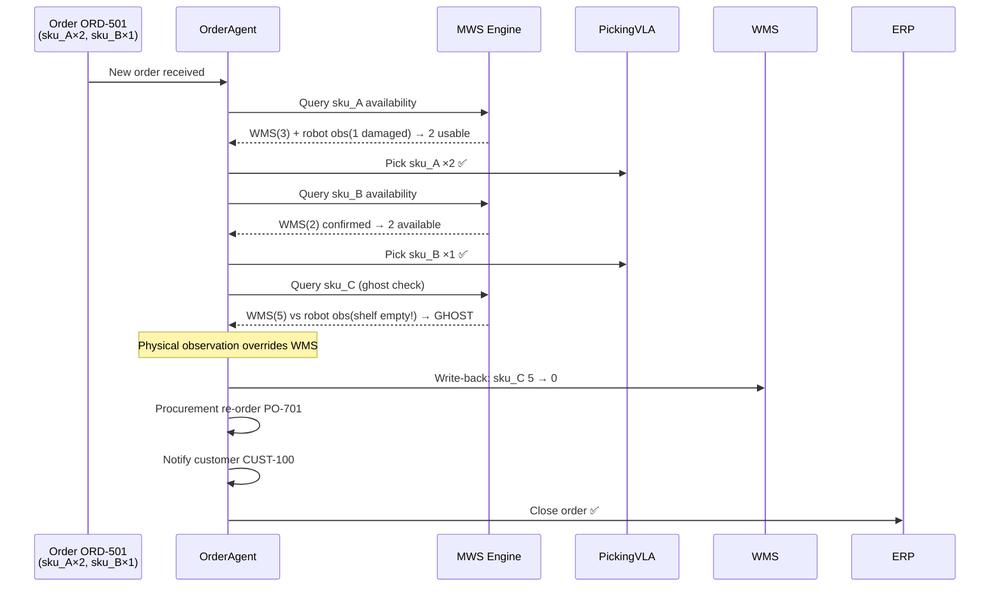

# Scenario 7: Order to Fulfillment End-to-End

**CLI key**: `order_to_fulfillment`
**Source**: `mws/scenarios/s7_order_to_fulfillment/`

## Scenario Flow



## Purpose

Demonstrate that MWS can orchestrate a complete order fulfillment workflow that
spans multiple business systems (order management, WMS, procurement, ERP) and
the physical world. The key challenge is **ghost inventory** — situations where
the Warehouse Management System records items as available, but the physical
reality is different (items are damaged, misplaced, or simply not there). MWS
resolves this by treating robot observations as a more authoritative source than
business records, automatically correcting the WMS, triggering procurement for
the shortfall, notifying the customer, and closing the ERP record.

## Hypotheses Under Test

- **H4 (Freshness)**: Physical observations with higher freshness override stale
  WMS records. The system correctly privileges recent robot observations over
  outdated digital records.
- **H8 (Consumer-Aware Projection)**: The OrderAgent receives text + provenance
  projection for decision-making, while the PickingVLA receives pose + tensor
  projection for physical manipulation.

## MuJoCo World

A warehouse with shelved SKUs and a packing station:

| Entity | Type | Position | Description |
|--------|------|----------|-------------|
| `shelf_A` | Storage | (0, 0, 1) | 3 units of sku_A (1 is damaged) |
| `sku_A_1` | Item | (0, -0.3, 0.8) | Undamaged |
| `sku_A_2` | Item | (0, 0, 0.8) | Undamaged |
| `sku_A_3` | Item | (0, 0.3, 0.8) | **Damaged** — visually discolored |
| `shelf_B` | Storage | (3, 0, 1) | 2 units of sku_B (all good) |
| `sku_B_1` | Item | (3, -0.2, 0.8) | Undamaged |
| `sku_B_2` | Item | (3, 0.2, 0.8) | Undamaged |
| `shelf_C` | Storage | (6, 0, 1) | **Empty** — ghost inventory |
| `packing_station` | Station | (9, 0, 0.8) | Order packing area |
| `picking_robot` | Agent | (-2, 0, 0.3) | Mobile robot with gripper |

## Business Data (seed_memory phase)

| Source | Atoms | Content |
|--------|-------|---------|
| WMS — sku_A | 1 | shelf_A: qty = 3 (actual: 2 usable + 1 damaged) |
| WMS — sku_B | 1 | shelf_B: qty = 2 (correct) |
| WMS — sku_C | 1 | shelf_C: qty = **5** (GHOST — physical qty = 0) |
| Product Master | 3 | sku_A (2 kg), sku_B (1.5 kg), sku_C (3 kg) |
| Order | 1 | ORD-501: sku_A x2, sku_B x1, customer = CUST-100 |

**Total seed atoms**: 7

## Injected Condition

1. **Damaged item**: Robot observes sku_A unit 3 on shelf_A is damaged
   (condition = damaged, severity = 2). Available sku_A = 2 instead of 3.
2. **Ghost inventory**: Robot observes shelf_C is physically empty. WMS records
   5 units of sku_C, but reality is 0.

## Actors and Queries

### OrderAgent (ADK mock — 9-step plan)

The OrderAgent orchestrates the entire fulfillment flow:

| Step | Action | Detail |
|------|--------|--------|
| 1. `receive_order` | Accept order | ORD-501: sku_A x2, sku_B x1 |
| 2. `check_sku_a` | Query MWS for sku_A | WMS says 3, robot sees 1 damaged → 2 available |
| 3. `pick_sku_a` | VLA picks sku_A x2 | Success — 2 undamaged units picked |
| 4. `check_sku_b` | Query MWS for sku_B | WMS says 2, confirmed available |
| 5. `pick_sku_b` | VLA picks sku_B x1 | Success |
| 6. `detect_ghost` | Query MWS for sku_C | WMS says 5, robot observation says **0** → ghost detected |
| 7. `write_back_wms` | Override WMS | sku_C: 5 → 0 (physical observation overrides) |
| 8. `trigger_procurement` | Reorder sku_C | PO-701 issued for sku_C replenishment |
| 9. `close_order` | Finalize | Customer CUST-100 notified, ERP closed |

**Query pattern**: Structured + spatial + semantic + temporal indices,
freshness = strict (ensures recent robot observations outrank stale WMS records).

### PickingVLA (retrieval-augmented policy)

Queries MWS for the physical location of items (spatial + semantic), receives
pose + tensor projection, and executes deterministic pick actions.

## Metrics

### Order Fulfillment
- `order_success`: True — sku_A x2 and sku_B x1 successfully picked and packed
- `e2e_success_rate`: 1.0 (all fulfillable line items completed)

### Ghost Inventory Detection
- `ghost_inventory_detected`: True — sku_C WMS mismatch identified
- `wms_write_back`: sku_C corrected from 5 to 0

### External System Actions
- `procurement_triggered`: True — PO-701 for sku_C replenishment
- `customer_notified`: True — CUST-100 informed of status
- `erp_closed`: True — order record finalized

### Retrieval Metrics
- Recall@5, Recall@10, MRR, nDCG@10 (ground-truth: WMS + product master +
  observation atoms matching the order SKUs)

### System Metrics
- Latency, embedding calls, bandwidth, cache stats

## Data Flow

```
Order ORD-501 arrives
  │
  ├─ Query sku_A → WMS(3) + Robot(1 damaged) → Effective: 2 ✓
  │   └─ Pick sku_A x2 → Success
  │
  ├─ Query sku_B → WMS(2) confirmed → Effective: 2 ✓
  │   └─ Pick sku_B x1 → Success
  │
  └─ Query sku_C → WMS(5) vs Robot(0) → GHOST DETECTED ✗
      ├─ Write-back WMS: 5 → 0
      ├─ Procurement: PO-701 for sku_C
      ├─ Notify customer CUST-100
      └─ Close ERP
```

## Success Criteria

1. Physical observation overrides WMS ghost inventory (sku_C: 5 → 0).
2. Procurement re-order triggered for sku_C.
3. Customer notification sent.
4. ERP record closed.
5. Order for sku_A and sku_B fulfilled despite the damaged unit.
6. Deterministic under the same seed.

## Acceptance Tests

| Test | Assertion |
|------|-----------|
| `test_s7_completes_mock` | Run completes in mock mode |
| `test_s7_ghost_inventory_detected` | ghost_inventory_detected is True |
| `test_s7_wms_write_back` | WMS corrected from 5 to 0 |
| `test_s7_procurement_and_notification` | procurement_triggered and customer_notified |
| `test_s7_deterministic` | Same seed produces identical metrics |

## Running

```bash
uv run python -m mws.cli scenario run --name order_to_fulfillment --seed 0
```
