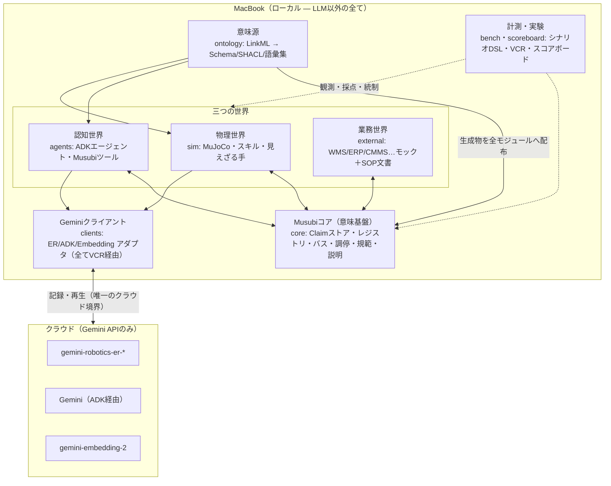
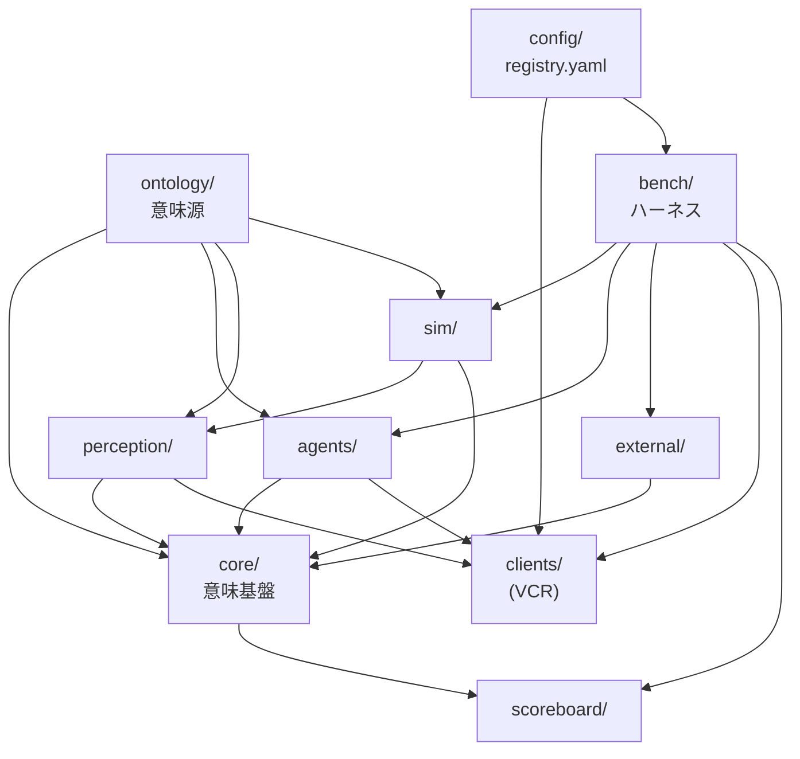
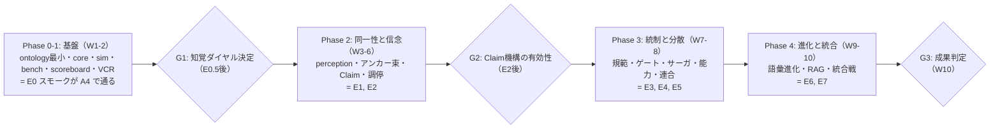
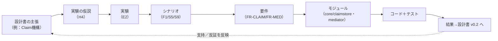

# PROJECT.md — Musubi

**ロボティクス × 業務AIエージェント × 外部システムのための共有オントロジー検証プラットフォーム**

> 本書はプロジェクト **Musubi** の全体定義（single source of truth for *what* and *why*）である。何を・なぜ作るのか、どの範囲までを対象とし、どんな構成・要件・成果・進め方で進めるのかを定義する。
>
> **本書が扱わないこと**：日々の開発の *how*（ビルド／テスト／lint コマンド、コーディング規約、ブランチ・コミット運用、Claude Code の作業手順、シナリオやモジュールの追加手順）は、別途 `CLAUDE.md` に定義する。両者の境界は §2 に明記する。迷ったら「WHAT/WHY は PROJECT.md、HOW は CLAUDE.md」。

---

## 1. プロジェクト概要

### 1.1 一言で

Musubi は、**複数のロボット・複数の業務AIエージェント・複数の外部業務システムが、同じ「意味」を共有して一つの業務を成立させる**ための共有オントロジーと、それを **MacBook 上の MuJoCo シミュレーションと Gemini API 群で検証する**ための実験プラットフォームである。本リポジトリで開発するのは、オントロジー本体（意味の定義）と、それを走らせ・測る実行環境の一式である。

### 1.2 ビジョンとミッション

- **ビジョン**：物理世界（ロボット）・認知世界（エージェント）・業務世界（基幹システム）という、存在論も時間スケールも確実性も異なる三つの世界を、単一の共有された意味の層で結ぶ。
- **ミッション（本プロジェクトの検証課題）**：そのオントロジーが「役に立つ」ことを、逸話ではなく**再現可能な実験と機械採点可能な指標**で示す。測る対象はロボットの器用さではなく、**システムの「正直さ」——信念と現実の乖離を検出し、調停し、説明する能力**である。

### 1.3 名称

「結（Musubi）」は、物理・認知・業務の三世界を*結ぶ*こと、および観測とエンティティの*結合（binding）*を中核概念とすることに由来する。オントロジーの名前空間プレフィクスは `msb:` を用いる。

### 1.4 プロジェクトの性格

- 研究プロトタイプ（production ではない）。1〜少人数＋Claude Code による開発を前提とする。
- **LLM 以外はすべてローカル（MacBook）で動かす**。クラウドに出るのは Gemini API 呼出（Robotics ER・エージェント推論・埋め込み）だけであり、その境界は一箇所（VCR、§7.3）に集約する。
- 成果物は「動くデモ」ではなく「**再利用可能なベンチマークと計測基盤**」（MusubiBench / MusubiKit）である。

---

## 2. ドキュメント体系と PROJECT.md / CLAUDE.md の境界

### 2.1 正典ドキュメント（canonical documents）

本プロジェクトは4つの正典で定義される。上位ほど「なぜ・何を」、下位ほど「どう測る・どう作る」に寄る。

| ドキュメント | 役割 | 主な読者 |
|---|---|---|
| **設計書**（Ontology Design） | オントロジーそのもの（概念・関係・アクション・アーキテクチャ・標準マッピング）の定義 | 設計者・研究者 |
| **実験計画**（Experiment Plan） | 研究方法論・リグ・実験プログラム E0〜E7・指標・統計 | 研究者 |
| **シナリオカタログ**（Scenario Catalog／結の十六景） | 検証シナリオ16本（各々が機械採点可能なベンチマーク） | 研究者・実装者 |
| **PROJECT.md**（本書） | 上記3つを束ね、プロジェクト全体（スコープ・要件・構成・成果・進め方・用語・ガバナンス）を定義 | 全員・Claude Code |

これら3つの設計文書は本書の随所から参照される。**本書と設計文書が矛盾した場合、当該領域の設計文書を正とし、本書を改訂する**（本書はそれらの上位要約ではなく、統合と運用定義である）。

### 2.2 PROJECT.md と CLAUDE.md の分担（重要）

| 観点 | PROJECT.md（本書） | CLAUDE.md（別途） |
|---|---|---|
| 問い | 何を・なぜ作るのか | どう作る・どう動かすのか |
| 内容 | ビジョン、スコープ、要件、アーキテクチャ、モジュール定義、用語（ユビキタス言語）、成果物、受け入れ基準、ロードマップ、ガバナンス、リスク | ビルド／テスト／lint／実行コマンド、コーディング規約、命名・型の実務、ブランチ／コミット／PR 運用、Claude Code の作業ルール、「シナリオを1本足す手順」「実験を1本回す手順」等の手順書 |
| 変更頻度 | 低い（プロジェクトの節目で改訂） | 高い（開発の実態に追随） |
| 安定性 | 契約に近い | 運用マニュアルに近い |

原則：**本書は「定義」までを書き、「操作」は書かない**。たとえば本書はモジュール `bench/` の責務と入出力を定義するが、`bench` の起動コマンドや依存インストール手順は CLAUDE.md に置く。本書は用語 `Claim` の意味を定義するが、`Claim` を表す Python クラスの実装規約は CLAUDE.md に置く。

---

## 3. 目的・ゴール・非ゴール

### 3.1 プロジェクトゴール（達成すれば成功）

| ID | ゴール | 測り方（詳細は §12・実験計画） |
|---|---|---|
| G1 | オントロジーを「単一意味源」としてコード化し、そこから多目的生成（スキーマ・検証・語彙集）が回る | ontology から生成物が CI で再生成でき、全モジュールが同一版を参照 |
| G2 | 三世界を結ぶ実行環境が、MacBook 上でローカル完結（LLM 呼出を除く）で動く | E0 スモークが A4 構成で通る |
| G3 | オントロジーの有効性を、素結合との差分（アブレーション A0→A4）で定量的に示す | E7 の主要評価項目でアームの階段差が有意 |
| G4 | 16シナリオのうち中核（最低フラッグシップ3本）が機械採点ベンチマークとして再現実行できる | F1・F2・F3 の oracle が自動判定で回る |
| G5 | すべての実験が再現可能である（同一シードで同一結果、API 呼出は再生可能） | VCR 再生で API 呼出ゼロ・シム bit 一致 |

### 3.2 非ゴール（明示的にやらないこと）

- **実機ロボット制御・sim-to-real 転移**は対象外。研究対象は意味層であり、シミュレータは意図的な選択（実験計画 §0.1）。将来課題（§11）に留める。
- **器用な操作（把持・組立）の研究**は対象外。荷役は理想化（weld/adhesion）し、失敗は物理ではなく確率注入で作る。
- **production 品質の非機能性**（HA、水平スケール、マルチリージョン）は対象外。単一 MacBook 上の擬似分散で足りる範囲に限る。
- **本番業務システムへの接続**は対象外。WMS/ERP/CMMS 等はすべてローカルのモックで実装する。
- **新規 LLM/埋め込みモデルの学習・微調整**は対象外。既存 Gemini API を利用する。
- **UI プロダクト化**は対象外。ダッシュボードは計測・説明のための最小限。

### 3.3 スコープの一文定義

> 「一台の MacBook 上で、MuJoCo のミニチュア倉庫世界と、Gemini を用いた業務AIエージェント群と、モックの外部業務システムを、Musubi オントロジーで結び、帳簿と現実の乖離・不可逆アクション・規範・分散といった状況に対するシステムの振る舞いを、再現可能なシナリオと機械採点指標で検証する。」

---

## 4. 背景と問題意識（要約）

三つの世界の統合が難しいのは、通信プロトコルの不一致ではなく、**四つの断層**があるためである（詳細は設計書 §1）。

| 断層 | 内容 | Musubi の答え |
|---|---|---|
| 意味 | 点群クラスタ「(12.3, 4.0) 付近」＝在庫レコード「SKU-456/ロット789」の対応が失われる | 三相アスペクト＋アンカー束＋段階的グラウンディング |
| 時間 | 制御（ms）・熟考（秒）・業務（時〜日）の時間スケールを直結すると破綻する | セマンティック・ギアボックス（集約／具体化の変速） |
| 認識 | 観測（不確実だが新鮮）・帳簿（権威的だが陳腐化）・推論（導出的）を同格の「事実」にすると矛盾で壊れる | 主張（Claim）＋信頼度減衰＋バイテンポラル＋信念調停 |
| 規範 | SOP・安全規程・契約の規則がロボット・エージェントに見えていない | ノルム搭載空間＋コンプライアンス・コンパイル＋可逆性ゲート |

オントロジーの役割は、この四断層に橋を架ける**語彙と関係を、全インスタンスが共有すること**にある。本プロジェクトは、その橋が実際に効くかを検証する。

---

## 5. システム全体像

### 5.1 境界：ローカルとクラウド



**設計上の要**：クラウド境界は `clients/`（VCR 経由）の一点に集約される。これにより、(a) 再現性（記録再生）、(b) コスト管理（キャッシュ）、(c) モデル移行（回帰比較）が一箇所で成立する。

### 5.2 三つの実行ループ（時間スケールの分離）

Musubi は制御・熟考・業務の三ループを直結させない。層の間に集約（上り：観測→イベント→エピソード→ケース）と具体化（下り：注文→目標→タスク→スキル呼出）の変速段を置く（詳細は設計書 §1.3）。この分離は本プロジェクトの実装境界そのものであり、「センサ生データは `sim/` に留まり、意味を持った瞬間に `core/` のバスへイベントとして上がる」という規律で表れる。

---

## 6. コンポーネント／モジュール定義

各モジュールは「責務・主な入出力・主な内部要素・依存」で定義する（実装の *how* は CLAUDE.md）。モジュールは概ね疎結合で、依存の向きは §6.2 の図に従う。

### 6.1 モジュール一覧

| モジュール | 責務（一言） | 主な入力 | 主な出力 |
|---|---|---|---|
| `ontology/` | 唯一の意味源。概念・関係・アクションを定義し、多目的生成物を吐く | LinkML ソース | JSON Schema・SHACL・NL語彙集・型ライブラリ |
| `core/` | 意味基盤。信念・同一性・調停・規範・説明を担う | イベント・主張・要求 | 有効 Claim・調停結果・検証可否・説明 |
| `sim/` | 物理世界。MuJoCo 世界・スキル・撹乱・レンダリング | スキル呼出・撹乱指示 | 観測・イベント・真値・レンダ画像 |
| `perception/` | 知覚。真値／ER から Claim を作る（ダイヤル切替） | レンダ画像・真値 | DetectedObject 等の Claim |
| `agents/` | 認知世界。計画・調停判断・文書処理・委任 | 目標・文脈・道具 | 計画・アクション・主張・委任 |
| `external/` | 業務・社外システムのモックと文書コーパス | API 呼出 | 帳簿・通知・文書・ポータル応答 |
| `clients/` | Gemini（ER/ADK/Embedding）アダプタ。VCR を内包 | 正規化リクエスト | 応答（記録 or 再生） |
| `bench/` | 実験ハーネス。シナリオ展開・実行・シード・VCR | シナリオDSL | ラン成果物（イベント・Claim・カセット・真値） |
| `scoreboard/` | 計測。指標算出・ダッシュボード・レポート | ラン成果物 | 指標・可視化・レポート |
| `config/` | 構成の一元管理（モデルID・単価・予算・ダイヤル既定） | — | 設定（全モジュール参照） |

### 6.2 モジュール依存関係



**依存の原則**：`ontology/` は全モジュールの上流（誰も ontology に依存されるが、ontology は何にも依存しない）。`clients/` はクラウドへの唯一の出口。`bench/` はオーケストレータであり各世界を駆動する。`scoreboard/` は読み取り専用の観測者（本番経路に副作用を持たない）。循環依存は禁止。

### 6.3 主要な内部インターフェース（定義のみ・実装は CLAUDE.md）

- **意味エンベロープ**：モジュール間メッセージは JSON-LD エンベロープを携行する（`@context` は ontology 生成物、詳細は設計書 §5.5）。`sim/`⇄`core/` の境界はこのエンベロープで話す。
- **Claim API**：`core/claimstore` は「主張の追加・置換（supersede）・有効主張の照会・バイテンポラル照会」を提供する。削除は行わない（追記のみ）。
- **アクション契約**：`sim/skills` と `agents/tools` の各アクションは、事前条件・期待効果・失敗モード・補償・可逆性クラスをメタデータとして持つ（アクション統一モデル、設計書 §3.1）。
- **検証ゲート**：`agents/` が生成した計画は、実行前に `core/norms` の SHACL 検証・規範チェック・可逆性ゲート・資源予約を通る。
- **クライアント境界**：`clients/` は Gemini 三種を単一の記録再生インターフェースで包む。`bench/` はモード（record／replay／passthrough）を選ぶ。

---

## 7. 外部依存とインテグレーション境界

### 7.1 ランタイム／主要ライブラリ

| 対象 | 選定 | 備考 |
|---|---|---|
| OS | macOS（Apple Silicon 想定） | 対話ビューアは `mjpython` 必須（下記） |
| 言語 | Python 3.11+ | 主要言語 |
| 物理 | `mujoco`（Python バインディング） | オフスクリーンは `mujoco.Renderer`（RGB/深度/セグメンテーション） |
| エージェント | `google-adk`（ADK） | `LlmAgent`＋カスタム FunctionTool 中心 |
| LLM/埋め込み | `google-genai` | ER・埋め込みの呼出 |
| 保存 | SQLite（Claim・カセット・埋め込みキャッシュ）、DuckDB（指標集計） | ローカル完結 |
| 業務モック | FastAPI＋SQLite | WMS/ERP 等のポータル |
| 検証 | SHACL（pySHACL 等）・JSON Schema | ontology 生成物 |

> macOS 固有：`viewer.launch_passive()`（対話ビューア）は `mjpython` ランチャを要する。ヘッドレスのバッチ実行（`mj_step` ループ・`Renderer` によるオフスクリーン）は通常の `python` でよい。デモ録画は `mjpython`、実験ランは `python`、という使い分け。

### 7.2 Gemini モデル（クラウド）

| 用途 | モデル | 本プロジェクトでの扱い |
|---|---|---|
| ロボティクス知覚・空間推論 | `gemini-robotics-er-1.6-preview`（執筆時の最新。**ER 2 公開時は `config/registry.yaml` の差し替えで移行**） | 指差し（正規化 `[y,x]` 0–1000）・箱・軌道・空間質問。pixel→world はシム深度で持ち上げ（実験計画 §4.2） |
| エージェント推論 | ADK 経由の Gemini（モデルIDは registry で固定） | 計画・調停判断・文書処理。組込みツールとカスタムツールの混在は避ける |
| 埋め込み | `gemini-embedding-2`（マルチモーダル、MRL 次元可変、切詰め自動正規化） | 視覚アンカー（画像埋め込み）・エンティティ連結RAG・ギャップクラスタリング。既定次元 768、`gemini-embedding-001` とは空間非互換のため混在禁止 |

**モデルIDは決してソースにハードコードしない**。すべて `config/registry.yaml` に集約し、全 Claim/ラン記録にモデルID・thinking budget 等を来歴として残す。これがモデル移行を「アップグレード」ではなく「回帰実験」として扱えるようにする（実験計画 M3）。

### 7.3 クラウド境界＝ VCR（single choke point）

`clients/` は Gemini 三種すべてを **LLM VCR**（記録再生プロキシ）で包む。`hash(モデルID, 正規化リクエスト) → 応答` を SQLite に保存し、同一入力は再生（API に出ない）。これが本プロジェクトの再現性・コスト・移行管理の要（実験計画 §3.3）。**Gemini を直接呼ぶコードを `clients/` の外に書かない**ことをアーキテクチャ規約とする。

### 7.4 認証・秘密情報（定義）

- API キーは環境変数（`.env`、コミット禁止）。本書は「秘密はリポジトリに置かない・`config/registry.yaml` にキー実体を書かない」という*方針*を定義する。取得・設定の*手順*は CLAUDE.md。
- ネットワーク到達先は Gemini エンドポイントのみ。それ以外の外部通信は設計上存在しない（外部システムは全ローカルモック）。

---

## 8. ユビキタス言語（用語集）

オントロジー・プロジェクトにとって用語の共有は付随物ではなく**中核成果物**である。以下は全ドキュメント・全コード・全エージェントプロンプトで一貫して使う語彙の定義（正典は設計書）。コードの識別子・イベント型・API 名はこの語彙に従う。

### 8.1 オントロジー中核概念

| 用語 | 定義 |
|---|---|
| Entity | 同一性（不変の IRI）を持つあらゆるもの（物・人・場所・設備・組織・情報物） |
| Aspect（三相） | エンティティの投影。PhysicalAspect（観測される顔）／CognitiveAspect（推論上の顔）／BusinessAspect（帳簿上の顔）。三相が揃うのは前提でなく達成目標 |
| Authority | アスペクト×範囲ごとに宣言される記録系（System of Record）。「エンティティ全体のマスタ」は存在しない |
| Anchor（アンカー束） | 同一性の手がかり。物理（タグ・外観埋め込み）／空間（位置＋時刻）／業務キー（SKU・シリアル）を束ねて保持 |
| IdentityBinding | 観測（TrackedObject）とエンティティの、信頼度・根拠付きで**撤回可能**な結合イベント |
| Claim | 世界状態の言明。出所（source）・方法（method）・信頼度（confidence）・時刻（valid/transaction）・レルム付き。事実を直接持たず、常に「誰かの主張」 |
| Realm（レルム） | 主張が属する世界：real／simulated／planned／hypothetical。同一グラフに共存し差分クエリ可能 |
| Confidence Decay | 主張種別ごとの信頼度の時間減衰。調停の入力になる（位置は数分、所有は取引まで、など） |
| Belief Mediation（信念調停） | 矛盾する Claim の裁定（権威×減衰調整後信頼度×方法格付け）。敗者は削除せず supersede |
| Action | 世界を変える行為の抽象。事前条件・期待効果・失敗モード・補償・可逆性クラス・コスト・資源要求を持つ |
| Skill / Tool / WorkflowStep | Action の各世界での実装（ロボットスキル／エージェントのツール／業務ステップ）。統一モデルで同一に扱う |
| Realization（実現多相性） | 同一抽象アクションの複数の実現：PhysicalRealization／InformationalRealization／HumanRealization |
| ReversibilityClass | reversible／compensable／irreversible。不可逆性が自律度と承認要件を決める |
| Compensation / Saga | 補償アクションと、それを繋いだ物理サーガ（補償ベースの分散実行） |
| Capability / Requirement | アクターが公告する能力と、タスクの要求。マッチングは包摂推論 |
| Norm（規範） | 義務・許可・禁止。適用範囲・強度（hard/soft）・出所文書リンク（normSource）を持つ |
| Delegation / Contract | 委任と合意。連鎖して説明責任チェーン（Accountability Chain）を作る |
| Goal / Task / Plan | 宣言的目標／割当可能な作業／アクションの順序構成 |
| Frame / Zone / Route | 座標系（変換も Claim）／意味と規範を持つ空間／接続 |
| Affordance | 対象が提供する行為可能性（知覚と行為の橋、実現多相性の基盤） |
| Event / Episode / Case | 意味を持つ状態変化／目的を持つ活動1回／業務単位の物語。物語的集約の三層 |
| Exception | 期待からの逸脱と対応経路（リトライ→再計画→委任変更→人間） |

### 8.2 プロジェクト／リグ固有の用語

| 用語 | 定義 |
|---|---|
| MusubiWorld | MuJoCo 上のミニチュア倉庫世界（micro-warehouse）。検証の物理舞台 |
| Invisible Hand（見えざる手） | 帳簿と現実の乖離を再現可能に製造する撹乱装置（move/swap/remove/degrade_tag/spawn_unknown/churn） |
| Perception Dial（知覚ダイヤル） | 知覚の出どころを oracle／hybrid／live で切替える装置。意味層の実験を知覚性能から分離する |
| Epistemic Scoreboard（認識的スコアボード） | 真値と Claim を常時突合する主計器（信念正解率 BA・較正誤差 ECE・鮮度・MTTC 等） |
| LLM VCR | 全 Gemini 呼出の記録再生プロキシ（`clients/`）。再現性・コスト・モデル移行の要 |
| Cassette（カセット） | VCR が保存する記録の単位（リクエストハッシュ→応答） |
| Ablation Ladder（A0–A4） | オントロジー機能を段階有効化した実験アーム（A0素結合／A1意味エンベロープ／A2Claim／A3規範・安全／A4フル） |
| Oracle（オラクル） | シナリオの成否を機械採点する条件（シム真値・SHACL・植え付けた正解） |
| Gap Event（ギャップイベント） | 既存語彙で表現できない事象の検出。語彙進化の起点 |
| Scenario DSL | シナリオを宣言的に記述する YAML（初期世界・帳簿・撹乱・故障・oracle・アーム・反復） |
| Semantic Observability | Case/Episode の IRI をトレースIDとして注文→モーターまでを一本で辿る可観測性 |

---

## 9. データとアーティファクトの定義

本プロジェクトが生み・扱うデータ資産と、その置き場所・寿命・正典性。

| アーティファクト | 実体 | 置き場所 | 寿命・正典性 |
|---|---|---|---|
| オントロジー・ソース | LinkML スキーマ | `ontology/src/` | **意味の正典**。Git 管理・SemVer |
| オントロジー生成物 | JSON Schema・SHACL・NL語彙集・型 | `ontology/generated/`（Git 管理） | ソースから再生成可能だが**再現性のためコミットする** |
| Claim ストア | バイテンポラルな主張 | SQLite（ランごと） | ランの成果物。追記のみ（削除しない）。監査・フォレンジックの源 |
| 真値スナップショット | `qpos` 由来のエンティティ状態 | ランごと | 採点用の神視点。研究専用（システムからは不可視） |
| カセット | Gemini 呼出の記録 | SQLite（共有） | 再現・回帰・コスト削減の資産。モデルID別 |
| 埋め込みキャッシュ | ベクトル | SQLite（共有） | `hash(モデル,次元,内容)→ベクトル`。二重課金の防止 |
| シナリオ | Scenario DSL（YAML） | `bench/scenarios/` | ベンチマークの正典。シード込みで再現可能 |
| SHACL シェイプ | 受け入れ判定（例 world_ok.ttl） | `ontology/shapes/` | oracle の一部 |
| 文書コーパス | SOP・マニュアル・図説明＋正解アノテーション | `external/docs/` | 規範コンパイル・RAG の評価正解 |
| ラン成果物 | イベント・エピソード・指標 | `scoreboard/`（DuckDB） | 分析対象。ラン ID で追跡 |
| 事前登録 | 仮説・指標・停止規則 | `bench/PREREG.md` | 実行前にコミット。研究の自己拘束 |
| レポート | 実験結果・図表 | `scoreboard/reports/` | 成果物（§12） |

**データ規律（定義）**：Claim は追記のみ・削除しない。真値スナップショットは採点専用でシステム経路に混ぜない。秘密情報（APIキー）はいずれの成果物にも含めない。人物の同定情報は保存しない（§10 NFR-P）。

---

## 10. 要件定義

要件は機能要件（FR）と非機能要件（NFR）に分け、各々を**検証手段（実験 E・シナリオ）に対応付ける**（トレーサビリティは §15）。

### 10.1 機能要件（FR）

| ID | 要件 | 主担当モジュール | 検証 |
|---|---|---|---|
| FR-ONT | オントロジーを単一ソースから定義し、スキーマ・SHACL・語彙集・型を生成・配布できる | ontology | E0 |
| FR-SIM | MuJoCo 世界を構築し、スキル実行・失敗注入・見えざる手による撹乱・多視点レンダ（RGB/深度/セグメンテーション）ができる | sim | E0, E0.5 |
| FR-PER | 知覚ダイヤル（oracle/hybrid/live）を切替え、ER 指差しを pixel→world で Claim 化できる | perception, clients | E0.5, E1 |
| FR-CLAIM | 主張を出所・信頼度・時刻・レルム付きで格納し、減衰・バイテンポラル照会・置換ができる | core/claimstore | E2, E5 |
| FR-MED | 矛盾主張を権威×信頼度×方法で調停し、是正イベントと下流無効化を発行できる | core/mediator | E2 |
| FR-ID | アンカー束で同一性を段階的に結合し、撤回・下流再検証ができる | core/registry, perception | E1 |
| FR-ACT | スキル・ツール・業務ステップを統一アクションとして実行し、可逆性クラス・補償・サーガを扱える | sim/skills, agents/tools, core | E3 |
| FR-GATE | 計画を実行前に SHACL・規範・可逆性ゲート・資源予約で検証できる | core/norms | E3 |
| FR-NORM | 文書から規範をコンパイルし、計画時・実行時にチェックできる | agents, core/norms | E6b |
| FR-CAP | 能力を公告・照会・マッチングし、能力から道具定義を自動生成できる（新機体はコード0行で追加） | core/registry, agents/capability_compiler | E4 |
| FR-AGENT | ADK エージェントが目標分解・計画・調停判断・委任・文書処理を行える | agents, clients | E7 |
| FR-EXT | 外部業務システム（WMS/ERP/CMMS 等）とポータル（監査/当局/保険等）をモックし、意図的な帳簿乖離を張れる | external | 各シナリオ |
| FR-BUS | 意味エンベロープでインスタンス間連携し、遅延・欠落・分断を注入できる | core/bus | E5 |
| FR-RAG | 文書をエンティティ連結で索引し、グラフ近傍拡張検索と条項 IRI 引用ができる | agents, external/docs | E6c |
| FR-EVOLVE | ギャップ検出→クラスタリング→定義起草→承認→再配布の語彙進化ループを回せる | agents, ontology | E6a |
| FR-BENCH | シナリオ DSL を展開し、シード・アームを制御して再現実行できる | bench | 全実験 |
| FR-VCR | 全 Gemini 呼出を記録・再生・回帰比較できる | clients/vcr | 全実験 |
| FR-SCORE | 真値と信念を突合し、指標算出・可観測性・レポート生成ができる | scoreboard | 全実験 |

### 10.2 非機能要件（NFR）

| ID | 要件 | 基準（定義） |
|---|---|---|
| NFR-REPRO | 再現性 | 同一シード（シム初期状態＋失敗注入＋見えざる手）＋VCR 再生で、シム軌跡が bit 一致し API 呼出ゼロ |
| NFR-DETERM | 決定性 | シミュレーションは決定論的（同一入力→同一結果）。非決定は LLM のみに局在させ VCR で固定可能にする |
| NFR-COST | コスト統制 | 全 Gemini 呼出が `config/registry.yaml` の単価・日次上限で計上され、上限超過で停止。カセット・埋め込みキャッシュで再課金しない |
| NFR-LOCAL | ローカル完結 | LLM 呼出を除く全機能がオフラインで動作。ネットワーク到達先は Gemini のみ |
| NFR-DEGRADE | 縮退耐性 | クラウド到達不能・バス分断下でも、エッジのローカル世界モデルで安全動作を継続し、復帰後に整合マージできる |
| NFR-TRACE | 追跡性 | すべての物理アクションが説明責任チェーン（justifiedBy）で業務根拠まで遡れる |
| NFR-P（プライバシー） | 人物非同定 | センサに映る人物は既定で IdentityBinding を禁止。匿名の所在・姿勢のみを扱い、人物同定情報を保存しない |
| NFR-SEC | セキュリティ | インスタンス間 Claim は署名可能。委任は能力トークンで表現。信頼できない外部入力は不可逆アクションの単独根拠にしない |
| NFR-EXT | 拡張性 | 新ロボット・新シナリオ・新外部系の追加が、既存コード変更を最小化（能力公告・DSL・モック追加）で済む |
| NFR-OBS | 可観測性 | Case/Episode 単位で、関与した全インスタンスの全アクションを一つのトレースで閲覧できる |
| NFR-PORT | 可搬性 | 単一 MacBook（Apple Silicon）で全実験が完走できる規模に収める |

### 10.3 制約と前提

- 単一 MacBook。擬似分散（複数プロセス）はするが物理的には1台。
- Gemini API はレート制限・課金・（ER は）プレビュー仕様変更がありうる（→ §16 リスク）。
- 荷役は理想化、失敗は確率注入（物理チューニングを研究対象にしない）。
- シーンはミニチュア。規模の一般化は主張しない（外的妥当性の限界を明示）。

---

## 11. マイルストーンとロードマップ

実験計画の10週計画（Go/No-Go ゲート付き）に対応する。各フェーズは「動くもの」で終わる。



| フェーズ | 主に立ち上がるモジュール | 完了の定義（Definition of Done） | 対応実験／シナリオ |
|---|---|---|---|
| Phase 0-1 基盤 | ontology(最小30概念)・core・sim・bench・scoreboard・clients | E0 スモークが A4 で通り、トレース完全性 ≥95%・シム再現 bit 一致・VCR 再生でAPI呼出ゼロ | E0 |
| G1 ゲート | perception | E0.5 で知覚ダイヤル既定を決定（live/hybrid/oracle）。**中止でなく配分ゲート** | E0.5 |
| Phase 2 同一性と信念 | perception・core/mediator・core/registry | アンカー束 F1 が単独を上回る／減衰較正済み調停が固定規則を下回る | E1, E2 ／ F1, S5, S9 |
| G2 ゲート | — | H4（Claim 機構の有効性）を判定。不成立なら「効かない条件の特定」に方針転換も可 | E2 |
| Phase 3 統制と分散 | core/norms・agents/capability_compiler・core/bus | 三重圧力下で未承認不可逆0件／新機体コード0行追加／120s分断で二重実行0 | E3, E4, E5 ／ F2, S2-S4, S6-S8 |
| Phase 4 進化と統合 | agents(RAG/進化)・ontology(進化) | 語彙進化ループが一巡／統合戦でアームの階段差が出る | E6, E7 ／ C1-C4 |
| G3 判定 | scoreboard/reports | 技術レポート＋デモ3本＋MusubiBench 公開判断 | — |

推奨する最初の実装航路（シナリオ側）：**F1 → S5 → F2**（リグ差分が小さく、対外説明力が高い順。シナリオカタログ §5）。

---

## 12. 成果物と受け入れ基準

### 12.1 成果物（deliverables）

| # | 成果物 | 内容 |
|---|---|---|
| D1 | **MusubiKit** | 再利用可能なライブラリ：Claim ストア・調停器・能力コンパイラ・VCR・意味エンベロープ |
| D2 | **MusubiBench** | シナリオ DSL・oracle・SHACL シェイプ・シード集（16景の実行可能版） |
| D3 | Epistemic Scoreboard＋ダッシュボード | 指標算出と意味的可観測性の可視化 |
| D4 | 技術レポート | 仮説台帳（実験計画 §6.2）への回答。アブレーション結果と効果量 |
| D5 | デモ動画3本 | UC1 物語（帳簿矛盾→検証→再結合）／文書→規範→行動／Day-0 オンボーディング |
| D6 | 設計書 v0.2 | 各実験が支持／反証した設計判断の対応表付き改訂版 |

### 12.2 主要評価項目（primary endpoints、事前登録対象）

統合戦 E7（＝実運用の縮図）で事前登録し、A0→A4 の階段で評価する（数値は E0 実測後に確定）。

1. **注文遂行率**（A4 が A0 比で有意に高い）
2. **未承認不可逆アクション件数 = 0**（A3/A4 で必達）
3. **人間介入回数**
4. **トークン/意思決定**（A4 が A0 比で低い＝文脈経済の改善）

副次：MTTC、説明チェーン完全性、IRI 幻覚率、総コスト。

### 12.3 プロジェクト全体の受け入れ基準

§3.1 のゴール G1〜G5 がすべて満たされ、フラッグシップ3シナリオ（F1/F2/F3）が機械採点で再現実行でき、技術レポート（D4）が仮説台帳の各行に「支持／反証／保留」を根拠付きで返している状態。

---

## 13. リポジトリ構成

```
musubi/
├── ontology/              # L0: 唯一の意味源
│   ├── src/               #   LinkML スキーマ（概念・関係・アクション）
│   ├── generated/         #   生成物（JSON Schema/SHACL/NL語彙集/型）※Git管理
│   └── shapes/            #   SHACL シェイプ（world_ok.ttl 等）
├── core/                  # Musubi コア（意味基盤）
│   ├── claimstore/        #   Claim ストア（SQLite・バイテンポラル・減衰）
│   ├── mediator/          #   信念調停器
│   ├── registry/          #   エンティティ／能力レジストリ・権威マトリクス
│   ├── norms/             #   規範ストア＋検証ゲート
│   ├── bus/               #   イベントバス（JSON-LD エンベロープ・toxic モード）
│   └── explain/           #   説明サービス
├── sim/                   # 物理世界
│   ├── worlds/            #   MJCF シーン（micro_warehouse.xml…）
│   ├── skills/            #   半理想化スキル＋失敗注入
│   ├── invisible_hand/    #   乖離製造装置
│   └── render/            #   オフスクリーンレンダラ（RGB/深度/セグメンテーション）
├── perception/            # 知覚ダイヤル（oracle|hybrid|live）・pixel→world・ER アダプタ
├── agents/                # 認知世界（ADK）
│   ├── <role>/            #   履行・フリート・保全等のエージェント
│   ├── tools/             #   Musubi ツール（entity_resolve/claim_query/norm_check…）
│   └── capability_compiler/ # 能力→ADK/MCP ツール定義
├── external/              # 業務・社外システムのモック
│   ├── wms/  cmms/  hr/  ec/  ...   # 帳簿・保全・人事・EC 等
│   ├── portals/           #   監査・当局・保険・DR 等の対外ポータル
│   └── docs/              #   SOP コーパス＋エンティティ連結 RAG 索引＋正解
├── clients/               # Gemini アダプタ（ER/ADK/Embedding）※VCR を内包
│   └── vcr/               #   記録再生（record|replay|passthrough）
├── bench/                 # 実験ハーネス
│   ├── scenarios/         #   シナリオ DSL（YAML）
│   ├── runner/            #   ランナー・シード管理
│   └── PREREG.md          #   事前登録
├── scoreboard/            # 計測
│   ├── metrics/           #   指標クエリ（DuckDB）
│   ├── dashboard/         #   意味的可観測性（HTML）
│   └── reports/           #   レポート生成
├── config/
│   └── registry.yaml      # モデルID・単価・日次予算・ダイヤル既定
├── PROJECT.md             # 本書（プロジェクト全体定義）
└── CLAUDE.md              # 開発運用（別途・後続で作成）
```

> ディレクトリ構成は §6.2 の依存方向と一致する。詳細なパッケージ規約・命名・テスト配置は CLAUDE.md。

---

## 14. 環境と構成管理（定義）

- **構成の一元化**：モデルID・thinking budget 既定・API 単価・日次予算・知覚ダイヤル既定・許容誤差などの**可変値は `config/registry.yaml` に集約**する。コードに定数を散らさない。全ラン記録に、その時点の設定スナップショットを残す。
- **秘密情報**：API キーは環境変数（`.env`、コミット禁止）。registry にキー実体を書かない。
- **オントロジー版の追跡**：どのモジュール・どのランがオントロジーのどの版で動いているかを記録し、混在時の互換を管理する（§15）。
- **シードの三点管理**：MuJoCo 初期状態・失敗注入乱数・見えざる手時刻表を束ねてシードとして扱い、DSL に明記する。

> セットアップ手順・依存インストール・`mjpython` の使い分けの具体コマンド・`.env` の作り方は **CLAUDE.md**。本書はここまで（何を一元管理し、何を秘匿するか）を定義する。

---

## 15. ガバナンスとトレーサビリティ

### 15.1 オントロジー変更管理

- オントロジーは Git 管理・**セマンティックバージョニング**。破壊的変更はメジャー更新。生成物は CI で再生成し差分を検証。
- 変更は「提案（文書・ギャップから起草）→ 影響分析（使用インスタンス一覧）→ レビュー → リリース → 段階配布」。**生きたオントロジー**（ギャップ駆動の進化、C1/E6a）はこの経路に乗せる。
- 語彙の欠落（Gap Event）は捨てず、進化の入力として記録する。

### 15.2 研究の規律

- **事前登録**（`bench/PREREG.md`）：仮説・主要評価項目・除外規則・停止規則を実行前にコミット。
- **決定ログ**：設計判断（RDF vs PG、推論の深さ等）と実験からのフィードバックを記録し、設計書 v0.2 に反映。

### 15.3 トレーサビリティ・チェーン（本プロジェクトの背骨）

Musubi 自身の思想（すべてのアクションは説明可能）を、プロジェクト管理にも適用する。



各設計判断 → 仮説 → 実験 → シナリオ → 要件 → モジュール → コード が一本の鎖で辿れることを、本プロジェクトの品質規律とする。この対応表（trace matrix）は `scoreboard/reports/` で維持する。

---

## 16. リスクと前提（プロジェクトレベル）

| 分類 | リスク | 影響 | 緩和 |
|---|---|---|---|
| 技術 | ER が合成画像で精度不足 | 知覚系シナリオが弱る | E0.5 を最優先ゲートに。ダイヤルで oracle/hybrid に退避しても研究は前進（G1 は配分ゲート） |
| 技術 | ER プレビュー仕様変更／ER 2 への移行 | 呼出が壊れる | モデルID を registry に固定・`clients/` に抽象境界・VCR 回帰（M3） |
| 運用 | API レート制限・課金超過 | 実験停止・コスト膨張 | 429 リトライ＋レートリミッタ＋日次予算ガード＋停止規則。カセット再生でアーム増でも知覚コスト不変 |
| 運用 | 基盤づくりに時間が溶ける | 研究に届かない | E0 を2週で打ち切り、以降は毎週「仮説台帳のどの行が動いたか」で進捗管理 |
| 妥当性 | 合成/ミニチュアの外挿限界 | 結論の一般化不可 | 主張のスコープを明示（意味層の結論を知覚・規模から分離）。限界を成果に併記 |
| 妥当性 | アーム間の交絡（プロンプト量差等） | 効果量の解釈が濁る | 共通テンプレート・隣接アーム比較・トークン量を共変量化（実験計画 §8） |
| スコープ | 機構の盛り込みすぎ | 完成しない | 最小30概念から。§3.2 非ゴールを厳守。シナリオはリグ差分の小さい順 |

**主要な前提**：Gemini API（ER・ADK・埋め込み）が利用可能であること／MacBook が全実験を完走できる規模に問題を収められること／荷役の理想化と失敗の確率注入が研究の妥当性を損なわないこと（実験計画 §8 で感度分析）。

---

## 17. 参照

- 正典設計文書：設計書（Ontology Design）／実験計画（Experiment Plan）／シナリオカタログ（結の十六景）。本書はこれらを統合・運用定義する。
- 開発運用：`CLAUDE.md`（後続で作成。コマンド・規約・手順）。
- 外部標準（設計書 §6 に対応表）：W3C SOSA/SSN・PROV-O・OWL-Time・SHACL・QUDT、GS1 EPCIS 2.0、AAS/OPC UA、ROS 2/VDA 5050/Open-RMF、MCP・A2A、LinkML・CloudEvents。
- 外部API：MuJoCo Python バインディング、Gemini Robotics（ER）、Gemini ADK、Gemini Embedding。モデルID の実値は `config/registry.yaml` を正とする。

---

*本書はプロジェクト全体定義 v0.1 である。開発の具体（HOW）は CLAUDE.md に切り出す。両書と3つの正典設計文書が、Musubi の完全な定義を成す。*