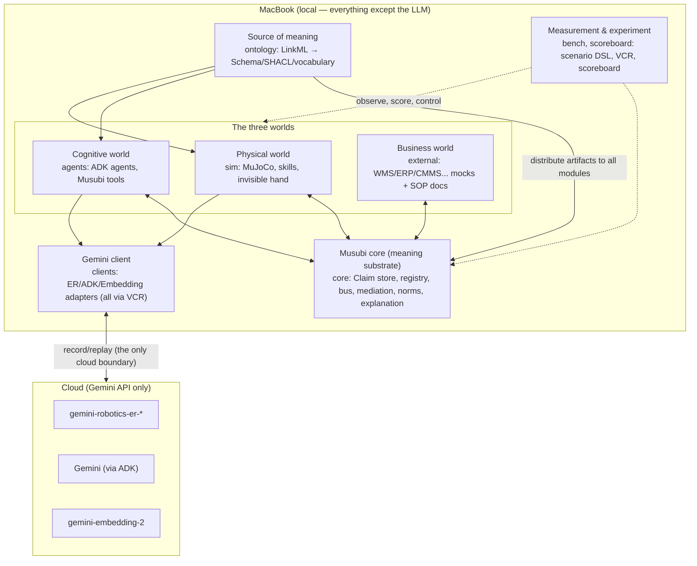
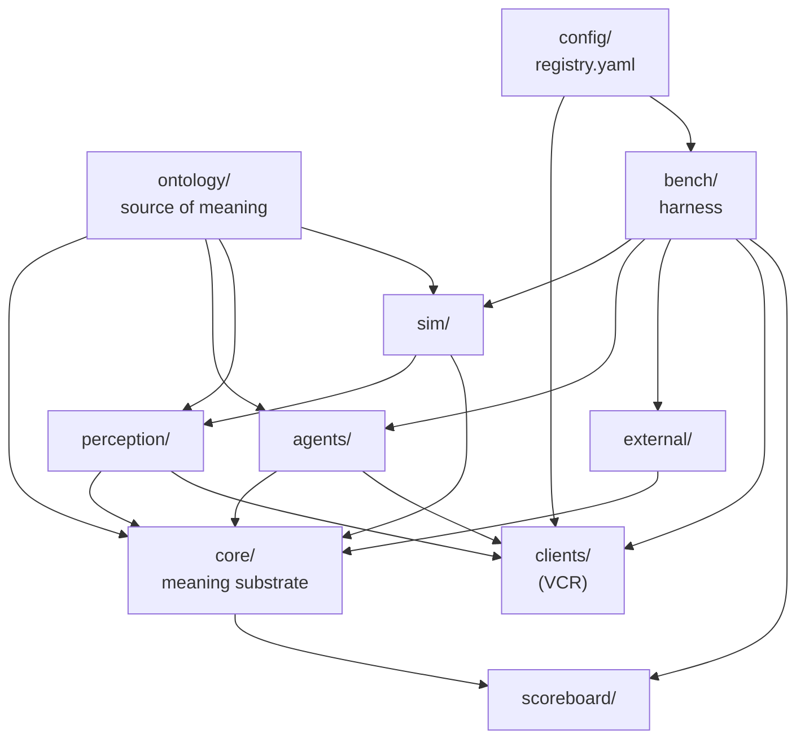
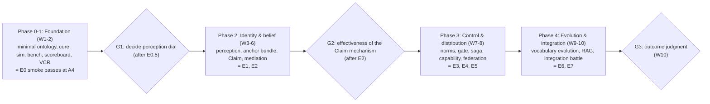
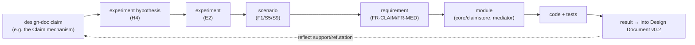

# PROJECT.md — Musubi

**A shared-ontology verification platform for Robotics × business AI agents × external systems**

> This document is the whole-project definition of **Musubi** (the single source of truth for *what* and *why*). It defines what we build and why, what is in and out of scope, and with what structure, requirements, deliverables, and process we proceed.
>
> **What this document does not cover**: the *how* of day-to-day development (build/test/lint commands, coding conventions, branch and commit operations, Claude Code procedures, how to add a scenario or module) is defined separately in `CLAUDE.md`. The boundary between the two is stated in §2. When in doubt: "WHAT/WHY in PROJECT.md, HOW in CLAUDE.md."

---

## 1. Project Overview

### 1.1 In one sentence

Musubi is a shared ontology for **letting multiple robots, multiple business AI agents, and multiple external business systems share the same "meaning" to accomplish a single piece of work**, together with an experiment platform for **verifying it with a MuJoCo simulation and the Gemini API family on a MacBook**. What this repository develops is the ontology itself (the definition of meaning) plus the whole runtime that runs and measures it.

### 1.2 Vision and Mission

- **Vision**: bind the three worlds — the physical world (robots), the cognitive world (agents), and the business world (core systems), which differ in ontology, time scale, and certainty — with a single, shared layer of meaning.
- **Mission (this project's verification challenge)**: show that the ontology is "useful" not with anecdotes but with **reproducible experiments and machine-scorable metrics**. What we measure is not the robot's dexterity but **the system's "honesty" — its ability to detect, mediate, and explain the divergence between belief and reality**.

### 1.3 Name

"Musubi" (結) derives from *binding* the three worlds — physical, cognitive, business — and from making the *binding* of observation and entity the core concept. The ontology namespace prefix is `msb:`.

### 1.4 Nature of the project

- A research prototype (not production). It assumes development by one to a few people plus Claude Code.
- **Everything except the LLM runs locally (MacBook)**. The only thing that goes to the cloud is Gemini API calls (Robotics ER, agent reasoning, embeddings), and that boundary is concentrated at a single point (the VCR, §7.3).
- The deliverable is not a "working demo" but a **reusable benchmark and measurement platform** (MusubiBench / MusubiKit).

---

## 2. Document System and the PROJECT.md / CLAUDE.md Boundary

### 2.1 Canonical documents

This project is defined by four canonical documents. The higher ones lean toward "why/what," the lower ones toward "how we measure / how we build."

| Document | Role | Primary readers |
|---|---|---|
| **Design Document** (Ontology Design) | Defines the ontology itself (concepts, relations, actions, architecture, standard mappings) | Designers, researchers |
| **Experiment Plan** | Research methodology, rig, experiment programs E0–E7, metrics, statistics | Researchers |
| **Scenario Catalog** (The Sixteen Views of Musubi) | The 16 verification scenarios (each a machine-scorable benchmark) | Researchers, implementers |
| **PROJECT.md** (this document) | Binds the above three and defines the whole project (scope, requirements, structure, deliverables, process, terminology, governance) | Everyone, Claude Code |

These three design documents are referenced throughout this document. **If this document conflicts with a design document, the relevant design document is canonical and this document is revised** (this document is not an upper-level summary of them but their integration and operational definition).

### 2.2 Division of labor between PROJECT.md and CLAUDE.md (important)

| Aspect | PROJECT.md (this document) | CLAUDE.md (separate) |
|---|---|---|
| Question | What / why we build | How to build / how to run |
| Content | Vision, scope, requirements, architecture, module definitions, terminology (ubiquitous language), deliverables, acceptance criteria, roadmap, governance, risk | Build/test/lint/run commands, coding conventions, naming/typing practice, branch/commit/PR operations, Claude Code working rules, procedures like "how to add a scenario" / "how to run one experiment" |
| Change frequency | Low (revised at project milestones) | High (tracks the reality of development) |
| Stability | Close to a contract | Close to an ops manual |

Principle: **this document writes down to the "definition" and does not write "operations."** For example, this document defines the responsibility and I/O of the `bench/` module, but the command to launch `bench` and the dependency-install procedure go in CLAUDE.md. This document defines the meaning of the term `Claim`, but the implementation conventions of the Python class that represents `Claim` go in CLAUDE.md.

---

## 3. Purpose, Goals, and Non-Goals

### 3.1 Project goals (achieving them is success)

| ID | Goal | How to measure (details in §12 / Experiment Plan) |
|---|---|---|
| G1 | Codify the ontology as a "single source of meaning" from which multi-purpose generation (schema, validation, vocabulary) runs | Artifacts regenerate from the ontology in CI, and all modules reference the same version |
| G2 | A runtime that binds the three worlds runs self-contained on a MacBook (except LLM calls) | The E0 smoke passes in the A4 configuration |
| G3 | Demonstrate the ontology's effectiveness quantitatively via the difference against bare coupling (ablation A0→A4) | The staircase difference across arms is significant on E7's primary endpoints |
| G4 | The core of the 16 scenarios (at least 3 flagships) runs reproducibly as machine-scored benchmarks | The oracles of F1/F2/F3 run under automatic judgment |
| G5 | Every experiment is reproducible (same seed → same result, API calls are replayable) | Zero API calls on VCR replay, bit-identical sim |

### 3.2 Non-goals (explicitly not done)

- **Real-robot control and sim-to-real transfer** are out of scope. The research subject is the meaning layer; the simulator is a deliberate choice (Experiment Plan §0.1). Kept as future work (§11).
- **Research on dexterous manipulation (grasping, assembly)** is out of scope. Handling is idealized (weld/adhesion), and failures are made by probabilistic injection rather than physics.
- **Production-grade non-functionals** (HA, horizontal scale, multi-region) are out of scope. Limited to what a pseudo-distributed setup on a single MacBook can cover.
- **Connecting to real business systems** is out of scope. WMS/ERP/CMMS, etc. are all implemented as local mocks.
- **Training/fine-tuning new LLM/embedding models** is out of scope. We use the existing Gemini API.
- **Productizing a UI** is out of scope. The dashboard is the minimum for measurement and explanation.

### 3.3 One-sentence scope definition

> "On a single MacBook, bind a MuJoCo miniature warehouse world, a set of Gemini-based business AI agents, and mock external business systems with the Musubi ontology, and verify the system's behavior against situations such as ledger-vs-reality divergence, irreversible actions, norms, and distribution, using reproducible scenarios and machine-scored metrics."

---

## 4. Background and Problem Statement (summary)

Integrating the three worlds is hard not because of a communication-protocol mismatch but because of **four faults** (details in Design Document §1).

| Fault | Content | Musubi's answer |
|---|---|---|
| Meaning | The correspondence between the point-cloud cluster "near (12.3, 4.0)" and the inventory record "SKU-456 / lot 789" is lost | Three-phase aspects + anchor bundle + staged grounding |
| Time | Directly connecting the control (ms), deliberation (s), and business (hours–days) time scales collapses | A semantic gearbox (shifting via aggregation / concretization) |
| Cognition | Treating observation (uncertain but fresh), ledger (authoritative but stale), and inference (derived) as equal-rank "facts" breaks on contradiction | Claims + confidence decay + bitemporal + belief mediation |
| Norms | The rules of SOPs, safety regulations, and contracts are invisible to robots and agents | Norm-equipped space + compliance compile + reversibility gate |

The role of the ontology is to **have all instances share the vocabulary and relations** that bridge these four faults. This project verifies whether that bridge actually works.

---

## 5. System Overview

### 5.1 Boundary: local and cloud



**The design keystone**: the cloud boundary is concentrated at a single point, `clients/` (via VCR). This makes (a) reproducibility (record/replay), (b) cost control (cache), and (c) model migration (regression comparison) all work in one place.

### 5.2 The three execution loops (time-scale separation)

Musubi does not directly connect the control, deliberation, and business loops. Between the layers it places shift stages for aggregation (upward: observation → event → episode → case) and concretization (downward: order → goal → task → skill call) (details in Design Document §1.3). This separation is the implementation boundary of the project itself, and it shows up as the discipline that "raw sensor data stays in `sim/`, and the moment it carries meaning it rises to `core/`'s bus as an event."

---

## 6. Component / Module Definitions

Each module is defined by "responsibility, main I/O, main internals, dependencies" (the implementation *how* is in CLAUDE.md). Modules are mostly loosely coupled, and the dependency direction follows the diagram in §6.2.

### 6.1 Module list

| Module | Responsibility (one line) | Main input | Main output |
|---|---|---|---|
| `ontology/` | The single source of meaning. Defines concepts, relations, actions, and emits multi-purpose artifacts | LinkML source | JSON Schema, SHACL, NL vocabulary, type library |
| `core/` | The meaning substrate. Handles belief, identity, mediation, norms, explanation | Events, claims, requests | Valid Claims, mediation results, validation verdicts, explanations |
| `sim/` | The physical world. MuJoCo world, skills, perturbation, rendering | Skill calls, perturbation directives | Observations, events, ground truth, rendered images |
| `perception/` | Perception. Makes Claims from ground truth / ER (dial switch) | Rendered images, ground truth | Claims such as DetectedObject |
| `agents/` | The cognitive world. Planning, mediation judgment, document processing, delegation | Goals, context, tools | Plans, actions, claims, delegations |
| `external/` | Mocks of business/external systems and the document corpus | API calls | Ledgers, notifications, documents, portal responses |
| `clients/` | Gemini (ER/ADK/Embedding) adapters. Encapsulates the VCR | Normalized requests | Responses (record or replay) |
| `bench/` | The experiment harness. Scenario expansion, execution, seeds, VCR | Scenario DSL | Run artifacts (events, Claims, cassettes, ground truth) |
| `scoreboard/` | Measurement. Metric computation, dashboard, reports | Run artifacts | Metrics, visualizations, reports |
| `config/` | Centralized configuration (model IDs, unit prices, budget, dial defaults) | — | Config (referenced by all modules) |

### 6.2 Module dependencies



**Dependency principle**: `ontology/` is upstream of all modules (everyone may depend on the ontology, but the ontology depends on nothing). `clients/` is the only exit to the cloud. `bench/` is the orchestrator that drives each world. `scoreboard/` is a read-only observer (no side effects on production paths). Circular dependencies are forbidden.

### 6.3 Key internal interfaces (definitions only; implementation in CLAUDE.md)

- **Semantic envelope**: inter-module messages carry a JSON-LD envelope (`@context` is an ontology artifact, details in Design Document §5.5). The `sim/`⇄`core/` boundary speaks in this envelope.
- **Claim API**: `core/claimstore` provides "add a claim, replace (supersede), query valid claims, bitemporal query." No deletion (append-only).
- **Action contract**: each action in `sim/skills` and `agents/tools` carries preconditions, expected effects, failure modes, compensation, and reversibility class as metadata (the unified action model, Design Document §3.1).
- **Verification gate**: a plan generated by `agents/` passes through `core/norms`'s SHACL validation, norm check, reversibility gate, and resource reservation before execution.
- **Client boundary**: `clients/` wraps the three Gemini services in a single record/replay interface. `bench/` chooses the mode (record / replay / passthrough).

---

## 7. External Dependencies and Integration Boundaries

### 7.1 Runtime / key libraries

| Target | Choice | Notes |
|---|---|---|
| OS | macOS (Apple Silicon assumed) | Interactive viewer requires `mjpython` (below) |
| Language | Python 3.11+ | Primary language |
| Physics | `mujoco` (Python bindings) | Offscreen via `mujoco.Renderer` (RGB/depth/segmentation) |
| Agents | `google-adk` (ADK) | Centered on `LlmAgent` + custom FunctionTool |
| LLM/embedding | `google-genai` | ER and embedding calls |
| Storage | SQLite (Claim, cassette, embedding cache), DuckDB (metric aggregation) | Fully local |
| Business mocks | FastAPI + SQLite | Portals like WMS/ERP |
| Validation | SHACL (pySHACL, etc.), JSON Schema | Ontology artifacts |

> macOS-specific: `viewer.launch_passive()` (interactive viewer) requires the `mjpython` launcher. Headless batch runs (`mj_step` loop, offscreen via `Renderer`) are fine with plain `python`. The convention: `mjpython` for demo recording, `python` for experiment runs.

### 7.2 Gemini models (cloud)

| Use | Model | Treatment in this project |
|---|---|---|
| Robotics perception & spatial reasoning | `gemini-robotics-er-1.6-preview` (latest at writing; **migrate to ER 2 by swapping `config/registry.yaml`**) | Pointing (normalized `[y,x]` 0–1000), boxes, trajectories, spatial questions. pixel→world lifts by sim depth (Experiment Plan §4.2) |
| Agent reasoning | Gemini via ADK (model ID pinned in the registry) | Planning, mediation judgment, document processing. Avoid mixing built-in and custom tools |
| Embedding | `gemini-embedding-2` (multimodal, MRL variable dimension, truncation with auto-normalization) | Visual anchors (image embeddings), entity-linked RAG, gap clustering. Default dimension 768; incompatible space with `gemini-embedding-001`, so do not mix |

**Never hardcode model IDs in the source.** Concentrate everything in `config/registry.yaml`, and leave the model ID, thinking budget, etc. as provenance on every Claim/run record. This lets model migration be treated as a "regression experiment" rather than an "upgrade" (Experiment Plan M3).

### 7.3 The cloud boundary = the VCR (single choke point)

`clients/` wraps all three Gemini services in an **LLM VCR** (a record/replay proxy). It stores `hash(model ID, normalized request) → response` in SQLite and replays the same input (does not go to the API). This is the keystone of the project's reproducibility, cost, and migration management (Experiment Plan §3.3). **Do not write code that calls Gemini directly outside `clients/`** — this is an architectural rule.

### 7.4 Authentication / secrets (definition)

- API keys are environment variables (`.env`, never committed). This document defines the *policy* that "secrets are not placed in the repository; no key material in `config/registry.yaml`." The *procedure* for obtaining and setting them is in CLAUDE.md.
- The only network destination is the Gemini endpoint. Any other external communication does not exist by design (external systems are all local mocks).

---

## 8. Ubiquitous Language (glossary)

For an ontology project, sharing terminology is not incidental but a **core deliverable**. The following are definitions of the vocabulary used consistently across all documents, all code, and all agent prompts (the canonical source is the Design Document). Code identifiers, event types, and API names follow this vocabulary.

### 8.1 Ontology core concepts

| Term | Definition |
|---|---|
| Entity | Anything with an identity (an immutable IRI): objects, people, places, equipment, organizations, information objects |
| Aspect (three-phase) | A projection of an entity. PhysicalAspect (the observed face) / CognitiveAspect (the inferred face) / BusinessAspect (the ledger face). Having all three is not a premise but an achievement goal |
| Authority | The system of record declared per aspect × scope. A "master for the whole entity" does not exist |
| Anchor (anchor bundle) | Clues to identity. Bundles the physical (tag, appearance embedding) / spatial (position + time) / business key (SKU, serial) together |
| IdentityBinding | A **revocable** binding event, with confidence and evidence, between an observation (TrackedObject) and an entity |
| Claim | A statement about the world state. Carries source, method, confidence, time (valid/transaction), and realm. It does not hold facts directly; it is always "someone's claim" |
| Realm | The world a claim belongs to: real / simulated / planned / hypothetical. They coexist in the same graph and can be diff-queried |
| Confidence Decay | Time decay of confidence per claim kind. It is an input to mediation (position over minutes, ownership until the transaction, etc.) |
| Belief Mediation | Adjudicating contradictory Claims (authority × decay-adjusted confidence × method rank). Losers are not deleted but superseded |
| Action | The abstraction of an act that changes the world. Carries preconditions, expected effects, failure modes, compensation, reversibility class, cost, resource requirements |
| Skill / Tool / WorkflowStep | The implementation of an Action in each world (robot skill / agent tool / business step). Handled uniformly by the unified model |
| Realization (realization polymorphism) | Multiple realizations of the same abstract action: PhysicalRealization / InformationalRealization / HumanRealization |
| ReversibilityClass | reversible / compensable / irreversible. Irreversibility determines autonomy level and approval requirement |
| Compensation / Saga | Compensating actions and the physical saga that chains them (compensation-based distributed execution) |
| Capability / Requirement | The capability an actor advertises and the requirement of a task. Matching is subsumption inference |
| Norm | Obligation, permission, prohibition. Carries scope, strength (hard/soft), and a source-document link (normSource) |
| Delegation / Contract | Delegation and agreement. They chain to form an Accountability Chain |
| Goal / Task / Plan | A declarative goal / assignable work / an ordered composition of actions |
| Frame / Zone / Route | Coordinate system (transforms are Claims too) / space with meaning and norms / connections |
| Affordance | The action possibility an object offers (a bridge between perception and action, the basis of realization polymorphism) |
| Event / Episode / Case | A meaningful state change / one purposeful activity / a business-unit narrative. The three-layer narrative aggregation |
| Exception | A deviation from expectation and its handling path (retry → replan → change delegation → human) |

### 8.2 Project / rig-specific terms

| Term | Definition |
|---|---|
| MusubiWorld | The miniature warehouse world (micro-warehouse) on MuJoCo. The physical stage for verification |
| Invisible Hand | The perturbation device that reproducibly manufactures ledger-vs-reality divergence (move/swap/remove/degrade_tag/spawn_unknown/churn) |
| Perception Dial | The device that switches the source of perception between oracle / hybrid / live. Separates meaning-layer experiments from perception performance |
| Epistemic Scoreboard | The primary instrument that continuously reconciles ground truth with Claims (belief accuracy BA, calibration error ECE, freshness, MTTC, etc.) |
| LLM VCR | The record/replay proxy for all Gemini calls (`clients/`). The keystone of reproducibility, cost, and model migration |
| Cassette | The unit of record the VCR stores (request hash → response) |
| Ablation Ladder (A0–A4) | The experiment arms that progressively enable ontology features (A0 bare coupling / A1 semantic envelope / A2 Claim / A3 norms & safety / A4 full) |
| Oracle | The condition that machine-scores a scenario's success/failure (sim ground truth, SHACL, planted answers) |
| Gap Event | Detection of a phenomenon that cannot be expressed with the existing vocabulary. The origin point of vocabulary evolution |
| Scenario DSL | The YAML that declaratively describes a scenario (initial world, ledger, perturbation, faults, oracle, arms, repeats) |
| Semantic Observability | Observability that traces order → motor in a single thread using the Case/Episode IRI as the trace ID |

---

## 9. Data and Artifact Definitions

The data assets this project produces and handles, with their location, lifetime, and canonicity.

| Artifact | Substance | Location | Lifetime / canonicity |
|---|---|---|---|
| Ontology source | LinkML schema | `ontology/src/` | **The canon of meaning.** Git-managed, SemVer |
| Ontology artifacts | JSON Schema, SHACL, NL vocabulary, types | `ontology/generated/` (Git-managed) | Regenerable from source but **committed for reproducibility** |
| Claim store | Bitemporal claims | SQLite (per run) | A run artifact. Append-only (no deletion). The source for audit and forensics |
| Ground-truth snapshot | Entity state derived from `qpos` | Per run | The god's-eye view for scoring. Research-only (invisible to the system) |
| Cassette | Records of Gemini calls | SQLite (shared) | Asset for replay, regression, cost reduction. Per model ID |
| Embedding cache | Vectors | SQLite (shared) | `hash(model, dim, content) → vector`. Prevents double billing |
| Scenario | Scenario DSL (YAML) | `bench/scenarios/` | The canon of the benchmark. Reproducible with the seed |
| SHACL shape | Acceptance judgment (e.g. world_ok.ttl) | `ontology/shapes/` | Part of the oracle |
| Document corpus | SOPs, manuals, figure descriptions + answer annotations | `external/docs/` | The evaluation answers for norm compile / RAG |
| Run artifacts | Events, episodes, metrics | `scoreboard/` (DuckDB) | The analysis subject. Tracked by run ID |
| Pre-registration | Hypotheses, metrics, stopping rules | `bench/PREREG.md` | Committed before running. The research's self-binding |
| Reports | Experiment results, figures | `scoreboard/reports/` | Deliverable (§12) |

**Data discipline (definition)**: Claims are append-only, never deleted. The ground-truth snapshot is for scoring only and is not mixed into system paths. Secrets (API keys) are in no artifact. Person-identifying information is not stored (§10 NFR-P).

---

## 10. Requirements

Requirements are split into functional (FR) and non-functional (NFR), and each is **mapped to a verification means (experiment E, scenario)** (traceability in §15).

### 10.1 Functional requirements (FR)

| ID | Requirement | Owning module | Verification |
|---|---|---|---|
| FR-ONT | Define the ontology from a single source and generate/distribute schema, SHACL, vocabulary, types | ontology | E0 |
| FR-SIM | Build a MuJoCo world, and support skill execution, failure injection, invisible-hand perturbation, and multi-view rendering (RGB/depth/segmentation) | sim | E0, E0.5 |
| FR-PER | Switch the perception dial (oracle/hybrid/live) and Claim-ify ER pointing via pixel→world | perception, clients | E0.5, E1 |
| FR-CLAIM | Store claims with source, confidence, time, realm, and support decay, bitemporal query, and replacement | core/claimstore | E2, E5 |
| FR-MED | Mediate contradictory claims by authority × confidence × method, and emit corrective events and downstream invalidation | core/mediator | E2 |
| FR-ID | Progressively bind identity via anchor bundles, with revocation and downstream re-verification | core/registry, perception | E1 |
| FR-ACT | Execute skills, tools, and business steps as a unified action, handling reversibility class, compensation, and sagas | sim/skills, agents/tools, core | E3 |
| FR-GATE | Validate a plan before execution with SHACL, norms, a reversibility gate, and resource reservation | core/norms | E3 |
| FR-NORM | Compile norms from documents and check them at plan time and run time | agents, core/norms | E6b |
| FR-CAP | Advertise, query, and match capabilities, and auto-generate tool definitions from capabilities (a new machine is added with zero lines of code) | core/registry, agents/capability_compiler | E4 |
| FR-AGENT | An ADK agent performs goal decomposition, planning, mediation judgment, delegation, and document processing | agents, clients | E7 |
| FR-EXT | Mock external business systems (WMS/ERP/CMMS, etc.) and portals (audit/regulator/insurer, etc.), and stage intentional ledger divergence | external | Each scenario |
| FR-BUS | Coordinate between instances with semantic envelopes and inject delay, drop, partition | core/bus | E5 |
| FR-RAG | Index documents with entity linking, and do graph-neighborhood-expanded search with clause-IRI citation | agents, external/docs | E6c |
| FR-EVOLVE | Run the vocabulary-evolution loop of gap detection → clustering → definition drafting → approval → redistribution | agents, ontology | E6a |
| FR-BENCH | Expand the scenario DSL and run reproducibly with control over seeds and arms | bench | All experiments |
| FR-VCR | Record, replay, and regression-compare all Gemini calls | clients/vcr | All experiments |
| FR-SCORE | Reconcile ground truth with belief, and support metric computation, observability, and report generation | scoreboard | All experiments |

### 10.2 Non-functional requirements (NFR)

| ID | Requirement | Criterion (definition) |
|---|---|---|
| NFR-REPRO | Reproducibility | With the same seed (sim initial state + failure injection + invisible hand) + VCR replay, the sim trajectory is bit-identical and API calls are zero |
| NFR-DETERM | Determinism | The simulation is deterministic (same input → same result). Nondeterminism is localized to the LLM only and can be pinned by the VCR |
| NFR-COST | Cost control | Every Gemini call is accounted against the unit price and daily cap in `config/registry.yaml` and stops when over the cap. No re-billing via cassettes or the embedding cache |
| NFR-LOCAL | Local self-containment | All functionality except LLM calls works offline. The only network destination is Gemini |
| NFR-DEGRADE | Degradation tolerance | Even under cloud unreachability or bus partition, the edge's local world model continues safe operation and can consistency-merge after recovery |
| NFR-TRACE | Traceability | Every physical action can be traced back to its business basis via the accountability chain (justifiedBy) |
| NFR-P (privacy) | No person identification | People captured by sensors are, by default, forbidden from IdentityBinding. Only anonymous location/pose is handled, and no person-identifying information is stored |
| NFR-SEC | Security | Inter-instance Claims can be signed. Delegation is expressed with capability tokens. Untrusted external input is not the sole basis for an irreversible action |
| NFR-EXT | Extensibility | Adding a new robot, scenario, or external system minimizes changes to existing code (capability advertising, DSL, mock addition) |
| NFR-OBS | Observability | Per Case/Episode, all actions of all involved instances can be viewed in a single trace |
| NFR-PORT | Portability | Sized so that all experiments complete on a single MacBook (Apple Silicon) |

### 10.3 Constraints and assumptions

- A single MacBook. Pseudo-distribution (multiple processes) is used, but physically one machine.
- The Gemini API may have rate limits, billing, and (for ER) preview spec changes (→ §16 Risk).
- Handling is idealized, failures are probabilistically injected (physics tuning is not a research subject).
- Scenes are miniature. No claim of scale generalization (the limits of external validity are stated explicitly).

---

## 11. Milestones and Roadmap

Corresponds to the Experiment Plan's 10-week plan (with Go/No-Go gates). Each phase ends with "something that works."



| Phase | Modules primarily standing up | Definition of Done | Corresponding experiments / scenarios |
|---|---|---|---|
| Phase 0-1 Foundation | ontology (minimal 30 concepts), core, sim, bench, scoreboard, clients | E0 smoke passes at A4, trace completeness ≥95%, bit-identical sim, zero API calls on VCR replay | E0 |
| G1 gate | perception | Decide the perception-dial default at E0.5 (live/hybrid/oracle). **An allocation gate, not a stop** | E0.5 |
| Phase 2 Identity & belief | perception, core/mediator, core/registry | Anchor-bundle F1 beats single-anchor / decay-calibrated mediation beats a fixed rule | E1, E2 / F1, S5, S9 |
| G2 gate | — | Judge H4 (effectiveness of the Claim mechanism). If not supported, may pivot to "identify the conditions where it fails" | E2 |
| Phase 3 Control & distribution | core/norms, agents/capability_compiler, core/bus | Zero unapproved-irreversible under triple pressure / new machine added with zero lines of code / zero double-execution under 120s partition | E3, E4, E5 / F2, S2-S4, S6-S8 |
| Phase 4 Evolution & integration | agents (RAG/evolution), ontology (evolution) | The vocabulary-evolution loop completes one cycle / the staircase difference across arms appears in the integration battle | E6, E7 / C1-C4 |
| G3 judgment | scoreboard/reports | Technical report + 3 demos + a decision on publishing MusubiBench | — |

Recommended first implementation route (on the scenario side): **F1 → S5 → F2** (in order of small rig difference and high explanatory power to outsiders; Scenario Catalog §5).

---

## 12. Deliverables and Acceptance Criteria

### 12.1 Deliverables

| # | Deliverable | Content |
|---|---|---|
| D1 | **MusubiKit** | A reusable library: Claim store, mediator, capability compiler, VCR, semantic envelope |
| D2 | **MusubiBench** | Scenario DSL, oracle, SHACL shapes, seed set (the runnable version of the Sixteen Views) |
| D3 | Epistemic Scoreboard + dashboard | Metric computation and visualization of semantic observability |
| D4 | Technical report | Answers to the hypothesis ledger (Experiment Plan §6.2). Ablation results and effect sizes |
| D5 | 3 demo videos | The UC1 story (ledger contradiction → verification → re-binding) / document → norm → action / Day-0 onboarding |
| D6 | Design Document v0.2 | A revised version with a correspondence table of which design decisions each experiment supported/refuted |

### 12.2 Primary endpoints (pre-registered)

Pre-registered in the integration battle E7 (= a miniature of real operation) and evaluated across the A0→A4 staircase (numbers finalized after the E0 measurement).

1. **Order fulfillment rate** (A4 significantly higher than A0)
2. **Number of unapproved irreversible actions = 0** (must-pass at A3/A4)
3. **Number of human interventions**
4. **Tokens per decision** (A4 lower than A0 = improved context economy)

Secondary: MTTC, explanation-chain completeness, IRI hallucination rate, total cost.

### 12.3 Whole-project acceptance criteria

A state in which goals G1–G5 in §3.1 are all satisfied, the three flagship scenarios (F1/F2/F3) run reproducibly under machine scoring, and the technical report (D4) returns "supported / refuted / on hold" with evidence for each row of the hypothesis ledger.

---

## 13. Repository Structure

```
musubi/
├── ontology/              # L0: the single source of meaning
│   ├── src/               #   LinkML schema (concepts, relations, actions)
│   ├── generated/         #   artifacts (JSON Schema/SHACL/NL vocabulary/types) *Git-managed
│   └── shapes/            #   SHACL shapes (world_ok.ttl, etc.)
├── core/                  # Musubi core (meaning substrate)
│   ├── claimstore/        #   Claim store (SQLite, bitemporal, decay)
│   ├── mediator/          #   belief mediator
│   ├── registry/          #   entity/capability registry, authority matrix
│   ├── norms/             #   norm store + verification gate
│   ├── bus/               #   event bus (JSON-LD envelope, toxic mode)
│   └── explain/           #   explanation service
├── sim/                   # physical world
│   ├── worlds/            #   MJCF scenes (micro_warehouse.xml...)
│   ├── skills/            #   semi-idealized skills + failure injection
│   ├── invisible_hand/    #   divergence-manufacturing device
│   └── render/            #   offscreen renderer (RGB/depth/segmentation)
├── perception/            # perception dial (oracle|hybrid|live), pixel→world, ER adapter
├── agents/                # cognitive world (ADK)
│   ├── <role>/            #   fulfillment, fleet, maintenance, etc. agents
│   ├── tools/             #   Musubi tools (entity_resolve/claim_query/norm_check...)
│   └── capability_compiler/ # capability → ADK/MCP tool definitions
├── external/              # mocks of business/external systems
│   ├── wms/  cmms/  hr/  ec/  ...   # ledger, maintenance, HR, e-commerce, etc.
│   ├── portals/           #   audit, regulator, insurer, DR, etc. external portals
│   └── docs/              #   SOP corpus + entity-linked RAG index + answers
├── clients/               # Gemini adapters (ER/ADK/Embedding) *encapsulates the VCR
│   └── vcr/               #   record/replay (record|replay|passthrough)
├── bench/                 # experiment harness
│   ├── scenarios/         #   scenario DSL (YAML)
│   ├── runner/            #   runner, seed management
│   └── PREREG.md          #   pre-registration
├── scoreboard/            # measurement
│   ├── metrics/           #   metric queries (DuckDB)
│   ├── dashboard/         #   semantic observability (HTML)
│   └── reports/           #   report generation
├── config/
│   └── registry.yaml      # model IDs, unit prices, daily budget, dial defaults
├── PROJECT.md             # this document (whole-project definition)
└── CLAUDE.md              # development & operations (separate, created later)
```

> The directory structure matches the dependency direction in §6.2. Detailed package conventions, naming, and test placement are in CLAUDE.md.

---

## 14. Environment and Configuration Management (definition)

- **Centralized configuration**: **configurable values** — model IDs, thinking-budget defaults, API unit prices, daily budget, perception-dial defaults, tolerances, etc. — **are concentrated in `config/registry.yaml`**. Do not scatter constants across the code. Leave a snapshot of the config-at-that-time on every run record.
- **Secrets**: API keys are environment variables (`.env`, never committed). No key material in the registry.
- **Ontology-version tracking**: record which module and which run runs against which ontology version, and manage compatibility when they mix (§15).
- **Three-point seed management**: bundle the MuJoCo initial state, failure-injection randomness, and invisible-hand schedule as the seed, and state it explicitly in the DSL.

> The concrete commands for setup, dependency install, the `mjpython` distinction, and how to create `.env` are in **CLAUDE.md**. This document defines up to here (what to centralize, what to keep secret).

---

## 15. Governance and Traceability

### 15.1 Ontology change management

- The ontology is Git-managed with **semantic versioning**. Breaking changes are major bumps. Artifacts are regenerated in CI and the diff is verified.
- A change goes "proposal (drafted from a document or gap) → impact analysis (list of instances used) → review → release → staged distribution." The **living ontology** (gap-driven evolution, C1/E6a) rides this path.
- Missing vocabulary (a Gap Event) is not discarded but recorded as input for evolution.

### 15.2 Research discipline

- **Pre-registration** (`bench/PREREG.md`): commit hypotheses, primary endpoints, exclusion rules, and stopping rules before running.
- **Decision log**: record design decisions (RDF vs PG, inference depth, etc.) and feedback from experiments, and reflect them in Design Document v0.2.

### 15.3 The traceability chain (the backbone of this project)

Apply Musubi's own philosophy (every action is explainable) to project management too.



That each design decision → hypothesis → experiment → scenario → requirement → module → code can be traced along a single chain is a quality discipline of this project. This correspondence table (trace matrix) is maintained in `scoreboard/reports/`.

---

## 16. Risks and Assumptions (project level)

| Category | Risk | Impact | Mitigation |
|---|---|---|---|
| Technical | ER is inaccurate on synthetic images | Perception-heavy scenarios weaken | Make E0.5 the top-priority gate. Research still advances even if we fall back to oracle/hybrid on the dial (G1 is an allocation gate) |
| Technical | ER preview spec change / migration to ER 2 | Calls break | Pin the model ID in the registry, an abstraction boundary in `clients/`, VCR regression (M3) |
| Operational | API rate limits / billing overrun | Experiment stops / cost balloons | 429 retry + rate limiter + daily budget guard + stopping rule. Cassette replay keeps perception cost flat even as arms grow |
| Operational | Time dissolves into building the foundation | Never reaches the research | Cut off E0 at two weeks, then manage progress weekly by "which row of the hypothesis ledger moved" |
| Validity | Extrapolation limits of synthetic/miniature | Conclusions can't generalize | State the scope of claims explicitly (separate meaning-layer conclusions from perception/scale). List the limits alongside the results |
| Validity | Confounding across arms (prompt-length difference, etc.) | The interpretation of effect size gets muddy | Common templates, adjacent-arm comparison, token count as a covariate (Experiment Plan §8) |
| Scope | Over-stuffing mechanisms | Never finishes | Start from the minimal 30 concepts. Strictly obey the §3.2 non-goals. Scenarios in order of small rig difference |

**Key assumptions**: the Gemini API (ER, ADK, embedding) is available / the problem can be sized so a MacBook completes all experiments / the idealization of handling and probabilistic injection of failures do not undermine research validity (sensitivity analysis in Experiment Plan §8).

---

## 17. References

- Canonical design documents: the Design Document (Ontology Design) / the Experiment Plan / the Scenario Catalog (The Sixteen Views of Musubi). This document integrates and operationally defines them.
- Development & operations: `CLAUDE.md` (created later. Commands, conventions, procedures).
- External standards (correspondence table in Design Document §6): W3C SOSA/SSN, PROV-O, OWL-Time, SHACL, QUDT, GS1 EPCIS 2.0, AAS/OPC UA, ROS 2/VDA 5050/Open-RMF, MCP, A2A, LinkML, CloudEvents.
- External APIs: MuJoCo Python bindings, Gemini Robotics (ER), Gemini ADK, Gemini Embedding. The actual model IDs are canonical in `config/registry.yaml`.

---

*This is whole-project definition v0.1. The concretes of development (HOW) are split out into CLAUDE.md. These two documents plus the three canonical design documents form the complete definition of Musubi.*
