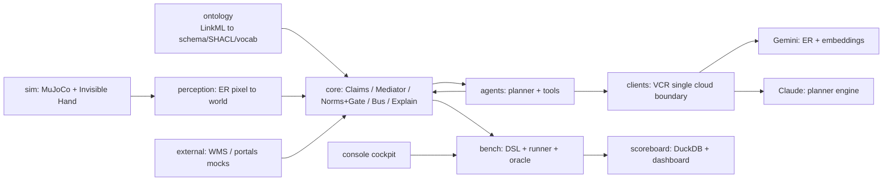
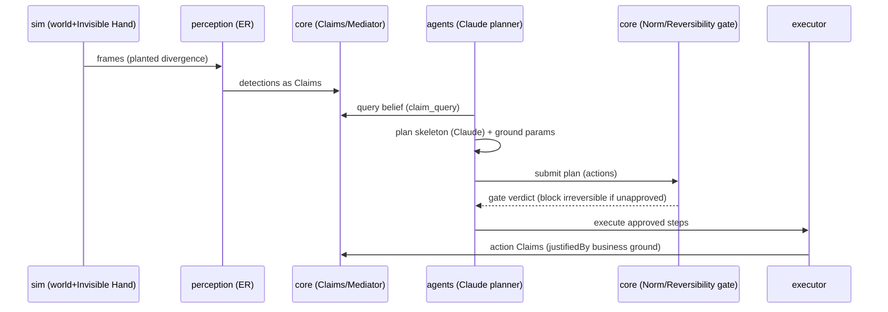

# BLOG.IDEA.md — テックブログ構成案：Musubi

> 本ファイルは **テックブログの構成案（設計図）** である。実記事ではなく、各章で「何を・どの順で・どの
> データ／図を使って語るか」を定義する。数値・所見は `REPORT.md`（rev.3）と `PROJECT.md`/`CLAUDE.md` に準拠。
> 実記事を書くときは各章の「盛り込む内容」を本文化し、「図表候補」を実際に作図・引用する。

---

## 0. メタ情報

- **タイトル案**（強い順）
  1. 「器用さ」ではなく「誠実さ」を測る — ロボット×AIエージェント×オントロジーの検証基盤 Musubi
  2. ロボットの信念は現実とズレる — 台帳と世界の乖離を検知・調停・説明する共有オントロジー基盤
  3. 不可逆な行動を止められるか — アブレーション梯子で「意味の層」の価値を実測する
- **サブタイトル案**: 決定論・オフライン・単一クラウド境界で「belief-vs-reality」を再現可能に検証する
- **対象読者**: ロボティクス／AIエージェント／ナレッジグラフ・オントロジーの実務者・研究者。
  「LLMエージェントを現実世界の業務に安全に接続する」ことに関心がある層。
- **キーメッセージ（1文）**: Musubi は、ロボットの器用さではなく **「信念と現実の乖離を検知・調停・説明し、
  不可逆な行動をゲートする誠実さ」** を、共有オントロジーの上で **決定論的・再現可能** に測る検証基盤である。
- **読後に持ち帰ってほしい3点**:
  (1) 現実業務での失敗は多くが「知覚の失敗」ではなく **「信念（台帳）と現実の乖離」** から起きる。
  (2) 意味の層（オントロジー＋Claim＋規範ゲート）を **段階的に足す（A0→A4）** と、どの段で安全性が立つか実測できる。
  (3) 非決定性を **LLM の一点に閉じ込める**と、システム全体を再現可能・監査可能にできる。
- **想定分量**: 6,000–9,000 字（図 6–8 点、コード／DSL 抜粋 4–6 点）。連載なら「概念編／アーキ編／検証編」に3分割可。
- **トーン**: 実装の裏付けを重視。誇張しない。**限界（未検証点）も正直に書く**のが差別化。

---

## 1. 導入：Musubi の課題意識（Why）

**狙い**: 「なぜ器用さではなく誠実さなのか」を最初の3段落で腑に落とさせる。

- **掴み（具体シーン）**: 倉庫のロボットが台帳を信じてパレットを出荷したら、実は別ロットだった――
  ロボットのアーム制御は完璧でも、**「世界についての信念」が誤っていた**ために業務事故になる。
- **問題の再定義**: ロボティクスの難所は把持・移動の *dexterity* だと思われがち。しかし現場の事故の多くは
  **belief-vs-reality の乖離**（台帳＝WMS の記録と、物理世界の実在の食い違い）から生じる。
- **3つの世界を「意味」で結ぶ必要**: 物理世界（ロボット/センサ）・認知世界（AIエージェントの判断）・
  業務世界（WMS・規制ポータル等）は、それぞれ別の語彙で世界を表す。これらを **共有オントロジー** で
  結ばないと、「誰の・いつの・どの権威に基づく主張か」を追跡できず、説明責任が成立しない。
- **Musubi が測る4能力**: ①乖離の **検知**（detection）②競合する主張の **調停**（mediation）
  ③不可逆行動の **ゲート**（gating）④結果の **説明**（explanation / accountability chain）。
- **なぜ「ベンチマーク基盤」なのか**: これらは主観評価では測れない。**シナリオ×アブレーション×オラクル** で
  機械判定し、**決定論的に再現**できて初めて「意味の層に価値があるか」を科学的に主張できる。
- 図表候補: **Fig.1「台帳 vs 現実」概念図**（WMS が "receiving" と言うが物理は別ゾーン、という乖離）。

---

## 2. 概念と関係：Robotics × AI エージェント × オントロジー（What/相互関係）

**狙い**: 3領域が Musubi でどう噛み合うか、共通語彙（ユビキタス言語）で説明する。読者の頭に「地図」を作る章。

- **オントロジーが上流（単一ソース）**: 型・スキーマ・語彙・制約は `ontology/src`（LinkML）から生成
  （`make gen`）。全モジュールが同一版を参照。**手書きの型を作らない**という規律。
- **中核概念（ユビキタス言語）を最小セットで紹介**:
  - `Claim` — **追記のみ・バイテンポラル**（validTime/transactionTime）の主張。更新は supersede、削除なし。
  - `Realm` — 主張が属する世界（real / ledger など）。「台帳上そうだ」と「実際そうだ」を区別する鍵。
  - `IdentityBinding`（アンカー束）— 業務キー（ロット/注文）と物理インスタンスの結合。**人物は同定しない**。
  - `ReversibilityClass` — reversible / compensable / irreversible。不可逆はゲート必須。
  - `Norm` — 義務/禁止などの規範。SHACL＋自然言語の二重表現。
  - `Capability` — 能力記述。エージェントは特定ロボットを知らず、能力で疎結合。
  - 意味エンベロープ — モジュール間メッセージ（JSON-LD、`@context` は生成物）。
- **3領域の役割分担（関係の核心）**:
  - **Robotics（物理）**: MuJoCo の世界と「見えざる手（Invisible Hand）」が **意図的な乖離** を植える。
    知覚（ER: pixel→world）が世界を Claim に変換する。
  - **AI エージェント（認知）**: Claim を読み、計画（planner）を立て、道具（FunctionTool）で行動。
    Claude が推論エンジン。**信念に基づいて動く**主体。
  - **オントロジー（意味）**: 上の二者と業務世界を **同じ語彙・同じ制約** で接続し、主張の権威・時制・
    可逆性・規範を明示可能にする。「意味の配線」そのもの。
- **一言で**: *ロボットが世界を Claim にし、エージェントが Claim で考え、オントロジーが Claim の意味
  （誰の・いつの・どの権威・可逆か）を保証する。*
- 図表候補: **Fig.2 三領域の関係図**（物理⇄意味⇄認知、業務世界が横から接続）。

---

## 3. アーキテクチャ（How：静的構造）

**狙い**: 依存の向きと「単一クラウド境界」を図で見せる。設計の一貫性を印象づける。

- **依存の向き**: `ontology → 各所`、クラウド出口は `clients` **一点**のみ、`scoreboard` は読み取り専用、循環なし。
- **モジュール地図**（各1行）: `ontology`（意味）/`sim`（物理・撹乱・描画）/`perception`（知覚ダイヤル）/
  `core`（Claim・調停・規範・バス・説明）/`agents`（計画・道具・能力コンパイラ）/`external`（業務モック）/
  `clients`（VCR＋LLM出口）/`bench`（DSL・runner・oracle）/`scoreboard`（DuckDB・ダッシュボード）/`console`（操作卓）。
- **縦スライス（動的）**: perceive → (mediate) → plan → (gate) → execute → (explain)。
  括弧内はアブレーションで on/off する層。
- **単一クラウド境界の意味**: ER・埋め込み（Gemini）とエージェント推論（Claude）は **すべて `clients/` の
  VCR の背後**。`clients/guard.py` が「`clients/` 外での LLM SDK import」を静的に禁止。
- 図表候補:
  - **Fig.3 依存グラフ**（下の mermaid をベースに清書）
  - **Fig.4 縦スライスのシーケンス図**（perceive→…→explain、各ステップが出す Claim/イベント）

---

## 4. 技術的特徴と技術選定（How：なぜその技術か）

**狙い**: 「なぜ MuJoCo/LinkML/DuckDB/VCR/Claude なのか」を **設計原則→技術** の因果で語る。選定理由が主役。

- **特徴1：意味の単一ソース（LinkML＋SHACL）**
  - 選定理由: 型・語彙・制約を1箇所から生成し全モジュールで共有 → **裸の数値・裸の参照を作らない**。
  - 二重表現: SHACL（機械可読制約）＋自然言語定義（人間可読）。生成物もコミット（再現性）。
- **特徴2：単一クラウド境界＋VCR（record/replay）**
  - 選定理由: 非決定を LLM の一点に閉じ込め、**オフラインで `make check` を再現可能**に。
  - 仕組み: 呼出は `hash(モデルID, 正規化リクエスト)` でカセット化。`replay` は未収録で `MissingCassette` を投げ
    事故を顕在化。`FakeGeminiClient` はスキーマ妥当なオフライン・ダブル。
  - **多プロバイダ化（D-0012）**: 出口は一点のまま、registry で `gemini | claude` を選択。**Claude を主エンジン**に。
- **特徴3：Claim の不変性（追記のみ・バイテンポラル）**
  - 選定理由: フォレンジック（S5）で「いつ真だったか／いつ記録したか」を分離、`as_of(t)` 照会を可能に。
- **特徴4：決定性の基盤（SimClock＋シード付きRNG）**
  - 選定理由: 「同一シード→ bit 一致、replay→API 0」を強制。素の時刻・未シード乱数を本番経路で禁止。
- **特徴5：宣言的オラクル（安全な式評価器）**
  - 選定理由: 採点を DSL に宣言。`eval` を使わない制限 AST＋述語レジストリ。**採点は god-view、システム経路と分離**。
- **特徴6：能力ベースの疎結合（Capability→Tool コンパイラ）**
  - 選定理由: 新機体追加でエージェントコードを変えない（capability compiler が道具を生成）。
- **技術スタック早見表（記事では表で）**: 言語 Python3.11 / 依存 uv / lint ruff / 型 mypy / test pytest /
  物理 MuJoCo / エージェント Claude(anthropic)＋(google-adk) / ER・埋め込み Gemini(google-genai) /
  オントロジー LinkML＋pySHACL / 保存 SQLite(Claim/カセット)・DuckDB(指標) / 操作 console(argparse)。
- **Claude の使い方（実装トピック）**: `claude-opus-4-8`、adaptive thinking、structured outputs で
  「action-type スケルトン」を生成 → ローカルで座標を接地（`ground_relocate`）。**推論は LLM、幾何は決定論**。
- 図表候補: **Fig.5 VCR の record/replay 状態遷移**、**コード抜粋**（registry.yaml のモデル定義／guard.py の禁止 import）。

---

## 5. 検証シナリオ（What we test）

**狙い**: アブレーション梯子と5シナリオを紹介。各シナリオが「どの能力を試すか」を明快に。

- **アブレーション梯子 A0→A4**（記事の背骨）:
  A0 裸結合 / A1 ＋意味エンベロープ / A2 ＋Claim・調停 / A3 ＋規範・可逆性ゲート / A4 ＋説明（accountability）。
  → **意味の層を1枚ずつ足す**と何が変わるかを対照実験できる。
- **DSL とオラクル**: シナリオは YAML（初期世界・見えざる手・規範・oracle・arms・repeats）。
  oracle は `success`／`must`／`endpoints` の宣言式。**真値スナップショットは採点専用**でシステムに混ぜない。
- **5シナリオの要旨（記事では1枚の表）**:
  | シナリオ | 何を試すか | 試される能力 |
  |---|---|---|
  | e0_smoke（relocate） | 縦スライス全体が通るか；A2–A4 で Claude が計画 | 統合・エンジン配線 |
  | f1_confidence | 確信度が低い在庫だけ監査してコスト削減 | 検知・確信度較正 |
  | s5_ghost | すり替えの根本原因を時制照会で特定 | フォレンジック・調停 |
  | f2_recall | ロット回収で不可逆廃棄をゲート | 安全ゲート・同定 |
  | c3_redteam | 3攻撃（注入/ローグ/偽能力）を防御 | 敵対的安全性 |
- **「見えざる手」の役割**: 台帳乖離・タグ劣化・look-alike 混入などを **実行前に植える**。オラクルはその
  植えた正解に対して機械判定する。
- 図表候補: **Fig.6 アブレーション梯子の概念図**（各段で有効化される機構）、**DSL 抜粋**（f2_recall.yaml の oracle）。

---

## 6. 検証結果と分析（Results）

**狙い**: REPORT.md の数値で「意味の層の価値」を示す。**設計どおりの失敗**（下位アーム）を価値として読ませる。

- **全体像**: 全 **129 ラン**・**API 0**・オフライン決定論。未承認不可逆は **下位アーム（A0–A2）のみ** で発生。
- **結果1：安全ゲートの因果（f2 / c3）** ← 記事の目玉
  - f2 リコール: A0–A2 は未承認の不可逆廃棄が 1 件通る（oracle 不合格）。**規範・可逆性ゲートが入る A3 で
    unappr=0** に。回収再現率は全アーム 1.0、過剰隔離 0.25。
  - c3 レッドチーム: 攻撃成功数 A0=3 → A2=2（計測QoSで偽能力を1件排除）→ **A3/A4=0（全防御）**。
  - **含意**: f2 と c3 が **同じ段（A3）** で安全ギャップを閉じる＝「不可逆はゲートを通す」という不変条件の対照実証。
  - 図表候補: **Fig.7 A0→A4 で未承認不可逆／攻撃成功数が 0 に落ちる折れ線**（f2 と c3 を重ねる）。
- **結果2：確信度駆動監査のコスト削減（f1）**
  - audit_level=0.95 で **5個中4個だけ検査＝走査コスト 20% 減**、植え付け乖離を検出、較正 OK。
  - スイープ（0.7–0.99）は **合否ゲートでなく確信度–コスト曲線**（0.99 では全数検査が要る＝設計どおり）。
  - 図表候補: **Fig.8 確信度–コスト曲線**（audit_level 対 scan_cost）。
- **結果3：フォレンジック（s5）**
  - バイテンポラル追跡で **根本原因を正答（forensic_accuracy=1.0）・冤罪なし**、`as_of(t0)` 照会が機能。
- **結果4：エンジン配線とアブレーション機構差（e0）**
  - A0 裸（イベント/Claim 0）→ A1 エンベロープ（実行イベント4）→ A2+ Claim層（検知+実行 bus9・Claim10）。
  - A2–A4 は **Claude が計画**（`llm:claude`, `llm_calls=1`）、幾何は決定論的に接地。
- **再現性の実証（rev.3）**: スイート二重実行が **bit-for-bit 一致**、標準ログは前回コミットと **バイト一致**。
- **正直な限界（この章で必ず書く）**:
  - **Claude の実働は e0 のみ**（flagship 4本は planner 非経由）→「主エンジン」は 1/5 シナリオでのみ実証。
  - **オフライン double のみ**＝実 Claude の推論品質・トークン・遅延は未計測。
  - **シード不活性（G9）**: 世界も metrics もシード間で不変 → `repeats:3` は分散を生まない。
- 図表候補: **集計表**（シナリオ×ラン×oracle×unappr×API、REPORT 付録B）。

---

## 7. 今後の展望と課題（What's next）

**狙い**: 未解決を **ロードマップ** として提示。誠実さを保ちつつ将来像を描く。

- **短期（実測の空白を埋める）**:
  - **ライブ Claude カセットの収録**（`ANTHROPIC_API_KEY`＋record）→ 実モデルの推論品質・トークン・遅延を計測（G4/G8）。
  - **flagship を agentic 化**（少なくとも1本を Episode/planner 経由に）→「Claude が主エンジン」を業務タスクで実証（G1/G7）。
  - **シードを効かせる**（見えざる手・配置を seeded RNG 化）→ repeats が分布を生むようにする（G9）。
- **中期（意味の層の拡張）**:
  - シナリオ拡充（S1–S9, C1–C4 等）と実験プログラム E1–E7 の展開。
  - 権威のアスペクト単位化・多テナント分離・A2A（エージェント間）連携の検証。
  - ER 1.6→2 やモデル移行を **出口一点** のまま差し替える運用の実証。
- **長期（問い）**:
  - 「誠実さ」の指標を業界横断のベンチマークへ。信頼できない外部入力（通知・文書メモ）を不可逆行動の
    単独根拠にしない、という安全規範の一般化。
  - 正典設計文書（Ontology Design / Experiment Plan）の整備で暫定値を確定へ。
- **設計上の教訓（記事の締めに効く）**:
  「非決定を一点に閉じ込める」「意味を単一ソースから生成する」「不可逆はゲートを通す」「採点を god-view に隔離する」
  は、LLM エージェントを現実業務へ繋ぐ **再利用可能な原則** である。

---

## 8. まとめ（Takeaways）

- Musubi は **器用さではなく誠実さ** を、共有オントロジーの上で **決定論的・再現可能** に測る。
- **意味の層を1枚ずつ足す**と、どの段（＝A3 の規範ゲート）で安全性が立つかを実測できる。
- **非決定を LLM の一点に閉じ込める**設計が、システム全体の監査可能性と再現性を担保する。
- そして **限界を正直に書く**（Claude 実働は e0 のみ／実モデル未計測／シード不活性）――これ自体が
  「検証基盤」としての誠実さの実践である。

---

## 付録：制作メモ

- **図表リスト**（8点）: Fig.1 台帳vs現実 / Fig.2 三領域関係 / Fig.3 依存グラフ / Fig.4 縦スライス /
  Fig.5 VCR状態遷移 / Fig.6 アブレーション梯子 / Fig.7 安全性折れ線 / Fig.8 確信度–コスト曲線。
- **コード／DSL 抜粋候補**: registry.yaml（モデル定義）/ guard.py（禁止 import）/ f2_recall.yaml（oracle）/
  ground_relocate（推論と幾何の分離）/ 二重実行 diff（再現性）。
- **一次データの所在**: `REPORT.md`（分析）・`logs/`（生ログ：summary/inspect/digest/40_reproducibility/41_seed）。
- **書き方の注意**: モデル名・単価・閾値は本文にハードコードせず「registry 管理」と述べる。数値は REPORT の
  rev.3 に一致させる。**誇張しない・未検証を隠さない**。
- **連載分割案**: ①概念編（§1–2）②アーキ・技術編（§3–4）③検証編（§5–7）。
- **想定媒体・体裁**: 技術ブログ（Zenn/Medium 等）。各章 800–1,500 字目安、図は各章1–2点。
