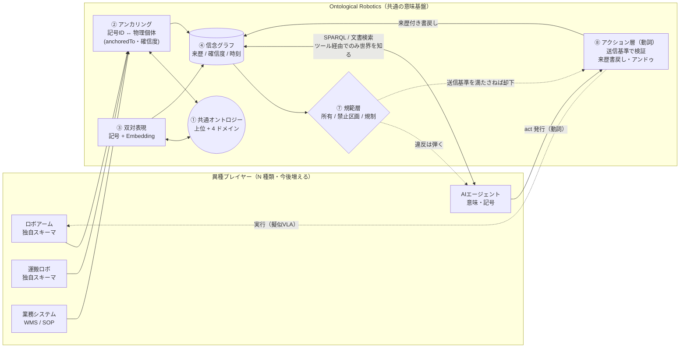

# Robotics AIとOntology

## Research Question

> ロボティクスに触り始めたエンジニアが、「ロボットとAIエージェントと業務システムは、同じ言葉を使っていても、同じ意味で話しているとは限らないよね？」という疑問を勝手に課題化し、シミュレータの中で、全員が同じ「オントロジー（共通の意味の地図）」を通して世界を理解する仕組みを作って遊んだ記録です。

## ソフトウェアのバベルの塔（3 回目）

最近、ロボティクスがじわじわ盛り上がってきている気配を感じています。そこで勉強がてら、[MuJoCo](https://mujoco.readthedocs.io/en/stable/overview.html) というシミュレータの中で、AIエージェントや業務システムと組み合わせて遊んでいます。これで 3 回目です。毎回ひとつ問いを立てて取り組んでいるのですが、今回の問いはこれです。

**「ロボティクス・AIエージェント・業務システムが業務で連携するとき、データの“形式”を揃えるだけでは足りないのではないか。そもそも 3 者は、同じ言葉を使っていても、同じ意味・同じ関係で使っているとは限らない。プレイヤーが増えていく AIエージェントの時代には、形式の下にある“意味”を揃える共通基盤が必要なのではないか？」**

これは前 2 回の続きでもあります。1 回目（PSL）は **データの形式（単位・座標系・誤差）を揃える中間表現** を作る話、2 回目（MWS）は **全員が同じ検索システムを共通プロトコルにする** 話でした。どちらも「形をどう合わせるか」「どう引いてくるか」に主眼がありました。

しかし、現場をもう一段深く考えると、形式が揃ってもなお噛み合わない層が残ります。たとえば、こんな指示です。

> From 業務システム　To ロボティクス　「ワークオーダー #42：ロット LOT-A の青いギアを回収し、QA トレイへ」

人間なら一瞬で理解できますが、システム間では次のような“意味のズレ”が起きます。

* 業務システムにとっての「LOT-A」は **出荷指示上の文字列** です。一方で、ロボットが扱うのは **いま目の前で動いている物理個体** です。この 2 つが「同じモノを指している」と、誰がどうやって保証するのでしょうか？
* アームが「掴んだギア」と、運搬ロボが「受け取ったギア」と、カメラが「映したギア」は、**本当に同じ 1 個体なのでしょうか**。識別子が読めない瞬間（搬送中など）に、どうやって同一性を保てばよいのでしょうか？
* 「所有」「禁止区画」「取り扱い履歴（来歴）」のような、**そもそもセンサーには映らない関係** を、ロボットはどう知ればよいのでしょうか？

形式（単位や座標系）は PSL で揃えられます。検索して引いてくることは MWS でできます。しかし、「LOT-A という言葉が、いま床を走っているどの物理個体を指すのか」「この瓶は誰のものか」「ここは入ってよい区画か」といった問題は、**形式でも検索でもなく、“意味と関係の取り決め”** の問題です。これがズレていると、現場では普通に事故につながります。

そして AIエージェントの時代になると、この問題はむしろ深刻になります。ロボットの種類も、エージェントの数も、業務システムも増えていき、プレイヤーごとに「自分の言葉」で多様なデータを吐き出すようになります。N 人が好き勝手な語彙で話す世界で、全員が同じ意味で会話するには、**「共通の意味の地図」＝オントロジー** を一枚用意し、各プレイヤーがそれを通して世界を理解すればよいのではないか。これが今回の発想です。この仕組みを **Ontological Robotics（OR）** と名付けて作ってみました。

## オントロジーとは

ここで、「オントロジー」という言葉を簡単に説明しておきます。

オントロジーは、もともと哲学の用語で、「世界に何が存在し、それらがどういう関係にあるか」を体系立てたものを指します。ソフトウェアの文脈では、**データの上に乗せる“意味の層”** ――データの形式（テーブルや JSON）ではなく、「それが現実世界の何を指し、何と何がどうつながるか」を定義したもの――と捉えると分かりやすいです。

実世界での代表例が [Palantir Foundry のオントロジー](https://www.palantir.com/docs/foundry/ontology/overview) です。これは、取り込んだデータセットやモデルを、設備・製品・注文といった現実の対応物に結びつけた「組織のデジタルツイン」です。ざっくり言うと、次の 2 種類の要素で構成されています。

* **セマンティック要素（名詞）**＝世界の構造: **オブジェクト型**（エンティティの定義。例:「空港」）、**プロパティ**（その特性）、**リンク型**（オブジェクト間の関係）。
* **キネティック要素（動詞）**＝世界の変化: **アクション型**（オブジェクトをどう変更してよいか）、**関数**（業務ロジック）。

エンジニア的には、馴染みのあるデータベースとの対応で見るのが一番分かりやすいです。

| データベース    | オントロジー           |
| --------- | ---------------- |
| テーブル      | オブジェクト型          |
| 行（Row）    | オブジェクト（現実の 1 個体） |
| 列（Column） | プロパティ            |
| 値（セル）     | プロパティ値           |
| 結合（JOIN）  | リンク型             |

ポイントは、オントロジーが **単なるデータカタログやスキーマ定義を超えて、「意思決定」まで載せる** ところです。Palantir の場合は、データ・ロジック・アクション・セキュリティを 1 つのリソースに統合し、人間にも AIエージェントにも共通の作業基盤を提供します。とくに AIエージェントとの相性がよく、エージェントは RAG のように「データを引くだけ」にとどまらず、オントロジー上のデータ・ロジック・アクションを **ツールとして安全に操作** できます。しかも、それが人間と同じ権限ポリシーで統制される、というのが近年の推しどころです。

本記事の Ontological Robotics（OR）も、この発想を **ロボティクスに持ち込んだもの** です。違いは、Palantir が主に業務データ（IT 世界）を対象にするのに対し、OR は **物理世界** まで踏み込む点です。そのため後述のとおり、OR のオントロジーには「同一性（どの物理個体が同じか）」「知覚（見た目の Embedding）」「規範（通ってよい区画か）」「来歴（誰がいつ測ったか）」といった、物理世界ならではの要素が載っています。

## なぜ素朴にやると詰まるのか ― 3 つの壁

作る前に、なぜ「形式を合わせるだけ」では足りないのかを整理します。大きく 3 つの壁があると考えました。

**1. 同じ言葉が、同じ意味とは限らない（セマンティクスのズレ）**

スキーマ変換（CSV→JSON、JST→UTC のような“構文の統合”）は、PSL/MWS でかなり吸収できます。しかし本当の難所は、**「在庫」「個体」「完了」といった概念が、システムごとに微妙に異なる存在論（何が存在し、何と何が同じか）にコミットしている** ことです。WMS の「在庫数」は少し前に人が登録した値であり、ロボットの「在庫数」はたった今カメラで数えた値です。同じ語でも、鮮度も信頼度も意味も違います。構文を合わせても、この“存在論のズレ”は残ります。OR の中核的な主張はここにあり、**「シンタックス統合ではなく、存在論的コミットメントの統一（セマンティクス統合）こそが本質課題である」** というものです。

**2. どの個体が「同じ実体」なのか（同一性）**

業務システムは「LOT-A の 3 番」のような **記号 ID** で個体を語ります。一方で、ロボットは **座標と見た目** で個体を捉えます。この 2 つを「同じ 1 個体だ」と結ぶのが同一性解決です。厄介なのは、ID が常に読めるわけではないことです。たとえば搬送中、遮蔽中、印字がかすれている場合などがあります。ID が読めない瞬間にも、位置の連続性・見た目・直前の文脈から「たぶんこれは同じ個体だ」と **確信度つきで** つなぎ続け、間違っていたら **やり直せる** 必要があります。`owl:sameAs` で「同じ」と書き切ってしまうと、後で分裂・統合をやり直せません。

**3. 知覚できない関係が世界を支配する（所有・規範・来歴）**

物理世界には、カメラに映らないにもかかわらず、決定的に重要な関係があります。「この水のコップは 304 号室の患者さんのもの（所有）」「この薬剤は公共区画を通ってはいけない（規範）」「この検体は誰がいつどの機器で測ったか（来歴）」といった関係です。これらは見た目には現れません。値だけを運ぶ素朴な連携では、こうした **関係が丸ごと抜け落ちます**。すると、瓜二つのコップを取り違えて別の患者に配ってしまったり、規制薬物が通ってはいけない区画を最短経路で突っ切ってしまったり、監査証跡を辿れなくなったりします。

形式を揃える層（PSL）と検索する層（MWS）の上に、**「意味と関係を共通化する層」** が必要なのではないか。それが今回の仮説です。

## 作ったもの ― Ontological Robotics（OR）

考えていった結果、OR は「共通オントロジー」と、それに現実を接続する「アンカリング層」を中心に、次の仕組みとして実装しました。

**① 共通オントロジー（みんなの“意味の地図”）**
全プレイヤーが共有する語彙です。「持続体／生起体」「物理的実体／情報的実体」といった上位概念の下に、4 つのドメイン（能力・行為／時空間・事象／主体・来歴／業務・文書）を定義します。各プレイヤーは「自分の言葉 ↔ 共通語」だけを実装すればよく、相手の事情を知らなくて済みます。PSL の中間表現と同じ N+N の発想を、“意味”のレイヤーでやるイメージです。語彙は [RDF](https://www.w3.org/RDF/) で書き、制約は [SHACL](https://www.w3.org/TR/shacl/) で機械検証します。

**② アンカリング（記号 ID と物理個体を“確信度つき”で結ぶ）**
業務システムの「LOT-A の 3 番」と、ロボットが見ている物理個体を、**時空間の整合 × 見た目の署名 × 記号 ID** の合わせ技で、同一の IRI（個体の住所）に束ねます。ポイントは、`owl:sameAs` で直書きせず、`orx:anchoredTo`（確信度つき）で表現することです。間違っていたら **分裂・統合をやり直せる** ように、同一性を「改訂可能な信念」として持ちます。

**③ 双対表現（記号＋ベクトルを併置）**
各個体に、記号属性（型・タグ・素材）と **埋め込みベクトル** の両方を付与します。記号は「辞書にある物体」を確実に扱えます。一方、ベクトルは「辞書にない物体」を見た目の意味的な近さで捉えられます。知覚には [CLIP](https://github.com/mlfoundations/open_clip) のローカル埋め込みを使いました。

**④ 信念グラフ（来歴・確信度・時刻つきの世界状態）**
全プレイヤーの主張を 1 枚の世界グラフ（ABox）に集約します。ただし、**すべての書き込みに「誰が・いつ・どれくらい確かに」言ったか（来歴・確信度・時刻）を必須** にします。これは SHACL で強制します。これにより、矛盾する観測が来たときに「どちらを信じるか」を調停でき、監査もできます。生データ（画像・点群）はグラフに入れず、外部ストアに置き、**意味だけをグラフに流す**（蒸留規律）という約束事も設けました。

**⑤ 能力契約（身体化された API スキーマ）**
各ロボットが「自分は何ができるか（重量範囲・形状クラス・成功率統計）」を、オントロジーの語彙で宣言します。エージェントはこの契約を見て、「この作業にはどの機体が適格か」を選べます。

**⑥ アイデンティティ・スレッド（業務‐物理ブリッジ）**
受注 → 出荷指示 → バーコード → 物理個体、という識別子の連鎖を辿れるようにします。これにより、「注文 #42 の品は、いま倉庫のどこにあるか」という **業務‐物理をまたぐクエリ** が成立します。

**⑦ 規範層（してはいけないことの地図）**
「禁止区画」「所有」「取り扱い規制」のような演繹的な規範（deontic）を語彙として持ち、経路計画や把持判断に効かせます。

**⑧ アクション層（キネティック層＝“してよい世界変更”の型）**
冒頭で紹介した Palantir の「キネティック要素（アクション型）」に当たる部分です。①〜⑦ までは「名詞（世界の構造・意味）」の話でしたが、ここで初めて「動詞（世界を変える）」に踏み込みます。エージェントが「この箱をあのゾーンへ」のようなアクションを発行すると、いきなり実行せず、まず **送信基準（submission criteria）** ――対象個体はグラフ上に居るか、その機体の能力契約は足りるか、目的地は規範に反しないか、行為者にその所有物を動かす権限はあるか――を世界グラフに照合します。満たせば擬似 VLA スキルで実行して世界を変え、結果を **来歴つきで書き戻し**、通行を custody（監査ノード）として残します。低確信のときは実行せず人間確認へ **ステージング** し、間違えたら **補償アクション（アンドゥ）** でやり直せます。つまり「同じ言葉が同じ意味を指す（名詞）」だけでなく、「安全に世界を変える（動詞）」までオントロジーに載せる、というのがこの層です。

LLM と Embedding は、この基盤の「接着剤」として使います。新しいロボットの独自スキーマを共通語へ写像する下書きを LLM に作らせたり、知らない物体を Embedding で接地したり、共通オントロジーを文脈として与えたエージェントに業務‐物理クエリを解かせたりする役回りです。

全体像はこんな感じです。

各プレイヤーは「自分の言葉 ↔ 共通オントロジー」だけを実装します（①）。記号 ID と物理個体はアンカリングで確信度つきに結ばれ（②）、各個体は記号と Embedding の両方を持ちます（③）。すべての主張は来歴つきで信念グラフに集約され（④）、規範層が「してはいけないこと」を弾きます（⑦）。そしてエージェントが世界を“変える”ときは、アクション層が送信基準で検証してから実行し、来歴つきで書き戻します（⑧）。エージェントには、**このグラフをツール経由でしか覗けない**、つまり真値への直接アクセスは禁止する、という制約をかけました。

## 検証してみる

実機は無いので、物理シミュレータ **MuJoCo** の中で検証しました。MuJoCo を選んだ理由は、MacBook で気軽に動くこと、そして「正解（真値）」がシミュレータから手に入るため、OR がどれだけ正確に世界を捉えられたかを **答え合わせ** できることです。

| 役割           | 使ったもの                                                                                                                                      |
| ------------ | ------------------------------------------------------------------------------------------------------------------------------------------ |
| ロボット／物理世界    | MuJoCo（複数ベンダー・ID 付き/無し混在・単位や命名をわざとバラバラに）                                                                                                   |
| 頭脳（AIエージェント） | [OpenAI API](https://platform.openai.com/docs/guides/function-calling)（`gpt-5.4-mini` / `gpt-5.4` / `gpt-5.4-nano`、temperature 0・全応答キャッシュ） |
| 知覚・埋め込み      | CLIP（ローカル・MPS）／`text-embedding-3-small`                                                                                                    |
| 知識基盤         | [pyoxigraph](https://pyoxigraph.readthedocs.io/)（RDF ストア）＋ SHACL 検証＋ベクトル索引                                                                 |
| 業務システム       | SQLite（WMS）＋ SOP 文書（Markdown）                                                                                                              |

そして、それぞれ「壊れどころ」が異なる **8 つの業務シナリオ** を用意しました。狙いは、OR の各仕組みが効く場面、あるいは効かない場面を撃ち分けることです。S1〜S7 は「名詞（意味・構造）」を試すシナリオ、最後の **S8 だけが「動詞（アクション）」＝キネティック層** を試すシナリオです。

| シナリオ          | 内容                             | 主に試した仕組み         | 壊れどころ           |
| ------------- | ------------------------------ | ---------------- | --------------- |
| S1 ロット回収      | 倉庫で対象ロットを回収。搬送中で ID が読めない個体も追う | 同一性・アイデンティティスレッド | 搬送中の個体追跡        |
| S2 アレルゲン交差汚染  | 食品工場で、触れてはいけない物の把持を弾く          | 信念調停・推移閉包        | 安全違反（履歴がないと見逃す） |
| S3 多ベンダー製造ライン | 段取り替えと故障時の機体再割当                | 能力契約・横断同一性       | 他ベンダー機体への翻訳     |
| S4 プラント点検     | 図面上の個体と、カメラが見た個体を同一化           | 双対表現（位置＋署名）      | 近接した瓜二つの取り違え    |
| S5 病院内搬送      | 規制薬物を、禁止区画を避けて搬送し履歴を残す         | 規範層・来歴           | 禁止区画通過・監査不能     |
| S6 リサイクル選別    | 学習に無い廃棄物を、規制に従い低コストに仕分ける       | 双対表現・規制写像        | 高コスト品の誤仕分け      |
| S7 介護施設の「所有」  | 瓜二つの私物を、所有者を間違えずに配る            | 同一性・所有関係         | 誤配送（取り違え）       |
| **S8 アクション型 fulfillment** | エージェントがアクション（移動／配送／廃棄）を発行して遂行 | **⑧ アクション層・送信基準・来歴書戻し・アンドゥ** | 能力不足のまま実行・規制/所有を無視・監査不能・回復不能 |

ここで、このプロジェクトで一番こだわった点を書いておきます。それは **「3 つの計測射程をきっちり分ける」** ことです。「オントロジーは効く」という主張は、雑にやると簡単に“盛れて”しまいます。そこで、次の 3 層を別々に測りました。

1. **天井（ceiling）**: そもそもオントロジーで **このタスクが表現・解決できるか** の上限。決定的なリファレンスソルバで測る。
2. **機構オンオフ（ablation）**: OR の各仕組み（同一性／信念／双対表現／規範）を **1 個ずつ切る** と何が壊れるか。因果の寄与を測る。
3. **実エージェント（agent / live）**: **実 LLM がオントロジーを使って生データに勝つか**。これが仮説の本体。

最初の 2 つは LLM を使わない決定的な実験で、完全オフライン・課金ゼロで再現できます。3 つ目だけが実際に LLM を呼びます。そして全シナリオに、**「入力を変えると予言どおり失敗する」反証テスト**（合計 32 本）を付けました。「もし OR が無効なら、ベースラインはこう壊れるはず」という予言を先に書いておき、実際にそう壊れることを確認する、というやり方です。「たまたま成功」を弾くための仕掛けです。

なお S1〜S7 は「同じ観測列を録っておき、条件を変えて再生する（反実仮想リプレイ）」方式ですが、アクションを発行する **S8 だけは“閉ループ”** ――エージェントの行動が物理を変えてしまうので履歴が条件ごとに分岐します。そこで S8 は条件ごとに独立に回し、シードを揃えた対応検定で比べました。

比較条件は、生データを直接投げる **B0**、ロボット個別スキーマだけの **B1**、フルスタックの **OR-full**、そして仕組みを 1 個ずつ切ったアブレーション群です。

## 結果

### 情報層（天井＋機構オンオフ）：反証 32/32、OR-full が一貫して最良

まずは決定的な層です。`make scenario-all` 一発で 8 シナリオを回し、**反証予言 32/32 がすべて ✓**、テスト 443 本緑、依存関係の不変条件 7/7 維持、という結果で通りました。代表的な数字を並べます。OR の仕組みを切ると、予言どおり壊れます。

表の読み方を先に書いておきます。**「OR-full」列＝全部入りの OR、「ベースライン／アブレーション」列＝その行で問われている仕組みを抜いた比較相手** です。右列のラベルはそれぞれ次を指します。

* **B0** … 生データを直接投げる（オントロジー無し）／**B1** … ロボット個別スキーマだけ（共通語無し）
* **OR-sym（位置のみ）** … 記号だけで Embedding 無し／**ベクトルのみ（OR-vec）** … Embedding だけで記号無し
* **round-robin** … 能力契約を見ずに総当たりで機体を割り当てる／**規範層なし・来歴なし** … その機構だけを切ったアブレーション

各指標の意味と「良い向き」は以下のとおりです。括弧内は理想値です。

* **回収完遂率（S1）/ 総合正答率（S3）/ 対応付け正答率（S4）/ 監査完全性（S5）**：割合。**高いほど良い**（理想 1.000）。
* **安全違反（S2）/ 異常見逃し（S4）/ 規範違反（S5）/ 高コスト誤り（S6）**：件数。**少ないほど良い**（理想 0）。
* **誤配送率（S7）**：持ち主を間違えて配った割合。**低いほど良い**（理想 0.000）。
* **平均コスト（S6）**：1 件をさばくのにかかった処理コスト（人手委譲も加算）。**低いほど良い**。

たとえば S2 の行は、「掴んではいけない物を掴んでしまった回数が、OR-full は **0**、生ダンプ B0 は **16**、個別スキーマ B1 は **8**」という意味です。S6 の行は、「OR-full は平均コスト **0.062**・危険物の誤仕分け **0** 件、ベクトルのみは平均コスト **44.2**・誤仕分け **30** 件」と読みます。

| シナリオ     | 指標（良い向き）                       | OR-full                    | ベースライン／アブレーション                             |
| -------- | ------------------------------ | -------------------------- | ------------------------------------------ |
| S1 ロット回収 | 回収完遂率（高いほど良い）                  | **1.000**                  | B0 0.500 / B1 0.500（搬送中の個体を解決できず半分で頭打ち）    |
| S2 アレルゲン | 安全違反＝掴んではいけない物の把持（少ないほど良い）     | **0** 件                    | B0 **16** 件 / B1 8 件（履歴が無いと見逃す）            |
| S3 多ベンダー | 総合正答率（高いほど良い）                  | **0.927**                  | B1 0.333 / round-robin 0.389（他ベンダー機体に届かない） |
| S4 点検    | 異常見逃し（少ないほど良い）／対応付け正答率（高いほど良い） | 見逃し **0** 件・対応 1.000       | 位置のみ（OR-sym）見逃し **8** 件・対応 0.723           |
| S5 病院搬送  | 規範違反（少ないほど良い）／監査完全性（高いほど良い）    | 違反 **0** 件 / 監査 **1.000**  | 規範層なし 違反 3 件／来歴なし 監査 0.500                 |
| S6 選別    | 平均コスト（低いほど良い）／高コスト誤り（少ないほど良い）  | コスト **0.062** / 誤り **0** 件 | ベクトルのみ コスト 44.2 / 誤り **30** 件              |
| S7 所有    | 誤配送率（低いほど良い）                   | **0.000**                  | ベクトルのみ 0.857 / B0 0.829                    |
| S8 アクション型 | 遂行率／安全違反／誤配送／監査完全性／回復率（理想 1・0・0・1・1） | 遂行 **1.000**・安全 **0**・誤配送 **0**・監査 **1.000**・回復 **1.000** | B0/B1 遂行 **0**・誤配送 **1.0**・監査 **0**・回復 **0**（能力不足のまま実行、規制/所有を無視、監査も回復もできない） |

ここから読めるのは、**「OR の各仕組みは、それぞれ担当する壊れどころを実際に防いでいる」** ということです。同一性を切れば搬送中の個体を見失い（S1）、信念調停を切れば安全違反を見逃し（S2）、双対表現を位置だけにすれば瓜二つを取り違え（S4）、規範層を切れば禁止区画を通ります（S5）。そして **S8 では、送信基準（アクション層）が無いと、能力不足の機体で実行して失敗し、規制区画へ廃棄し、別人へ誤配送し、監査証跡も残らず、間違えても回復できません**。逆に OR-full は、不適切なアクションを発行時点で弾き、来歴を残し、注入した誤動作も検出して自動でアンドゥします。**これは「オントロジーがこのタスクを表現・解決できる」ことの証明**であり、機構の因果寄与もアブレーションで切り分けられています。

ただし、これは LLM を使っていない決定的な層です。**「実 LLM がオントロジーを使って勝つ」という仮説の本体ではありません。** ここを混同しないことが大事です。そこで、次の層を測ります。

### エージェント射程（実 LLM）：効くところと、効かないところ

ここからが本番です。実際に OpenAI のエージェントに、オントロジー経由（OR-full）と生データ経由（B0/B1）でそれぞれ解かせて比較します。すべて応答をキャッシュしてあるので、`mode=cache` にすれば **実 API を一切叩かず $0 で再現** できます。

その前に、比較する 3 条件の違いを明確にしておきます。このあと出てくる `-llm` は、「実 LLM が解く agent 射程版」を意味する接尾辞で、決定的版と区別するために付けています。ポイントは、**使う LLM も、与えるタスクも、最終的に参照できる事実の範囲も同じ**だということです。違うのは、**エージェントが世界を“どの表現”で受け取るか** だけです。同じ頭脳に、同じ問題を、違う“メガネ”で見せているイメージです。

| 条件              | 世界を見る窓口（メガネ）                        | 持っているもの                                      | 持っていないもの                       |
| --------------- | ----------------------------------- | -------------------------------------------- | ------------------------------ |
| **OR-full-llm** | 共通オントロジー（世界グラフを SPARQL で問い合わせ＋文書検索） | 同一性で束ねた個体・記号＋Embedding の双対表現・来歴／確信度・規範層・能力契約 | ―（フルスタック）                      |
| **B1-llm**      | 各ロボットの**個別スキーマ**＋ツール                | ベンダーごとに整形済みのスキーマ                             | 横断の共通語（別ベンダー同士をつなぐ意味の地図）・同一性解決 |
| **B0-llm**      | **生データダンプ**を直渡し                     | 各機体・業務システムの生メッセージそのまま                        | オントロジーも個別スキーマ整形も無し             |

つまり OR-full-llm は「意味の地図越し」に、B1-llm は「各社バラバラのスキーマ越し」に、B0-llm は「生データ丸ごと」で、同じ世界を見ます。どの条件も **シム真値（正解）には直接触れません**。また、公平性のために、ゾーン定義や規制といった前提情報はベースラインにも同じく渡しています。この比較で切り分けたいのは、**「オントロジーという表現を与えると、実 LLM の判断は本当に良くなるのか？」** という一点です。

まず、抽象タスクで測った 4 仮説は、はっきり **支持** されました。

* **H6（業務‐物理クエリ）**: オントロジーを使うエージェント OR-full が正答率 **0.833**、生ダンプ B0 が 0.500、個別スキーマ B1 が 0.407。「表現できる」ではなく、「**エージェントが使って勝つ**」の初実証です。
* **H4（双対表現の検索）**: SOP 検索で、オントロジー誘導が P@1 = **1.000**、実ベクトル RAG が **0.139**。
* **H1（新ロボットの統合コスト）**: LLM 写像支援で、人手修正が **0.25 行**（手書きは平均 10.75 行）。
* **H7（オントロジー＝文脈圧縮）**: OR-full は B1 より **高精度かつ少トークン**（109k < 165k）。

そしてシナリオを実 LLM で回すと、**一様な勝ちにはなりませんでした**。ここが今回一番面白かったところなので、正直に並べます。

| シナリオ     | 仮説       | OR-full-llm            | ベースライン-llm             | 判定                |
| -------- | -------- | ---------------------- | ---------------------- | ----------------- |
| S1 ロット回収 | H2/H6    | 完遂 **1.000**           | 0.500                  | ✅ positive        |
| S2 アレルゲン | H5       | 安全違反 **0**             | B0 16 / B1 8           | ✅ positive        |
| S3 多ベンダー | H1/H3    | 正答 0.750・段取替後 **1.00** | B1 0.354・段取替後 **0.00** | ✅ positive        |
| S4 点検    | H2/H4    | 対応 **1.000**・見逃し **0** | 位置のみ 0.670・見逃し **10**  | ✅ positive        |
| S5 病院搬送  | H5/H6    | 違反 **0**               | 規範写像なし B1 も違反 **0**    | ⚪ **null**（常識規制。固有規制では ✅・後述） |
| S6 選別    | H4       | コスト 1.094・誤り 0（mini）   | B0 2.083・誤り 2（mini）    | ✅ positive（能力帯依存・後述） |
| S7 所有    | H2/H4/H6 | 成功 0.643・誤配送 **0.018** | B0 全件委譲                | 🟡 **mixed**      |
| S8 アクション型 | H8       | 遂行 **1.000**・安全 **0**・誤配送 **0**・監査 **1.000** | B0/B1 遂行 0・誤配送 1.0・監査 0 | ✅ **positive（3 モデル一致）** |

S1〜S4 は、決定的層と同じく、実 LLM でも勝ちました。そして **S8（アクション型）も、実 LLM できれいに勝ちました**（しかも後述のとおり、弱いモデルから強いモデルまで結果が変わりませんでした）。問題は **S5 の null** と **S7 の mixed** です。ここを掘ると、オントロジーが「効く場所」と「効かない場所」の境界が見えてきます。

## 分析

### 「じゃあ全部 LLM に任せればよくない？」を S5 が突きつけてくる

一番大きな発見が S5 でした。S5 は、「規制薬物は禁止区画（公共スペース）を通さない」というシナリオです。決定的層では、規範層を切ると違反 3 件、規範層ありなら違反 0 で、**規範オントロジーの価値ははっきり出ていました**。

ところが実 LLM でやると、**規範写像を持たない B1 エージェントも違反 0** だったのです。理由は単純で、**実 LLM は「規制薬物は人混みを避ける」という一般常識を既に知っていた** からです。明示的な規範オントロジーを足しても、上積みが現れません。これは、「オントロジーは要らないのでは？」という最大の反論そのものです。

しかし、これで終わらせると不正直なので、もう一歩踏み込みました。**LLM の事前知識に無い、架空のドメイン固有規制**（「試薬 ζ は特定の区画を通ってはいけない」のような、世間の常識には存在しないルール）を世界に足してみたのです。すると、**規範写像を持つ OR-full は違反 0、持たない B1 は違反 4** と、価値がはっきり復活しました。

ここから言えるのは、**オントロジーが効くのは「LLM が事前知識で代替できない部分」に限られる** ということです。常識的な規制は、LLM が既に飲み込んでいるので上積みが出ません。しかし、その会社・その現場・その規制に固有の知識は LLM の中に無いので、オントロジーが効きます。これは「効く／効かない」の二択ではなく、**境界条件**として読むのが正しいわけです。

### 同一性と双対表現は、モデルを変えても頑健に効く

逆に、**モデルを変えても揺るがなかった** 仕組みもあります。外的妥当性を確かめるために、第 1 モデル（`gpt-5.4-mini`）と、世代も容量も違う第 2 モデル（`gpt-5.4`）で主要結論を再現してみたところ、**中核結論の大半がモデル非依存** で同じ方向に出ました。S1 の完遂、S2 の安全違反 0、S3 の横断能力、S4 の署名同定、H1/H6/H7 ——「同一性を解決する」「記号と Embedding を併置する」「識別子連鎖を辿る」あたりは、モデルの賢さに関係なく効きます。さらに後述の **S8（アクション型）は、弱・中・強の 3 モデルで結果が完全一致** という、いちばん頑健な部類でした。これらは、**LLM の事前知識では代替しにくい“構造”の話**だからだと思います。

### オントロジーの価値は、モデルの賢さに対して“非単調”だった（S6）

唯一モデル依存だったのが S6 です。S6 は、「規制に従って廃棄物を低コストに仕分ける」シナリオで、規制の写像（どの品をどう扱うか）を OR が持っています。これが面白い壊れ方をしました。

| モデルの賢さ             | OR-full（規制写像あり） | B0（写像なし）           | 規制写像の効果                                        |
| ------------------ | --------------- | ------------------ | ---------------------------------------------- |
| `gpt-5.4-nano`（最弱） | コスト 3.0・全件委譲    | 3.0・全件委譲           | **無効** ― 弱すぎて自信を持って仕分けられず、両方とも全部人間に委譲          |
| `gpt-5.4-mini`（中位） | **1.094**・誤り 0  | 2.083・**高コスト誤り 2** | **有効** ― 写像なしは高コスト品を誤仕分け                       |
| `gpt-5.4`（強）       | 1.375・誤り 0      | **0.594**・誤り 0     | **冗長** ― 強いモデルは規制を自前知識で正しく処理し、OR の保守的委譲が逆にコスト増 |

つまり、**規制オントロジーの価値は、モデルの賢さに対して単調ではなく、“中位がスイートスポット”の逆 U 字** でした。弱すぎると、そもそも仕分けられないので、写像が活きる以前の問題になります。強すぎると、規制を自前知識で代替できてしまうので、写像が冗長になります。これは S5 の null と同じ現象が、コストの次元で起きているとも言えます。**「規制を扱えるだけの能力はあるが、その規制を事前知識だけでは賄えない、中くらいのモデル」** にだけ、オントロジーがコストを下げる効果を持つ。安全（高コスト誤り 0）はどのモデルでも保たれていて、変わるのは効率・自動化の次元だけ、という点もポイントです。

これは実務的にも大事な示唆だと思っています。つまり、**「OR の規範・規制レイヤーを入れる価値があるかは、使う LLM の能力帯に依存する」** ということです。地味ですが、デプロイ判断に直結します。

### 決定的な“安全”は、そのままではエージェントに移らない（S7）

S7 は、「瓜二つの私物を、所有者を間違えずに配る」シナリオです。決定的層では、OR-full は低マージン（見分けがつかない）時に必ず人間の確認へ委譲し、**誤配送 0** を保証します。ところが実 LLM でやると、**OR-full-llm は誤配送 0 を達成できませんでした（0.018）**。自動成功率（0.643）は生データ B0（全件委譲＝自動成功 0）より大きく上で、双対表現の蒸留は効いています。しかし、**LLM は「迷ったら確認」というルールを完全には守らず、たまに瓜二つの物を配ってしまう** のです。

これも正直に受け止めた上で、設計で応えました。**「低マージンなら必ず確認に回す」を、プロンプト上のお願いではなく、ツール側で機械的に強制** するガードを足したのです。すると **誤配送は 0.000** になり、かつ見分けがつく分（自動成功 0.286）は自動で配る、つまり全件委譲（B0 相当）には落ちない、という「安全な自動化」が成立しました。教訓は、**安全臨界の保証は LLM の自発的なルール順守に任せてはいけない。アーキテクチャ（ツール側のハード制約）で移植すべき** ということです。

### アクション型（動詞）まで踏み込む ― 安全はモデルの賢さに依存しない（S8）

S7 の教訓「安全はツール側で機械的に強制する」を、一段おし進めたのが S8 です。冒頭で紹介したオントロジーの **キネティック要素（アクション型）** ――AI が世界を“変える”側――を、ここで初めて正面から実装・検証しました。これまでの S1〜S7 は、エージェントが「答え（決定）」を出すだけで、物理を動かすのはスクリプトでした。S8 では、**エージェントが実際にアクションを発行し、それが世界を変える** ところまで閉じます。

仕掛けはこうです。エージェントが `act(機体, 対象, 目的地)` を呼ぶと、いきなり実行せず、まず **送信基準** ――対象はグラフ上に存在するか／その機体の能力契約は足りるか／目的地は規範に反しないか／その物を動かす権限はあるか――をオントロジーに照合します。満たさないアクションは **理由つきで却下** され、世界は変わりません（エージェントは却下理由を読んで計画し直せます）。満たせば実行し、結果を **来歴つきで書き戻し**、通行を custody として残します。さらに、わざと「誤った置き場所」を 1 件注入してみて、それを **来歴と規制知識から検出して自動でアンドゥ（補償）できるか**＝回復率も測りました。

実 LLM の結果は明快で、**OR-full は遂行 1.0・安全違反 0・誤配送 0・監査 1.0・回復 1.0**。ベースラインは、能力不足の機体で実行して失敗し、規制/所有を知らず誤配送し、監査も回復もできませんでした。

そして一番面白かったのが、これを **弱いモデル（nano）・中位（mini）・強いモデル（full）の 3 つ** で回しても、**OR-full の結果がまったく同じだった** ことです。S6 では「オントロジーの価値はモデルの賢さに対して逆 U 字（中位がスイートスポット）」でしたが、S8 は **能力帯の全域でモデル非依存** でした。理由はシンプルで、**S8 の安全・監査・可逆は LLM が頑張って守るのではなく、アクション層（送信基準のハード強制＋来歴＋決定的な補償）が機械的に保証** しているからです。共通オントロジーが「正しい目的地」をツールに直接渡すので、弱いモデルでも“明らかなアクション”を発行するだけで済みます。

ここに、今回の濃淡がきれいに表れていると思います。**「LLM の知識に依存する部分」（S5 の常識規制 null、S6 の能力帯依存）と、「アクション層が機械的に保証する部分」（S8 の安全・監査・可逆）は、まったく性質が違う。** 後者は、賢さに頼らない設計にした分、賢さに左右されない。安全臨界の世界変更こそ、オントロジーのキネティック層（型・送信基準・来歴）で固めるべき、という実感を得ました。

### 装置そのものを疑えるようにする

これは趣味のようなものですが、「結論が出来すぎている」ことを自分で疑えるように、いくつか仕掛けを入れました。評価役（オラクル）が OR 本体のコードを **import できない** ことを依存関係チェッカーで機械的に強制し、真値の漏洩、つまりカンニングを防ぎました。また、エージェントは世界をツール経由でしか覗けないようにし、すべての実験を記録して、リプレイで同じ数字が出ることを確認しています。さらに実験 run はそれ自体が監査対象になるようにしました。各 run ディレクトリには構造化ログ（何をいつどう評価したか）と実験・世界コンフィグ、エピソード入力までアーカイブされ、結果ファイルには **クリーンな（未コミット変更なしの）git コミット・構成ハッシュ・シード・モデルスナップショットが自動で焼き込まれる** ので、後日「この数字はどのコード・どの入力から出たのか」を run ディレクトリ単独で遡れます。反証予言 32 本、$0 でのキャッシュ再現、依存契約 7/7、テスト 443 本 ——このあたりが緑だと、数字を少し信じられます。前 2 回でも書きましたが、**「計測を計測でチェックする」** のは本当に効きます。

## やってみた感想

冒頭の問い ――**「AIエージェントの時代、形式の下にある“意味”を揃える共通基盤（オントロジー）は要るのか？」**―― への、遊んだ範囲での答えです。

* **オントロジーは効く。ただし、“効く場所”が決まっている。** 一番はっきり効いたのは、**LLM が事前知識で代替できない部分** ――同一性の解決（どの個体が同じか）、双対表現（記号と見た目の併せ技）、識別子連鎖の追跡、そして安全・監査の保証――でした。ここはモデルを変えても頑健に効きます。
* **逆に、LLM が常識として知っていることは、オントロジーを足しても上積みが出ない（S5 の null）。** ただし、その現場固有・その会社固有の、常識に無い知識を入れた瞬間に価値が戻ります。だから問いは「オントロジーは要るか？」ではなく、**「どの知識を、誰の頭の外に出して共通基盤に置くべきか？」** と捉えるのが正しいのだと思います。
* **オントロジーの ROI は、組み合わせる LLM の能力帯に依存する（S6 の逆 U 字）。** 弱すぎても強すぎても規制写像は活きず、中位モデルで一番効きます。ここは事前に決め打ちせず、測って判断すべきところでした。
* **安全はプロンプトに頼らず、アーキテクチャで移植する（S7）。** 決定的な安全保証は、そのままでは確率的な LLM に移りません。ツール側のハード制約に落とすのが筋でした。
* **「名詞（意味）」だけでなく「動詞（安全な変更）」まで載せられた（S8）。** 今回いちばんやって良かったのが、冒頭で紹介した キネティック層（アクション型）に踏み込めたことです。エージェントにアクションを発行させ、送信基準で弾き、来歴つきで書き戻し、間違えたらアンドゥする。そして面白いことに、この **安全・監査・可逆の保証は、LLM の賢さに依存しませんでした**（弱い nano でも崩れない）。判断を LLM に委ねず、アクション層で機械的に強制しているからです。S5/S6 の「LLM の知識に依存する境界」とちょうど対をなす、頑健な部分でした。

ざっくり言えば、今回できたのは、**「ロボティクス・AIエージェント・業務システムが共通で使える“意味（名詞）と安全な変更（動詞）”のオントロジーを作り、各シナリオで“OR がエージェントを助ける動作領域と、その境界”を定量的な地図にした」** ということです。プレイヤーが増え、規制やドメイン固有知識が絡み、安全がシビアになるほど、共通の意味基盤の価値は立ち上がります。逆に、LLM の常識で済む素朴な場面では価値は薄い。この濃淡が見えたのが収穫でした。

3 回シリーズの締めとして振り返ると、**PSL は「形式」を、MWS は「検索」を、OR は「意味（名詞）と安全な変更（動詞）」を** 共通化する試みでした。形を揃え、引いてこられるようにし、「同じ言葉が同じ意味を指す」ことを保証し、最後に「世界を変えるアクションを、送信基準と来歴をもつ“型”として安全に扱う」。AIエージェントの時代にプレイヤーが増えていくほど、この積み重ねが効いてくるのではないか、という手応えがありました。もちろん、すべてシミュレーション内の小規模な話なので、実機や大規模環境ではボロが出ると思います。それでも、「自分で課題を決めて、最後まで動かして、数字を後から疑える形で残す」を 3 周できたのは、普通に楽しかったです。

今回も Claude Code でほぼ Vibe coding しつつ、分からないところは AI に聞きながら進めました。便利な時代になったものです。

コードは以下で公開しています。興味があれば覗いてみてください。
https://github.com/shibuiwilliam/robotics-experiments/tree/main/OntologicalRobotics
