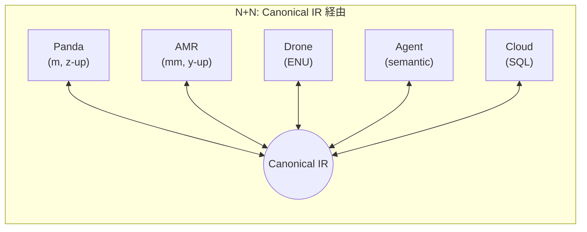
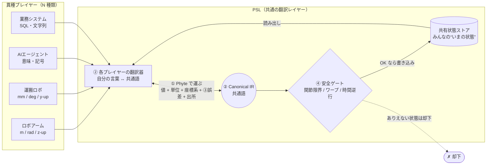

## Research Question

> ロボティクスを触り始めたエンジニアが、「ロボットとAIと業務システムってそもそも違う言語で話すよね？」という疑問を勝手に課題にして、シミュレータの中でロボティクスとAIエージェントと業務システムを同じ形式でコミュニケーションする中間表現を作って遊んだ記録です。

## ソフトウェアのバベルの塔

最近ロボティクスが徐々に流行り始めている兆しを感じてたので、せっかくなので遊んでみることにしました。とは言ってもハードウェアを買って設置するのは大変なので、[MuJoCo](https://mujoco.readthedocs.io/en/stable/overview.html)というシミュレーターを使いつつ、AIエージェントと組み合わせてみることにしました。ただ遊ぶだけだと生産性がないので、一つの問いを立ててみることにしました。

**「ロボティクスが世の中で価値を生んでいくためには、物理世界の操作だけでなく、IT世界の業務システムやAIエージェントと上手くコミュニケーションを取る必要が出てくるはずである。ロボティクス、AIエージェント、業務システムは異なるデータを扱うことになるが、その間を取り持つ意味的翻訳レイヤーを作る必要があるのではないか？」**

たとえばこんな指示を考えてみます。

> From 業務システム　To ロボティクス 「ワークオーダー #42：ビンCの青いギアが不良。回収してQAトレイへ」

人間なら一瞬で理解できますが、システム間では以下のような「翻訳」が何段も発生します。

- 業務システムの「ビンC」は **ただの文字列**。ロボットが欲しいのは `[0.3, 0.3, 0.45]` という **座標（メートル）**。
- アームは「メートル・ラジアン・z-up」で動くけど、運搬ロボットは「ミリ・度・y-up」。**単位も座標系もバラバラ**。
- AIが「不良の可能性 60%」と言ったとき、その **60%はどれくらい確かで、どこから来た値なのか？**

ここが噛み合わないと現場では普通に事故るでしょう。たとえば業務システム間をAPIで通信させて連携させる時も、異なるシステムで異なるデータをつなげるため、その形式や意味の翻訳は必須です（CSVをJSONにしたり、JSTをUTCにしたり・・・）。ロボティクス、AIエージェント、業務システムの間も同様で、**「言葉の壁」を埋める共通の翻訳レイヤーが必要なのではないか？** と思いました。

企業のオフィスワークを支えているIT基盤は業務システムと呼ばれる多様なソフトウェア群です。独自開発したものもあれば、SaaSとして利用しているものもあります。最近ではその中にAIエージェントが導入され、オフィスワークの高度な自動化が実践されようとしています。いずれにしても、企業の情報を管理し、オフィスワークを実現しているのは業務システムとAIエージェントとなっています。

ロボティクスが企業で使われることを考えた時、それはオフィスワークの物理世界への橋渡しと考えられると思います。具体例で言うと、物流におけるサプライチェーンは業務システムが担い、その管理をAIエージェントが支援し、ロボティクスは物理的な操作を担う、みたいなイメージです。そう考えると、ロボティクスが企業で価値を生むためには、**業務システムやAIエージェントと上手くコミュニケーションを取る必要がある** と考えられます。

ここまでが私の課題感の端緒です。


ロボティクスで遊んでみるにあたり「じゃあ全部いい感じに翻訳してくれる共通の層を作ればいいのでは？」と思い、今回課題として作って検証してみました。物理層を含めた意味翻訳ということで、名前は **Physical Semantic Layer (PSL)** とします。

## 何が難しいのか ― 3つの壁

作る前に、なぜ素朴にやると難しいのかを考えてみます。

**1. 翻訳の組み合わせ爆発（N×N）**

相手ごとに専用の変換器を書くやり方だと、組み合わせが急激に増えます。プレイヤーが N 種類いると、つなぐペアの数は N×(N−1) 本になります。3種類なら3×2=6本で済みますが、5種類で20本、10種類で90本と爆発します。しかも厄介なのは、1本の変換器の中で噛み合わせるべき軸が複数あることです（「単位（m↔mm）」「座標系（z-up↔y-up）」「制御方式（位置↔速度↔トルク）」「命名規則」等々）。新しいロボットを1台追加するたびに、既存の全員ぶんのアダプタを新規に書き、しかもどれか1つを直すたびに関係する全ペアを見直す——これは台数が増えるほど現実的に維持できなくなります。

マイクロサービス的に解決するのであれば、サービス側がそのサービスを利用するためのインターフェイスとプロトコルを定義して提供するプラクティスが一般的です（REST APIやgRPC等）。しかしマイクロサービスアーキテクチャは各サービスが同じようなWebサービスを前提としています。ロボティクスとAIエージェントと業務システムという性質の違うWebとは限らないプレイヤーがWeb的なインターフェイスを提供するのは現実的ではありません。**「共通語」を定めて、各プレイヤーは「自分の言葉 ↔ 共通語」の2本だけ実装する** というアプローチが必要になります。

**2. 不確実性とProvenanceが消える**

翻訳アダプタを手書きすると、ほとんどの場合は「値」だけを移して、それに付いていたはずの情報を落としがちです。たとえば「この座標は±0.5mmの誤差を持つ」という **不確実性** や、「この値はセンサAが10:32:05に取得した」という **出所（Provenance）**。これが消えると2つ困ることがあります。

- **判断がズレる**：エージェントが「不良の可能性60%」を確定値として扱い、閾値50%でQA送りにしたとします。しかし実際が「60%±13%」なら下限は47%で、閾値を割ってしまいます。点推定に潰した瞬間に“足切り”の結論が変わってしまうのです。
- **Provenance**：医薬品物流や検体管理のような規制産業では、「誰が・いつ・どの機器で測ったか」を辿れないこと自体が監査証跡の不備になり、コンプライアンスの問題に直結するでしょう。

値だけ合っていても、信頼できる判断材料としては足りないのです。

**3. 物理的にありえない値が素通りする**

業務システムの世界には無い制約が物理世界にはあります。関節には可動範囲があり、物体は瞬間移動（テレポート）できず、やり直しが難しく、質量やエネルギーは保存されます。ところが翻訳の途中でこれらが検査されないと、可動域を超えた関節角、1ステップで数メートル飛ぶ座標、原因より先に結果が観測される時系列、といった **“物理的にありえない状態”がそのままアクチュエータへ届いて** しまうかもしれません。単位ミスや通信の乱れ、ソフトウェアのバグは必ず起きるので、最終段に「物理的に無理な指令は弾く」関所が無いと、最悪ハードウェアの破損や事故につながりかねません。


## 作ったもの

こうしたことを考えていった結果、PSLとして以下4個のコンポーネントを開発しました。

**① 裸の数字を禁止する（Phyte）**
全データを「値だけ」ではなく、以下のようなセットで持つオブジェクトに包みます。

```python
class Phyte:
    value        # 値そのもの
    unit         # 物理単位（メートル？ミリ？）
    frame        # どの座標系か（z-up？ y-up？）
    timestamp    # いつの値か ＋ 誰の時計か
    covariance   # 不確実性（±どれくらいか）
    provenance   # 出所と確信度（誰がどう作ったか）
```

単位チェックが生成時に走るので、「メートルとミリの取り違え」が **型レベルで起きない** 状態になります。地味ですが重要です。

**② 全員が“共通語”だけ話す（Canonical IR）**
各プレイヤーは「自分の言葉 ↔ 共通語」の翻訳器を実装します。AはBを知らなくて良いということです。コンパイラの中間表現（IR）と同じ発想で、翻訳本数が「全ペア」から「人数ぶん」に減ります（N×N → N+N）。



**③ 誤差を捨てない**
①のおかげで「±いくつ」という不確実性を、翻訳しても消さずに最後まで運べます。

**④ 安全ゲートを通す**
共有状態ストア（全プレイヤーの現在の状態を集約した共有データストア）に書き込む前に「関節限界・ワープ・時間の逆行」をチェックして、ありえない状態を弾くようにします。ここだけは AI に判断させず、固いルールで実装しました。

これらをロボティクス、AIエージェント、業務システムの間に挟むことで、**「言葉の壁」を埋める共通の翻訳レイヤー** として機能することを目指しました。

全体像はこんな感じです。



各プレイヤーは「自分の言葉 ↔ 共通語」の翻訳器だけを持ち（②）、やり取りされるデータは必ず Phyte という箱（①）に包まれて、誤差や出所も一緒に運ばれます（③）。共有状態ストアへ書き込む直前には、必ず安全ゲート（④）が物理的にありえない状態を弾きます。

## Let's 検証

実機は無いので、物理シミュレータ **MuJoCo** の中で検証しました。MuJoCoを選んだ理由は、Macbookで簡単に動かせること、「正解（真値）」が手に入ること、翻訳がどれだけ正確かを答え合わせできることです。

| 役割 | 使ったもの |
|------|-----------|
| ロボット3種（アーム / 運搬ロボ / ドローン） | MuJoCo（単位・座標系・制御方式をわざとバラバラに） |
| 頭脳（エージェント） | [Claude Agent SDK](https://code.claude.com/docs/en/agent-sdk/overview) |
| 業務システム | SQLite + HTTPサーバで模擬 |
| 物体認識 | [CLIP ViT-B/32](https://pypi.org/project/open-clip-torch/) |
| 動作予測 | [SmolVLA](https://huggingface.co/docs/lerobot/smolvla) |

そして、それぞれ「壊れどころ」が違う **7つの業務シナリオ** を用意しました。

| シナリオ | 説明 | 試したこと | 壊れどころ |
|---|---|---|---|
| S1 混合フリートピック | 倉庫で不良品を回収し、別の種類のロボットへ受け渡す | アーム→運搬ロボへ受け渡し | 不確実性の伝播 |
| S2 ライン段取り替え | 製造ラインを別製品向けのレシピに再設定する | レシピ適用 | 安全ゲート |
| S3 ラボ検体追跡 | 検体を工程ごとに引き継ぎ、取り扱い履歴を残す | 検体の管理連鎖 | 出所（Provenance） |
| S4 検査＋ドローン | 既存システムにドローンを足して設備を点検する | ロボット追加 | N+N スケーリング |
| S5 医薬品管理 | 医薬品バイアルを検品し、表示と中身の食い違いを弾く | ラベル偽装の検出 | 記号＋学習の合わせ技 |
| S6 電子廃棄物分解 | 学習に無い電子部品を、掴める/外せるか判断して分解する | 未知物体の判定 | 開世界の接地 |
| S7 劣化運用 | 通信遅延や時計ずれがある状況でタスクを継続する | 時計ずれ下での動作 | 因果整合 |

各シナリオは「業務ゴール達成」と「翻訳品質の合格ライン」の**二層**で合否を判定します（たまたま成功を弾くため）。

## 結果

**MacbookでMuJoCoとClipとSmolVLAを動かしつつ、Claude エージェントに端から端まで自走させて、7/7 すべて成功** しました。1回フルで7シナリオを回して API 代は合計 **約 $0.73** でした。詳細は以下になります。

| シナリオ | 判定 | PSL の主要エビデンス（実測） | コスト |
|---------|------|---------------------------|--------|
| **S1** 混合フリートピック | ✅ | PSL rmse 1.08×10⁻⁵（変換式既知の手書きアダプタ B0 と一致、翻訳なし B1 は 576）、較正 NLL **−0.745**、可換性 0.0、R2R ハンドオフ誤差 0.0、エージェント 10 ターン / 9 ツール呼出 | $0.132 |
| **S2** ライン段取り替え | ✅ | PSL rmse **0.0**、**不可能姿勢を安全ゲートが拒否**（誤拒否 0）、可換性 0.0 | $0.068 |
| **S3** ラボ検体追跡 | ✅ | **管理連鎖 intact**、最小 Provenance 確信度 **0.99** | $0.211 |
| **S4** 検査 + ドローン | ✅ | ドローン R2R 往復誤差 **0.0**、ネゴシエーション成立、LOD 7 関節 | $0.065 |
| **S5** 医薬品管理 | ✅ | **汚染検出 100%**、神経記号検出率 **1.0** | $0.071 |
| **S6** 電子廃棄物分解 | ✅ | **埋め込みアドバンテージ 0.667**（CLIP 83.3% vs 記号 16.7%）、アクション妥当性 **100%**（3物体） | $0.072 |
| **S7** 劣化運用 | ✅ | **因果違反 0**、単調劣化、LOD ステイルネス 2.0 | $0.109 |


## 分析

### 「じゃあ全部 LLM に翻訳させればよくない？」を検証

一番気になったのがこの課題です。共通レイヤーを作らず、毎回 LLM に「この数字をこの形式と意味に変換して」とリクエストする案です。実際に Claude Haiku で測って比較してみました。

| | 精度RMSE（ノイズあり） | 速度 | 誤差伝搬 |
|---|---|---|---|
| 都度変換器（NxNで実装） | 0.0108 | 約0.1ms | ✗ |
| **LLMに丸投げ** | **0.0108** | **約2.4秒** | **✗** |
| **PSL** | **0.0108** | **約1.2ms** | **✓（共分散）** |
| 翻訳なし | 576 | ― | ✗ |

**精度は十分高い** 結果となりました。「1000で割って」と方法を教えれば、Claude はほぼ正確に変換します。差が出たのは別のところです。

- **速度**：当然ですが、LLM は1回 **約2.4秒** かかります。自前の変換（〜1ms）の **約2000倍遅い** のです。制御ループには到底入らないでしょう。
- **コスト**：1変換ごとに課金が発生します。
- **誤差を“正しく”渡せない**：「誤差も一緒に返して」とプロンプトすれば、数字自体は返ってきます。でもそれは入力のブレと変換の数学から**計算した値ではなく、較正されていない推測**です。PSL は入力の共分散を変換の数式で伝播させる（`J Σ Jᵀ` のような決定論的計算）ので、申告した誤差が実測とほぼ一致します（後述：1σ に実誤差の84%）。LLM の自己申告は当てにならず、**“それっぽい嘘の誤差”は無印より危険**になり得ます（下流が「±0.01 なら安全」と信じて動いてしまう）。本気で正しくやるには結局、入力共分散を渡して決定論的に行列計算させる＝**PSL を LLM の中に再発明する**ことになります。

つまり「LLM丸投げ」のコストは精度ではなく、**遅さ・お金・誤差情報の消失**という“構造”に出るのです。LLM が悪いのではなく、**毎回の単純変換に使うのは用途が合わない**、ということです。

### 「±いくつ」を、ちゃんと控えめに言える（較正）

不確実性はただ付いていれば良いわけではなく、「不確実性が正確であること」が大事です。PSL が「±これくらい」と申告した値と、実際の誤差を突き合わせたところ、 **実誤差の84%が宣言した1σ以内** に収まっていました（理想は68%）。やや広めに見積もる＝ **安全側に倒れている** ということで、ロボティクスでは過信より望ましい性質と言えるでしょう。

### ロボティクスやAIエージェントを1インスタンス足しても既存コードは変更不要

シナリオ4でドローン（座標系も自由度も制御方式もアーム/運搬ロボと全部違う）を追加したとき、**既存アダプタの変更はゼロ行**でした。共通語を介す設計（N+N）の狙いどおりです。

### 知らない物体でも、AIは少し気が利く

ロボットが「この物体は掴める？外せる？」を判断する素朴なやり方は、 **“物体名 → 性質”の対応表をあらかじめ人手で用意しておく** ことです（本記事ではこれを「記号辞書」と呼びます。たとえば「ギア → 掴める／外せる」を **事前登録** しておくイメージ）。確実ですが、 **登録していない物体が来た瞬間にお手上げ** になります。

そこで、 **事前登録していない（辞書に無い）物体** ――コンデンサ、ヒートシンク、リボンケーブル――で試してみました。記号辞書はエントリが無いのでほぼ全滅（属性正答 **約17%**）でした。一方、ウェブ規模で事前学習済みの **CLIP は、物体名の“言葉の意味”から推測して 約83%** 当てました。

ただし注意も必要で、ここで測っているのは画像からの視覚認識ではなく **物体名の意味的な近さ** です（CLIP の事前学習に capacitor などの語彙が入っているから当てられる、とも言えます）。サンプルも3個なので強い主張はできませんが、「辞書に無い＝お手上げ」だった世界にちょっと光が差す手応えはありました。

### どこで壊れるか

- **極端な変換のストレステスト（安全ゲート＝シナリオ2 と同系統）**：ランダムな単位・回転・ノイズを50パターン投げて、84%は安全ゲートを通過しました。落ちた16%は **「巨大なスケール×強いノイズ」**の組み合わせばかりです。弱点はノイズの増幅で、単位・座標変換そのものは頑健、と分かりました。
- **時計ずれ（シナリオ7 の深掘り）**：許容（5ms）以内のずれは受理、超えたら拒否、と素直に振る舞いました。「順序の信頼性を保証できないなら、保守的に止める」設計です。

## やってみた感想

検証を通して、冒頭の問い――**「ロボティクスが価値を生むには意味的翻訳レイヤーが要るのでは？」**――への回答です。

- **コミュニケーションが必要**：AIエージェント→ロボティクスへの簡単な指示でも翻訳が何段も発生し、難所はロボット単体の性能より「異種システムのつなぎ目」でした。
- **専用レイヤーは条件つきで必要**：単なる値変換なら都度変換（NxN）でもLLMでも精度は同じです。翻訳レイヤーが効くのは「ただ変換する」を超えた要求――**①拡張性（N+N）、②不確実性・出所の伝播、③安全性**――が課題になるときです。だから問いは「翻訳レイヤー」ではなく **「“意味的”な翻訳レイヤー」が要るか**、と読むのが正しいでしょう。
- **真価が出るのはこれから**：今回はシミュレーション内の単純変換が中心でした。規模が大きく、規制があり、安全がシビアな現実ほど抽象化・中間レイヤーが必要になるでしょう。

今夏はシミュレーションの中だけの検証でしたが、さらに複雑な状況や実機を実験すれば、さらにボロが出るはずと思います。ひとまず「自分で課題を決めて、最後まで動かして、数字で確かめる」を一周できたのは、面白い体験でした。同じくロボティクスを始めた人の参考になればうれしいです。

また、今回の実装にあたりClaude CodeでほぼVibe codingしつつ、不明点をAIに聞きながら進めました。便利な時代になったものです。

なお、今回検証したコードは以下で公開しています。興味があればぜひ見てみてください。
https://github.com/shibuiwilliam/robotics-experiments/tree/main/PhysicalSemanticLayer
