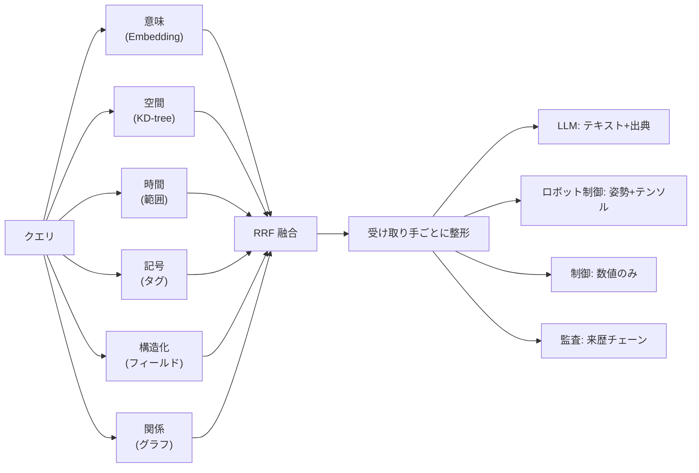
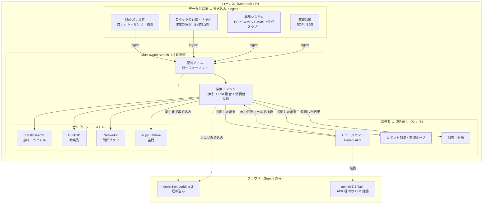

## Research Question

> ロボティクスを触り始めたエンジニアが、「ロボットとAIエージェントと業務システムって、結局みんなバラバラのデータで喋ってるよね？」という疑問を勝手に課題にして、シミュレータの中で全員が同じ検索システムを通して情報をやり取りする世界を作って遊んだ記録です。

## ソフトウェアのバベルの塔の話

最近ロボティクスがじわじわ流行ってきている気配を感じています。せっかくなので勉強がてら遊んでみることにしました。とはいえハードウェアを買って組むのは大変なので、[MuJoCo](https://mujoco.readthedocs.io/en/stable/overview.html) というシミュレータの中で、AIエージェントや業務システムと組み合わせて動かしてみることにします。しかしただ動かすだけだと面白くないので、一つ問いを立ててみます。

**「ロボティクスが企業の業務で価値を生むとき、ロボットは物理世界を操作するだけでなく、AIエージェントや業務システムと情報をやり取りすることになるはずである。しかしこの3者は、生成するデータの形も意味も時間スケールもバラバラなはずだ。3者が共通で使える『情報のハブ』みたいなものが要るのでは？」**


具体的に考えてみます。たとえば工場でこんな連携が起きるとします。

- **ロボット**は、ミリ秒〜秒のスケールで点群・姿勢・接触力・テレメトリを吐き出す。
- **ロボットの行動・スキル**は、秒〜分のスケールで「掴む」「運ぶ」といった作業の実演（行動軌跡）として残る。
- **業務システム**（ERP / WMS / CMMS など）は、時〜月のスケールで在庫や作業指示の構造化レコードを持つ。
- **文書知識**（SOP・マニュアル・SDS）は、ほぼ静的なテキスト。

厄介なのは、形式が違うだけではないところです。たとえば「在庫数」という同じ概念でも、WMS （Warehouse Management System、倉庫管理システム）の記録（少し前に人が登録した値）とロボットの物理観測（たった今カメラで数えた値）では、 **鮮度も信頼度も意味が違う** ことがあります。どちらを信じるべきか、という判断がそこに乗ってきます。

そして今後、ロボットの種類もエージェントの数も増えていくと思われます。プレイヤーごとに専用の連携を書いていると、つなぐペアの数は N×(N−1) で爆発します。3者なら6本ですが、5者で20本、10者で90本。これは嫌です。

そこで今回は、 **「全員が同じ検索システムにデータを投入して、必要なものは検索して取り出す」** という形にしたらどうなるか、試してみることにしました。各プレイヤーは相手の事情を知らなくて良くて、ただ検索システムに「これが欲しい」とクエリを投げる仕組みです。名前は **Multi-World Search（MWS）** としました。要するに、**検索を共通プロトコルにできるか？** という実験です。

> 念のため: これは「全部ベクトルDBに入れてRAGする」話とは違います。後で書きますが、ロボティクスのデータは時間スケールもクエリの種類も多様すぎて、単一のベクトル検索だと取りこぼします。各リソースに合わせた検索インデックススキーマを定義する必要があります。

## なぜ素朴にやると詰まるのか

作る前に、なぜ「全部ベクトルDBに入れてRAG」では足りないのかを考えてみます。3つ壁があると思われます。

**1. 時間スケールが違う**
振動センサーの高頻度データと、半年前に書かれたSOP（標準作業手順）マニュアルを同じインデックスに放り込むと、時間的な文脈がぐちゃぐちゃになります。

**2. クエリの種類が多すぎる**
実際に発生するクエリは「`equipment_id = pump_07` に完全一致」「3m 以内にある設備」「過去1時間の観測」・・・といったものになります。こういうクエリはベクトルの類似度だけでは **原理的に表現できません。** 意味検索が得意なのは「似ているもの」であって、「3m 以内」ではないのです。

**3. 受け取る側で欲しい形が違う**
同じ「ポンプの異常」でも、LLM は「出典つきテキスト」が欲しいし、ロボット制御は「姿勢＋テンソル」、制御ループは「低遅延の数値」、監査担当は「いつ誰が記録したかの履歴」が欲しいのです。1つの形で返しても誰かが困ります。

つまり共通プロトコルとしての検索は、 **多様なクエリと多様な受け取り手を1つの窓口で吸収する** 必要がある、ということです。

## 作ったもの


そんなことを考えながら、MWS には大きく4つの仕組みを実装しました。

**① 全データを「記憶アトム」という同じ箱に包む**
ロボットのセンサー値も、ERP の在庫レコードも、SOP マニュアルも、ロボットのスキル実演も、全部「記憶アトム」という統一フォーマットに変換します。中身は「封筒（時空間座標・モダリティ・信頼度・鮮度・出所・埋め込みベクトル）＋ペイロード（モダリティ固有のデータ）」という構造です。これが共通語の最小単位になります。

**② 6種類のインデックスを並べて融合検索する**
ベクトル検索1本ではなく、意味・空間・時間・記号（タグ）・構造化フィールド・関係（グラフ）の6種を並立させて、**RRF**（Reciprocal Rank Fusion: 各ランキングの順位の逆数を重みつきで足す手法）で1本のランキングにまとめます。クエリの中身に応じて発火するインデックスが切り替わるので、「意味で探す」も「3m 以内で探す」も同じ窓口で扱えるようになります。



**③ 受け取り手ごとに返し方を変える**
融合した結果を、LLM にはテキスト＋出典、ロボット制御には姿勢＋テンソル、というように同じアトムでも消費者ごとに違う形に整形して返します。

**④ 埋め込みは「文書」と「クエリ」で非対称にする**
意味インデックスの埋め込みには [Gemini の gemini-embedding-2](https://ai.google.dev/gemini-api/docs/embeddings?hl=ja) を使ったのですが、これは公式ドキュメントを読むと、索引する文書と検索クエリで違う接頭辞を付ける「非対称」な使い方が推奨されていました。素直に従ったらちょっと精度が上がったので、これも入れました。

埋め込みと LLM だけクラウド（Gemini）を使って、検索エンジン本体・各種ストレージは全部ローカル（MacBook 1台）で動かす構成です。

なお「スキル実演」も、ロボットが過去に行った作業の**行動記録（軌跡）を1つの記憶アトムとして保存しておくだけ**のものです。別のロボットがそれを検索で引っぱり出して再利用できるか、を見ます（賢い行動生成モデルを作る話ではなく、あくまで検索で共有・再利用できるかの実験です）。

## Let's 検証

実機は無いので、MuJoCo の中で検証しました。MuJoCo を選んだのは、MacBook で気軽に動くこと、そして「正解（真値）」がシミュレータから手に入るので、検索の良し悪しを答え合わせできることです。

| 役割 | 使ったもの |
|------|-----------|
| ロボット／物理世界 | MuJoCo（複数ワールド・複数インスタンス） |
| 頭脳（AIエージェント） | [Gemini ADK](https://adk.dev/) 経由の [gemini-3.5-flash](https://ai.google.dev/gemini-api/docs/whats-new-gemini-3.5?hl=ja) |
| 埋め込み | [gemini-embedding-2](https://ai.google.dev/gemini-api/docs/embeddings?hl=ja)（768次元・文書/クエリ非対称）一本 |
| ベクトル検索 | Elasticsearch（dense_vector + kNN, docker-compose）※テストはインメモリ |
| 時系列 / グラフ / 空間 | DuckDB / NetworkX / scipy KD-tree |
| 業務システム | 合成データ・スタブ |

全体像を描くとこんな感じです。各役割は **「書き込み（ingest）」か「検索（クエリ）」で MWS に触るだけ**で、相手の事情は考慮不要な構成にしています。そして **クラウド（Gemini）を使うのは埋め込みと LLM だけ**で、検索エンジン本体もストレージも全部ローカル（MacBook 1台）に置いています。




そして、それぞれ「壊れどころ」が違う **7つの業務シナリオ** を用意しました。

| シナリオ | 内容 | 主に試したこと |
|---|---|---|
| S1 設備保全の引き継ぎ | ポンプ異常を検知し、別形態のロボットへ作業を引き継ぐ | 異種データの融合検索＋スキル転移 |
| S2 物理と記録の調停 | ロボット観測と WMS 記録の食い違いを裁定する | 信頼度重み付き融合 |
| S3 群れによる弱信号発見 | 単独では無害な微小欠陥を群れ全体で束ねる | 直接通信なしの協調 |
| S4 新規SKUの即時立ち上げ | 1台の実演スキルを未経験の群れが再利用 | スキルの転移 |
| S5 インシデント対応 | 漏出検知→SDS/名簿の想起→偵察→計画確定 | 能動的な検索インフラ |
| S6 反実仮想の安全判断 | 危険操作前にリスクを計算して回避 | 「起こりうる未来」の記憶化 |
| S7 注文から充足まで | 幽霊在庫を物理観測で上書きし、再発注まで | 鮮度による真実の決定 |

ここでひとつ気をつけたのは、**「成功した！」を作り込まない**ことです。観測値を都合のいい定数にしたり、成功フラグを無条件に `True` にしたりすれば、どんな仮説でも「確証」できてしまいます。それは検証ではなく演出なので、各シナリオは「業務ゴール達成」と「検索品質の合格ライン」の二層で判定し、さらに **「入力を変えると失敗する」反証テスト** を全部に付けました（物理観測を古くすれば在庫上書きは起きない、ノイズを増やせばパターン発見は失敗する、等）。

## 結果

**MacBook で MuJoCo を回しつつ、Gemini エージェントに端から端まで自走させ** ました。1回フルで7シナリオを回しても API 代は数セントの桁です（各走ごとに呼び出し回数・トークン・推定コストを成果物に焼き込むようにしてあります）。安い。

| シナリオ | 判定 | 主なエビデンス（実測） |
|---------|------|----------------------|
| **S1** 設備保全 | ✅ | Recall@10 **0.90**、LLM が SOP の数値仕様（45 Nm 等）を取り違えず引用、スキル転移成功（=別ロボが残したスキル実演を検索で引いて再利用） |
| **S2** 物理と記録の調停 | ✅ | 融合推定 30.05（真値30・誤差0.05）、1024回試行で融合 < 単一観測、WMS を 50→30 に自動修正 |
| **S3** 弱信号発見 | ✅ | lot_L を「他ロットを厳密に上回る」と発見（margin 2）、3台が直接通信なしで到達 |
| **S4** スキル転移 | ✅ | 実演ありは安全な力（4.0N≤上限5N）で成功率 1.0、実演なしは握りつぶして 0.0 |
| **S5** インシデント対応 | ✅ | Recall@3 **0.43** / Recall@10 **1.00**、漏出取込で監視クエリが自動発火、遮蔽エリアへ偵察を派遣 |
| **S6** 反実仮想 | ✅ | SOP超過からリスク計算（0.80 / 0.615）→ どちらも閾値超で AVOID |
| **S7** 注文充足 | ✅ | Recall@3 **0.33** / Recall@10 **1.00**、幽霊在庫を鮮度比較で検出→上書き→再発注→ERPクローズ |

ひとつだけ場面を紹介すると、S1 はこんな感じです。

> ポンプの振動センサーが異常を出す → エージェントが MWS に投げると、過去の修理履歴（CMMS）・トルク仕様「45 Nm」（SOP）・部品在庫（ERP）・別ロボットが昔教えたスキル実演・技師のシフト表が**一括で**返ってくる → LLM がそれを元に保全計画を生成。このとき「45 Nm」を取り違えずに引用してきたのが地味に嬉しかったです。LLM が訓練データから「知っていた」のではなく、**こちらが業務データとして与えた値を検索して引いてきた**わけで、これがまさに検索を共通プロトコルにしたときに起きてほしいことでした。

## 分析


### 「じゃあ全部ベクトル検索でよくない？」を確かめる

一番気になったのが、6種インデックスを設計したけど、意味検索（ベクトル）だけで足りるのでは？という疑問です。S1 の代表クエリで、インデックスを1つずつ足しながら Recall@10 を測ってみました。

```
意味のみ        ████████░░  0.80
＋空間          ████████░░  0.80
＋構造化        ███████░░░  0.70  ← 一時的に下がった
＋記号（タグ）   █████████░  0.90  ← 回復・改善
全6種           █████████░  0.90
```

面白いのは「＋構造化」で **0.80 → 0.70 に下がった**ところです。構造化インデックスが返すヒットが融合の順位をかき乱して、意味検索の良いヒットを押し下げてしまっています。しかしタグ検索を足すと 0.90 に戻ります。**「インデックスを足せば必ず良くなる」わけではなく、何をどう重み付けるかの設計が要る**、という当たり前だけど作り込みでは出てこない挙動が見られました。

ちなみに後で重みのチューニングも試した（12パターン）のですが、全部同じ値になりました。調べたら Recall@5 には「正解が10件あるのに上位5件しか見ない＝最大でも5/10=0.5」という**構造上の天井**があって、すでに天井に張り付いていただけでした。「Recall@5 が伸びない」と悩んでいたのが、実は計測の上限だったというオチです。重みでは動かせないのです。

### 「理想の検索」とどれだけ差があるか（知覚税）

シミュレータは真値を持っているので、**「正解を全部最上位に並べる理想の検索器（オラクル）」** を作れます。これと実パイプラインの差を取ると、知覚・記述・埋め込みの劣化でどれだけ検索品質を損したかを純粋に分離できます（これを本稿では **「知覚税」** と呼んでいます）。S1 だとオラクルが Recall@10 = 1.0、実パイプラインが 0.9 なので、知覚税は 0.1。「あと何を直せば理想に近づくか」の伸びしろが数字で見えるのが気持ちいいです。最初は S1 でしか測っていなかったのですが、検索中心の全シナリオ（S1/S3/S5/S7）で測れるように直しました。

### クラウド埋め込みが遅い問題（単一モデル＋往復削減）

`gemini-embedding-2` のクラウド呼び出しは実測 p50 で約 400ms。これ、高頻度の制御ループには到底間に合いません。最初は「高品質な教師（クラウド）＋高速な生徒（ローカル小型モデル）」の二層構成も考えたのですが、**異なる埋め込み空間を混ぜると検索が壊れる**（座標系の違うベクトルを同じ距離で比べてしまう）リスクが高く、運用も面倒。結局 **埋め込みは `gemini-embedding-2` 一本に統一** しました。

代わりに往復そのものを減らす方向で殴ります。

- **content-hash キャッシュ**: 同じ内容は二度 embed しない。
- **バッチ**: 複数テキストを1リクエストにまとめる。
- **Batch API**: 文書側の索引化はオフラインで非同期・低コストに寄せる。

クエリ時に残るクラウド遅延は、隠さず既知の制約として計測・開示する方針です（高頻度の制御ループへの適合は今回のスコープ外）。なお検索バックエンドのベクトル探索は **Elasticsearch**（dense_vector + kNN）に載せていて、こちらは ES への HTTP 往復で実測 p50 約6ms。レイテンシ分解では「クラウド埋め込み（~400ms）」「ES検索往復（~6ms）」「ローカル処理」を **別々のバケット**で測るようにしてあります。同じ「検索が遅い」でも原因の桁が全然違うので、混ぜて測ると判断を誤るからです。

### 直接通信なしで群れが結論に至る（S3）

個人的に一番「おっ」と思ったのが S3 です。3台のロボットがそれぞれ別の時刻・別の場所で、単独では無害な微小欠陥を観測します。各ロボットは独立したローカルストアを持っていて、**直接通信は一切しません**。それでも検索の統合層を通すと、群れ全体で「lot_L に品質問題がある」というパターンが浮かび上がる。しかも、無関係なノイズ欠陥を混ぜても成立して、ノイズを増やしすぎると（信号がノイズに埋もれて）ちゃんと失敗します。

生物が巣やフェロモンという「共有環境」を介して間接的に協調する現象を**スティグマジー**と呼ぶそうですが、その共有環境を「共有検索レイヤー」が肩代わりした形になりました。検索プロトコルが協調のハブになる、というのが一番見たかった絵だったので満足です。

### 検索が「聞かれたら答える」を超えて能動的になる（S5）

S5 では、漏出アトムを `ingest()` した瞬間に**監視クエリ（standing query）が自動発火**して、SDS・平面図・名簿を引っ張ってきて対応計画を組む、という流れを作りました。さらに「room_B の観測が無い」という情報の空白を検知すると、偵察ロボットを派遣して埋めにいきます。検索が受動的なDBから、データ取り込みに反応して自分から動くインフラに変わる感じが出せました。

### 数字をちゃんと信じられるようにする

これは趣味みたいなものですが、「クラウド呼び出し64回でした」みたいな数字を自分でも信じられるようにしたくて、**実行ログのマーカー・メトリクスのカウンタ・応答記録ファイルの3つを突き合わせる監査**を入れました。1件でもズレたら失敗扱いです。

これが思いのほか役に立って、埋め込みの設定を変えた直後に「実呼び出し132 vs 計上123」という9件のズレを検出してくれました。追いかけると、環境変数の取り違えで埋め込みのキャッシュが効かず、こっそり余計な呼び出しが走っていた、というバグでした。「計測を計測でチェックする」と、こういう見えない穴が表に出てくるんだなと実感しました。

ついでに LLM の応答も全部記録するようにしたら、「同じ条件なのに計画が7ステップの回と8ステップの回がある」という揺らぎも、記録ファイルを見るだけで「ああ今回は8ステップ計画だったからだ」と数秒で説明がつくようになりました。LLM は揺らぐので、後から追える状態にしておくの大事です。

コスト周りも同じ発想で固めました。ライブで Gemini を叩く走では **1走ごとに呼び出し回数・トークン・推定コストを成果物（manifest / metrics）に焼き込む** ようにして、後からいくら使ったか監査できるようにしています。さらに、`.env` がライブ設定のまま「うっかり実課金で全シナリオ回す」事故を一度やらかしたので、**ライブ実行は明示的な確認フラグ（`MWS_CONFIRM_LIVE_SPEND=1`）が無いと、推定コストを表示して止まるゲート**を付けました。走る前にモード（mock / live）・埋め込み・ベクトルバックエンドを1行バナーで出すようにもしてあるので、「気づいたら課金されてた」が起きにくくなっています。

## やってみた感想

冒頭の問い――**「ロボット・AIエージェント・業務システムをつなぐ共通の情報ハブは、検索でやれるのか？」**――については、遊んだ範囲ではけっこう「いけるかも」という感触でした。ざっくりまとめると:

- **横断検索は普通に成立した**。物理観測も業務レコードもスキルも、同じ窓口でまとめて引けます。ただしベクトル検索1本だと取りこぼすので、複数インデックスの合わせ技は要りそう。
- **LLM に業務知識を覚えさせなくていいのが良い**。検索で根拠を引いてから喋らせると、数値仕様もちゃんと拾ってくれました。
- **直接おしゃべりしない群れが、共有検索レイヤーごしに勝手に結論へ辿り着く**のがちょっと面白かったです。
- **クラウド埋め込みの遅さはキャッシュやバッチで割と殴れる**。最後まで残ったのは LLM 推論そのものの待ち時間でした。

もちろんシミュの中・小規模での話なので、実機や大規模だとボロは出ると思います。それでも「自分で課題を決めて、最後まで動かして、数字を後から疑える形で残す」を一周できたのは普通に楽しかったです。ロボティクス始めたての人の何かのきっかけになれば。


今回も Claude Code でほぼ Vibe coding しつつ、分からないところは AI に聞きながら進めました。[途中までFable 5を使ってたのですが、急に使えなくなって笑いました。](https://www.anthropic.com/news/fable-mythos-access)

コードは以下で公開しています。興味があれば覗いてみてください。
https://github.com/shibuiwilliam/robotics-experiments/tree/main/MultiWorldSearch

なお、検索システムではなく中間表現（IR）でロボティクス、AIエージェント、業務システムのデータをつなげる実験は以下でブログにしました。
https://qiita.com/cvusk/items/ec1a51e7d89aada1f761
