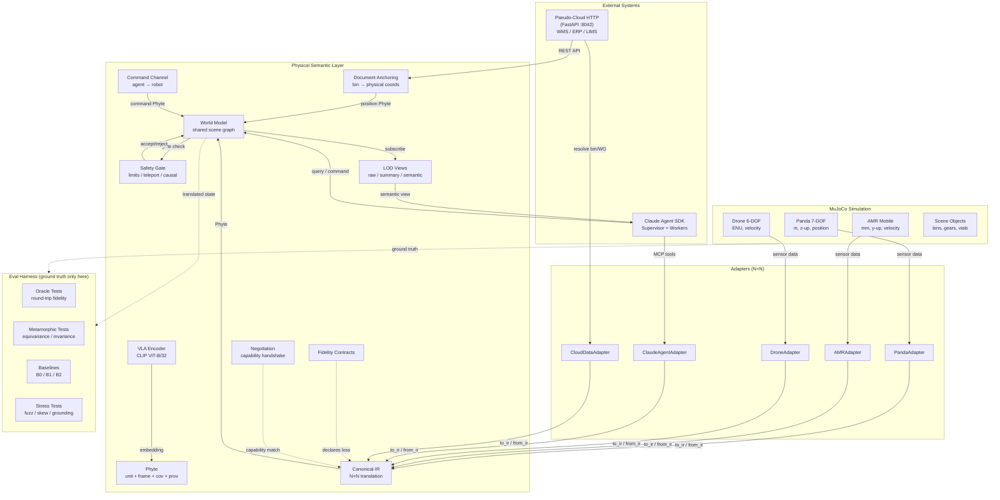

# PSL-Bench

**Physical Semantic Layer verification bench** — a research testbed that uses MuJoCo (physics + ground truth), the Claude Agent SDK (cloud-side agents), VLA-style grounding, and a pseudo-cloud HTTP service to turn a Physical Semantic Layer from "engineering artifact" into a falsifiable scientific object.

The central idea: MuJoCo is both the "physical world" and the perfect oracle. Because we have ground truth, we can measure exactly how much meaning a translation preserves, whether declared uncertainties are calibrated, and whether multi-hop translation paths commute. Each scenario is designed around a specific **breaking point** where naive translation fails — PSL's value is measurable only at those moments.

## Quick start

```bash
# 1. Install
make setup          # creates .venv with Python 3.12, installs everything

# 2. Configure
cp .env.example .env
# edit .env: set ANTHROPIC_API_KEY (needed only for agent features)

# 3. Verify
make doctor         # check all deps, pseudo-cloud, scene XMLs
make sim-smoke      # load Panda arm in MuJoCo, step 100 times, print state
make sim-scenes     # validate all 7 scenario-specific MuJoCo scenes load

# 4. Run tests
make check          # fmt + lint + type + unit tests (the pre-commit gate)
make test           # all 157 tests except API-calling ones
make test-oracle    # 50 ground-truth-based evaluation tests
make test-mr        # 23 metamorphic / property-based tests (hypothesis)

# 5. Run scenarios end-to-end (real physics, cross-adapter R2R, MCP tools, baselines)
make scenarios-all  # all 7 scenarios with two-layer success

# 6. Run a dose-response sweep
make sweep

# 7. Start the pseudo-cloud HTTP service (optional)
make pseudo-cloud-start   # launches on localhost:8042
make pseudo-cloud-health  # check it's running
```

## How it works

Each scenario loads its own **MuJoCo scene**, drives the sim through a **task-specific trajectory** (grasp, handoff, inspect), translates data through the PSL pipeline using **real cross-adapter R2R** (Panda→IR→WorldModel→IR→AMR), calls **MCP tools offline**, and runs **baselines (B0/B1/B2)** for comparison. The pseudo-cloud runs as a **local HTTP service** with REST endpoints, and the **VLA encoder** produces CLIP-style embeddings for affordance grounding.

## Overall Architecture



## The 7 verification scenarios

Each scenario loads its own MuJoCo scene, runs a task-specific trajectory, exercises all 3 data flows (R2R, A2R, A2A) plus document anchoring, and measures **two-layer success**: business goal AND PSL metric threshold.

| # | Scenario | Breaking point | What actually runs | RQ/H |
|---|----------|---------------|--------------------|------|
| **s1** | Mixed fleet pick | Uncertainty propagation + R2R mismatch | Panda grasps gear, hands off to AMR (mm, y-up) via world model | RQ1, RQ2/H2, RQ5/H4 |
| **s2** | Line changeover | Commutativity + safety gate rejection | Dual-arm scene, recipe beyond joint limits rejected | RQ3/H3, RQ7 |
| **s3** | Lab custody | Provenance chain as business deliverable | Handler→transport handoff, ablation proves provenance is needed | RQ1 |
| **s4** | Field inspection | Multi-resolution fusion + bidirectional anchoring | Contact arm inspects asset, LOD views at 3 levels | RQ1, LOD |
| **s5** | Pharma logistics | Neuro-symbolic binding + poisoning | Safety gate rejects causal violation from poisoned provenance | RQ7 |
| **s6** | E-waste disassembly | Open-world affordance grounding | VLA encoder on known vs holdout objects, embedding beats symbol-only | RQ6/H5 |
| **s7** | Degraded ops | Clock skew causality + graceful degradation | Reuses s1 scene with injected skew across 6 levels | Causal |

Each scenario has: a MuJoCo scene XML (`sim/scenes/sN_*/`), a YAML config (`experiments/scenarios/`), pseudo-cloud data (`pseudo_cloud/sN_*/`), an eval module with orchestrator (`eval/scenarios/sN_*/`), and tests (`tests/scenarios/`).

## Research questions

| # | Question | How we measure it |
|---|----------|-------------------|
| RQ1 | How much meaning does translation lose? | Round-trip reconstruction error (SE(3) geodesic) |
| RQ2 | Are declared uncertainties calibrated? | Regression ECE, NLL vs ground truth |
| RQ3 | Do different translation paths agree? | Commutativity divergence |
| RQ4 | Where does translation break under stress? | Dose-response curves across heterogeneity levels |
| RQ5 | Does adding a robot cost O(N) or O(N^2)? | Integration cost via semantic negotiation |
| RQ6 | Does embedding-based grounding help? | Holdout novel-object success rate |
| RQ7 | Can a safety gate block impossible states? | Gate rejection rate + false-reject rate |

## Key invariants

Enforced in code, lint rules, and tests:

1. **Ground-truth isolation** — MuJoCo state stays in `eval/`; banned by ruff lint rule in `src/psl/` and `agents/`
2. **No bare floats** — every physical quantity is a Phyte carrying units, frame, covariance, provenance
3. **N+N only** — all translation goes through the Canonical IR; no direct A-to-B adapters
4. **Uncertainty + provenance always propagated** — point estimates alone are forbidden
5. **Safety gate before every world model write** — joint limits, teleport detection, causal ordering
6. **Determinism** — all randomness from central seed; agent temperature pinned in config
7. **No API calls in control loops** — agents act at semantic level only

## The 10 core mechanisms

| # | Mechanism | Module | Status |
|---|-----------|--------|--------|
| 1 | Phyte (self-describing data unit) | `src/psl/phyte/` | Implemented |
| 2 | Canonical IR (N+N translation) | `src/psl/ir/` | Implemented |
| 3 | Shared world model | `src/psl/world_model/` | Implemented (thread-safe RLock) |
| 4 | Fidelity contracts | `src/psl/contracts/` | Implemented |
| 5 | VLA embedding grounding | `src/psl/grounding/` | Implemented (real CLIP ViT-B/32 + hash fallback) |
| 6 | Affordance prediction | `src/psl/grounding/` | Implemented (zero-shot CLIP + hash fallback) |
| 7 | Multi-resolution LOD | `src/psl/lod/` | Implemented (raw/summary/semantic + command channel) |
| 8 | Semantic negotiation | `src/psl/negotiation/` | Implemented |
| 9 | Physics consistency gate | `src/psl/safety/` | Implemented (limits, teleport, causality) |
| 10 | Document anchoring | `src/psl/anchoring/` | Implemented |

## Repository layout

```
src/psl/
  phyte/            Phyte: self-describing physical-semantic data unit
  ir/               Canonical IR, Adapter protocol, R2R translation
  contracts/        Fidelity contracts (what is preserved/lost)
  world_model/      Shared scene graph with safety-gated writes
  safety/           Physics consistency gate (joint limits, teleport, causality)
  grounding/        VLA encoder (CLIP embeddings + affordance prediction)
  adapters/         Per-entity native <-> IR adapters (N+N)
    robots/panda/     7-DOF arm (m, z-up, position control)
    robots/amr/       Mobile base (mm, y-up, velocity control)
    robots/drone/     6-DOF quadrotor (ENU, velocity control)
    agents/claude/    Claude Agent adapter (plan/decision → IR)
    cloud/            Business data adapter (work orders, bins → IR)
  anchoring/        Document -> physical resolution (Phytes with uncertainty)
  negotiation/      Capability descriptors + semantic handshake
  lod/              Multi-resolution views (raw/summary/semantic + command channel)

sim/
  scenes/           7 scenario-specific MuJoCo XMLs + panda_minimal + drone_minimal
  menagerie/        Model registry and path resolution
  wrapper.py        MuJoCo sim wrapper (sensor prefix support for multi-robot)
  task_controller.py  Per-scenario joint-target trajectories
  schema_gen/       Controlled heterogeneity transforms (unit/frame/noise)

agents/
  tools/            4 MCP tool handlers (query_world_model, command_robot, etc.)
  topology/         Claude Agent SDK supervisor + worker config
  smoke.py          Agent connectivity test

pseudo_cloud/
  server.py         FastAPI HTTP service (REST API on port 8042)
  data.py           Shared business data (WO#42, bins, inventory, SOPs)
  s2_*/..s7_*/      Scenario-specific data (recipes, samples, formulary, etc.)

eval/
  scenarios/
    orchestrator.py   Shared execution: scene load, trajectory, R2R, MCP, baselines
    agent_runner.py   Async Claude Agent SDK scenario runner + per-scenario prompts
    base.py           ScenarioResult, BreakpointResult, two-layer success
    s1_*/..s7_*/      Per-scenario eval (thin wrappers on orchestrator)
  metrics/          SE(3) distance, calibration ECE/NLL, contract accuracy
  oracle/           Ground-truth-based round-trip fidelity
  metamorphic/      Frame equivariance, unit invariance, compositionality
  baselines.py      B0 (N*N), B1 (raw), B2 (simulated LLM), B2-Live (real Claude API)
  b2_live.py        B2-Live driver: dose-response + non-determinism (make baseline-llm)
  ablations.py      Remove covariance/provenance/gate/contracts one at a time
  runner/           Dose-response sweep + run manifest generation

tests/              157 tests (84 unit + 50 oracle + 23 metamorphic)
experiments/        Config-as-code YAML (default sweep + 7 scenario configs)
docs/               Phyte spec, metamorphic relations, contracts, agents, scenarios
```

## The Phyte

PSL's core data unit. Every physical quantity travels as one — no bare floats:

```python
Phyte(
    semantic_id="joint_position_0",     # what it means
    frame="world",                       # reference frame
    pose=np.eye(4),                      # SE(3) in that frame
    timestamp=0.2,                       # when
    clock_domain="sim",                  # whose clock
    time_uncertainty=0.0,                # clock uncertainty
    unit="rad",                          # physical unit (pint)
    value=np.array([0.5]),               # the number(s)
    covariance=np.array([[1e-8]]),       # how sure
    provenance=Provenance(chain=[...]),  # where it came from
)
```

## Cross-adapter R2R through the world model

The R2R path goes through the shared world model, not directly between adapters:

```
Panda sensor → PandaAdapter.to_ir() → WorldModel.write("panda_arm")
                                              ↓ (safety gate check)
                                       WorldModel.read("blue_gear")
AMR actuator ← AMRAdapter.from_ir()  ← IRState from world model
                 (m→mm, z-up→y-up, rad→deg conversion)
```

## Pseudo-cloud HTTP service

The pseudo-cloud runs as a local FastAPI server, simulating real WMS/ERP/LIMS systems:

```bash
make pseudo-cloud-start     # launches on localhost:8042

# Endpoints:
GET  /api/v1/workorders/WO-42      # work order with bin locations
GET  /api/v1/inventory/gear_blue_001  # item status + location
GET  /api/v1/bins/C                 # bin physical position [0.3, 0.3, 0.45]
GET  /api/v1/sops/SOP-PICK-001     # standard operating procedure
POST /api/v1/exceptions             # create exception record
GET  /health                        # service health check
```

## VLA encoder

Grounding module that produces CLIP-style embeddings from MuJoCo renders:

```python
from psl.grounding import VLAEncoder

encoder = VLAEncoder(use_real_clip=False)  # hash-based fallback (no deps)
phyte = encoder.encode_object("circuit_board", timestamp=1.0)
# phyte.value = 512-dim embedding, phyte.provenance tracks encoder source

pred = encoder.predict_affordances("capacitor")
# pred.graspable=True, pred.material="metal", pred.confidence=0.7
```

With `open-clip-torch` installed, set `use_real_clip=True` for real CLIP ViT-B/32 encoding from MuJoCo camera renders.

## Baselines and ablations

**Baselines** (run under identical config via orchestrator):

| Baseline | Approach | Scales as |
|----------|----------|-----------|
| B0 | Hand-written N*N adapters | O(N^2) |
| B1 | Raw shared blackboard (no translation) | O(1) but wrong |
| B2 | Ask the LLM every time | O(N) but expensive |
| **PSL** | Canonical IR with Phytes | O(N) and cheap |

**Ablations**: Remove covariance, provenance, safety gate, or contracts one at a time.

## Makefile targets

```
Setup & Environment
  make setup               Install deps via uv
  make doctor              Environment diagnostics (deps, pseudo-cloud, scenes)

Code Quality
  make fmt                 Format (ruff)
  make lint                Lint (ruff — includes architecture invariant rules)
  make type                Type check (mypy strict, 78 source files)
  make check               fmt + lint + type + unit tests (pre-commit gate)

Tests (157 total, no API cost)
  make test                All tests except API (157 tests)
  make test-fast           Unit tests only (84 tests)
  make test-oracle         Ground-truth evaluation tests (50 tests)
  make test-mr             Metamorphic / property tests (23 tests)
  make test-scenarios      Scenario-specific tests (oracle + metamorphic)
  make test-api            [$$] API tests (calls Anthropic — costs money)

Simulation
  make sim-smoke           MuJoCo minimal load test
  make sim-scenes          Validate all 7 scenario scene XMLs

Scenarios (real physics, cross-adapter R2R, MCP offline, baselines)
  make scenario-s1         s1: mixed fleet pick (Panda + AMR handoff)
  make scenario-s2         s2: line changeover (commutativity + safety)
  make scenario-s3         s3: lab custody (provenance chain)
  make scenario-s4         s4: field inspection (LOD + anchoring)
  make scenario-s5         s5: pharma logistics (neuro-symbolic)
  make scenario-s6         s6: e-waste disassembly (open-world)
  make scenario-s7         s7: degraded ops (clock skew)
  make scenarios-all       Run all 7 scenarios

Pseudo-Cloud HTTP Service
  make pseudo-cloud-start  Start server on localhost:8042
  make pseudo-cloud-stop   Stop server
  make pseudo-cloud-health Check server health

Claude Agent SDK [$$]
  make agent-smoke         SDK 1-shot query (costs money)

Evaluation & Sweeps
  make sweep               Dose-response heterogeneity sweep
  make eval CFG=...        Run evaluation with config
```

## Development

**Dependencies:** Python 3.12, uv, Node.js (for Claude Agent SDK). All pinned via `uv.lock`.

**Testing philosophy:** Two-track verification.
- *Oracle tests* use MuJoCo ground truth to measure actual fidelity, calibration, and contract accuracy.
- *Metamorphic tests* use hypothesis to check invariance properties (frame equivariance, unit invariance, time equivariance, compositionality) without needing ground truth.

**Architecture enforcement:** Ruff lint rules ban imports from `eval/` in `src/psl/` and `agents/` — ground-truth isolation is enforced mechanically, not just by convention.

**Cost discipline:** Tests marked `@pytest.mark.api` call the Anthropic API and are excluded from `make check`. Agent scenario prompts are defined in `eval/scenarios/agent_runner.py`. Estimated cost: ~$0.05-0.20 per scenario run.

## Docs

- [PROJECT.md](PROJECT.md) — Why and what: research questions, hypotheses, evaluation design
- [CLAUDE.md](CLAUDE.md) — How to build: coding rules, architecture invariants, recipes
- [SCENARIOS.md](SCENARIOS.md) — The 7 verification scenarios: breaking points, flows, success conditions
- [IMPROVEMENT.md](IMPROVEMENT.md) — Gap analysis and improvement plan
- [PROMPT.md](PROMPT.md) — Claude Code development prompt
- [docs/phyte.md](docs/phyte.md) — Phyte schema specification
- [docs/metamorphic.md](docs/metamorphic.md) — Metamorphic relation catalog
- [docs/contracts.md](docs/contracts.md) — Fidelity contract specification
- [docs/agents.md](docs/agents.md) — MCP tool specs and agent topology
- [docs/scenarios/overview.md](docs/scenarios/overview.md) — Scenario summary and coverage matrix

## License

Research project. See repository for terms.
