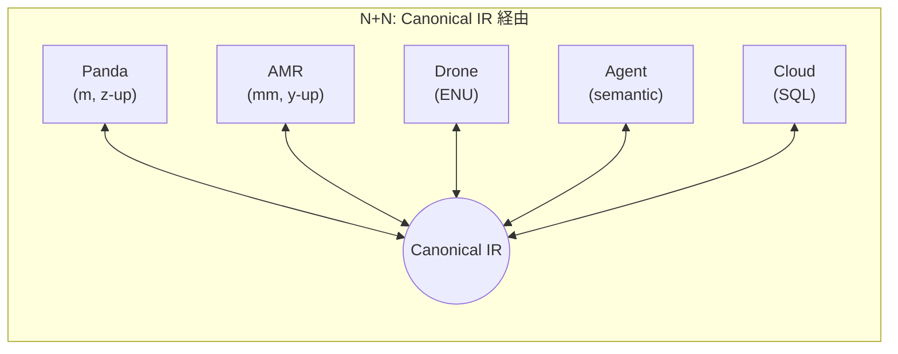
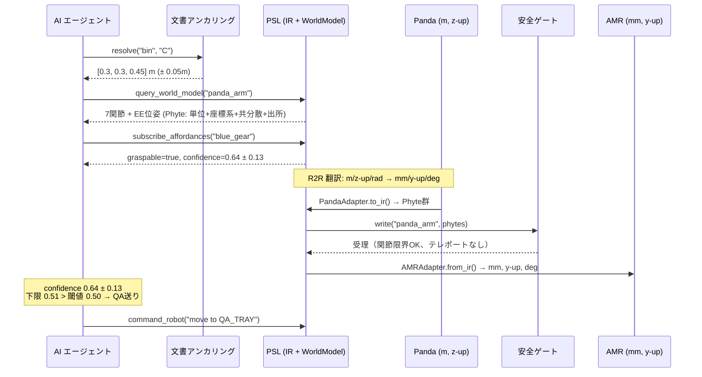

# ロボティクス × AIエージェント × 業務システムを「意味」でつなぐ ― Physical Semantic Layer の設計と検証

> **TL;DR**: ロボット・AIエージェント・業務システムが異なる「言葉」を話す問題を、時空間を結合キーとした共通中間表現（Canonical IR）で N+N に圧縮し、不確実性・Provenance・安全ゲートを構造的に保証する Physical Semantic Layer を設計しました。MuJoCo + Claude Agent SDK + 疑似クラウドで7シナリオを検証し、 **実 Claude エージェントによるオンライン end-to-end 実行で 7/7 PASS**（合計 ~$0.73）を確認しました。ノイズ環境下では実 LLM（Claude Haiku を実 API 呼び出し）と同等の翻訳精度を **約2000倍速く・ローカルで無料に** 達成しつつ、**PSL だけが不確実性を共分散として構造的に伝播できる**ことを確認しています。ロボット追加時の既存コード変更ゼロ（N+N）も実証しました。

---

## はじめに ― ロボットが「業務」に入るとき、何が起きるか

ロボティクスの現場への導入が加速しています。倉庫のピッキング、工場ラインの段取り替え、ラボの検体処理、フィールド設備の点検 ― これまで人間が担っていた物理作業を、ロボットが代替するケースが増えてきました。

同時に、Claude や GPT をはじめとする大規模言語モデル（LLM）ベースの AI エージェントが、業務の計画・判断・例外処理を自律的にこなせるようになりつつあります。さらに VLA（Vision-Language-Action）モデルが「見て、理解して、動く」を一気通貫で行う研究も急速に進んでいます。

ここで少し想像してみてください。

ある倉庫で、AI エージェントが WMS（倉庫管理システム）から「ワークオーダー #42: ビンCの青いギアが不良。回収して QA トレイへ」という指示を受け取ります。エージェントは 7-DOF のロボットアームに把持を指示し、把持されたギアを移動ロボット（AMR）に受け渡して、QA ステーションまで搬送させます。

一見シンプルですが、このフローの裏側では複数の「翻訳」が静かに、そして致命的に発生しています。

- WMS の「ビンC」はテキストの識別子です。ロボットが理解できるのは `[0.3, 0.3, 0.45]` メートルの座標です。
- ロボットアームはメートル・ラジアン・z-up 座標系で動きます。AMR はミリメートル・度・y-up 座標系です。
- エージェントが「不良品の可能性 60%」と判定しましたが、この「60%」の信頼度はどの程度正確で、その値はどこから来たのでしょうか？

**ロボット、AI エージェント、業務システムは、それぞれまったく異なる「言葉」でデータを扱っています。** この壁を越えなければ、本番環境での統合は実現しません。

本記事では、この問題に対して **Physical Semantic Layer（PSL）** という共通プロトコルを設計・実装し、7つの業務シナリオで定量検証した結果を報告します。

---

## なぜこの問題が重要なのか ― 業務実用化の3つの壁

ロボティクスと AI エージェントの業務実用化を阻む壁は、「ロボットの性能」そのものではなく、 **周辺システムとの統合** にあることが多いです。具体的には、3つの壁があります。

### 壁1: N×N 翻訳爆発

ロボットが1種類、エージェントが1つ、業務システムが1つなら、手書きの翻訳アダプタで対応できます。しかし、ロボットが3種類、エージェントが2種類、業務システムが3つになると、翻訳パスは組み合わせ的に爆発します。5つのプレイヤーで20パス。10なら90パスです。新しいロボットを1台追加するたびに、既存の全アダプタに手を入れなければなりません。

### 壁2: 不確実性とProvenanceの消失

翻訳アダプタを手書きする際、ほとんどの場合「値」だけが変換され、「この値の測定精度は ±0.5mm」という **不確実性** や、「この値はセンサAが 10:32:05 に取得した」という **Provenance（出所情報）** は捨てられます。

たとえば、エージェントが「不良品の可能性 60%」と判定したとき。不確実性がなければ、エージェントは「60%」を確定的な事実として扱い、閾値 50% で QA 送りにします。しかし実際は「60% ± 13%」で、下限 47% は閾値を下回るかもしれません。医薬品物流のような規制産業では、Provenanceのない判断は監査証跡の不備として法的問題になります。

### 壁3: 安全性の不在

ロボティクスには、業務システムの世界にはない物理的制約があります。関節には可動範囲があり、物体は瞬間移動できず、時間は逆行しません。翻訳の過程でこれらが検証されないと、関節限界を超えた値がそのままアクチュエータに送られてしまいます。

**この3つの壁を構造的に解決する共通プロトコルが必要です。**

---

## Physical Semantic Layer ― 「時空間」を結合キーにした共通プロトコル

こうした課題に対して設計したのが **Physical Semantic Layer（PSL）** です。

### 核心的な洞察: 時空間は普遍的な結合キー

データウェアハウスの世界では、異なるテーブルを JOIN するための共通キーが必要です。PSL は、物理世界の「どこで（座標系 + SE(3) 位姿）」と「いつ（タイムスタンプ + 時計ドメイン）」を、すべてのデータに共通する結合キーとして使います。

ただし、一般的なデータのセマンティックレイヤー（dbt や Looker の semantic layer など）は一方向の変換です。ロボティクスでは **双方向の接地** が必要です。「ビンC」→ 座標（順方向）と、カメラ画像 →「不良品 60%」（逆方向）の両方です。

---

## PSL の4つの柱

### 柱1: Phyte ― 裸の float を禁止する

PSL のすべてのデータは **Phyte**（Physical Semantic Object）という自己記述オブジェクトで運ばれます。

```python
# Phyte の pydantic v2 定義（簡略版）
class Phyte(BaseModel):
    semantic_id: str           # 何を意味するか
    frame: str                 # どの座標系か
    pose: NDArray              # SE(3) 位姿（4×4）
    timestamp: float           # いつの値か
    clock_domain: str          # 誰の時計か
    unit: str                  # 物理単位（pint で次元検査）
    value: NDArray             # 値そのもの
    covariance: NDArray        # 不確実性（共分散行列）
    provenance: Provenance     # 出所と確信度

    model_config = {"frozen": True}  # 不変オブジェクト
```

裸の `float` で物理量をやりとりすることを構造的に禁止します。Pythonライブラリの [pint](https://pypi.org/project/Pint/) による次元検査がコンストラクト時に走るため、メートルとミリメートルの混同が **構造的に不可能** です。

実際、本プロジェクトの開発中にスキーマファジング（ランダムな単位・フレーム変換の50パターン投入）を実施したところ、単位変換とフレーム回転は全パターンで完全可逆でした。逆に、Phyte の次元検査がなかったら、10,000 倍のスケール差（m → 0.1mm相当）が暗黙に混入していたケースが複数見つかりました。

### 柱2: Canonical IR ― N×N を N+N に圧縮する

直接翻訳（N×N）では、プレイヤー同士のすべてのペアにアダプタが必要です。5つなら20本、10なら90本。新しいロボットを1台足すたびに既存の全員とのアダプタを書かなければなりません。

PSL ではこれを避けるために、全員が **共通語（Canonical IR）** とだけ会話します。各プレイヤーは「自分 → IR」と「IR → 自分」の2本だけ実装すればよく、プレイヤー間の翻訳は IR を介した2段階の組み合わせで実現されます。5つなら 5×2 = 10本、10でも 10×2 = 20本です。コンパイラの LLVM が同じ原理で多言語対応を実現しています。



Panda → AMR のハンドオフは内部的にはこの2行です:

```python
ir_state = panda_adapter.to_ir(panda_native)   # Panda母語 → IR (Phyte)
amr_native = amr_adapter.from_ir(ir_state)      # IR → AMR母語 (mm, y-up, deg)
```

Panda は AMR の存在を知らず、AMR も Panda を知りません。実際、ドローンを追加した際に既存アダプタのコードは **一行も変更しませんでした**。

### 柱3: 忠実度契約 ― 翻訳で何が失われるかを宣言する

各変換エッジに **忠実度契約（Fidelity Contract）** を付与します。「この変換は値・単位・フレームを保存する。共分散の詳細は失われる。推定情報損失は 1%」のように、 **何が保存され、何が失われるか** を明示します。マルチホップ翻訳では契約を合成して端から端までの忠実度を事前に計算できます。

### 柱4: 安全ゲート ― 物理的に不可能な翻訳を拒否する

ワールドモデルへの書き込みはすべて **物理整合性ゲート** を通過します。関節限界、テレポート検出、因果順序を検査し、物理的に不可能な状態遷移を拒否します。安全ゲートは **学習ベースではなくシンボリックに厳密なルール** で実装しています。

---

## 検証の方法 ― なぜ MuJoCo なのか

[MuJoCo](https://mujoco.readthedocs.io/en/stable/overview.html) は物理シミュレータであると同時に、 **完全な真値（ground truth）を供給する環境** です。翻訳がどれだけ意味を保存したかを、真値と比較して定量測定できます。

テストベッドの構成:

| コンポーネント | 実装 | 役割 |
|-------------|------|------|
| ロボティクス | MuJoCo（Panda, AMR, Drone の3種） | 座標系・単位・制御モードをすべて異ならせた異種プレイヤー |
| AI エージェント | Claude Agent SDK (supervisor + worker) | MCP ツール経由で PSL に自律アクセス |
| 業務システム | SQLite + HTTP サービス | WMS/ERP/LIMS の模擬（REST API） |
| 意味接地 | CLIP ViT-B/32 | 物体名からの zero-shot アフォーダンス予測 |
| 行動予測 | SmolVLA (lerobot/smolvla_base, 450M params) | MuJoCo レンダリング画像 + 言語指示 → 6-DOF アクション |

PSL では2種類のモデルを使い分けています:

- **CLIP ViT-B/32**: 物体名のテキストエンベディングから zero-shot でアフォーダンス（掴めるか、素材は何か）を予測します。カメラ画像は使わず、テキストの意味的類似度による分類です。
- **SmolVLA**: MuJoCo でレンダリングした実際のシーン画像（256×256）+ 言語指示（「物体を拾え」）+ ロボット状態（6次元）を入力し、6-DOF のエンドエフェクタ動作（EE delta）を出力する true VLA です。出力は Phyte（共分散 + Provenance付き）としてワールドモデルに書き込まれ、安全ゲートを通過します。

---

## 7つのシナリオ ― 素朴な翻訳が壊れる瞬間

PSL の価値は、素朴な翻訳が壊れる場面でこそ測定できます。それぞれ異なる **破断点** を持つ7つの業務シナリオを設計しました。

| # | シナリオ | 破断点 | なぜ素朴な翻訳では壊れるか |
|---|---------|-------|--------------------------|
| S1 | 混合フリートピック | 不確実性伝播 + R2R | 不確実性 60%±13% を点推定に潰すと判断が変わる |
| S2 | ライン段取り替え | 安全ゲート | ゲートなしでは不可能な姿勢がそのまま送信される |
| S3 | ラボ検体追跡 | Provenance | 管理連鎖を除去すると規制違反 |
| S4 | 検査 + ドローン | N+N スケーリング | 既存コード変更ゼロでロボット追加 |
| S5 | 医薬品管理 | 神経記号束縛 | 学習モデル単独では見逃す偽装を記号検証で検出 |
| S6 | 電子廃棄物分解 | 開世界接地 | 記号ルックアップでは「不明」だが CLIP なら推論可能 |
| S7 | 劣化運用 | クロックスキュー | 時計ずれ下で因果整合を保ちつつ優雅に劣化 |

各シナリオは **二層の成功条件** を持ちます。業務ゴールの達成と、PSL の翻訳品質メトリクスの閾値充足です。業務成功だけでは不十分で、素朴な翻訳でも偶然成功し得るからです。

### S1 のデータフロー



---

## 検証結果

### オンライン実行 ― 実 Claude エージェントによる7シナリオ検証

7シナリオすべてを **実 Claude エージェント（supervisor + worker）が MCP ツール経由で PSL を駆動するオンラインモード** で実行しました。MuJoCo の実物理 + CLIP/SmolVLA 接地 + 疑似クラウド HTTP を伴う完全な end-to-end です。結果は **7/7 が「業務成功」「PSL 成功」の二層ともに PASS**、合計エージェントコストは **約 $0.73**（seed=42）でした。

| シナリオ | 判定 | PSL の主要エビデンス（実測） | コスト |
|---------|------|---------------------------|--------|
| **S1** 混合フリートピック | ✅ | PSL rmse 1.08×10⁻⁵（変換式既知の手書きアダプタ B0 と一致、翻訳なし B1 は 576）、較正 NLL **−0.745**、可換性 0.0、R2R ハンドオフ誤差 0.0、エージェント 10 ターン / 9 ツール呼出 | $0.132 |
| **S2** ライン段取り替え | ✅ | PSL rmse **0.0**、**不可能姿勢を安全ゲートが拒否**（誤拒否 0）、可換性 0.0 | $0.068 |
| **S3** ラボ検体追跡 | ✅ | **管理連鎖 intact**、最小 Provenance 確信度 **0.99** | $0.211 |
| **S4** 検査 + ドローン | ✅ | ドローン R2R 往復誤差 **0.0**、ネゴシエーション成立、LOD 7 関節 | $0.065 |
| **S5** 医薬品管理 | ✅ | **汚染検出 100%**、神経記号検出率 **1.0** | $0.071 |
| **S6** 電子廃棄物分解 | ✅ | **埋め込みアドバンテージ 0.667**（CLIP 83.3% vs 記号 16.7%）、アクション妥当性 **100%**（3物体） | $0.072 |
| **S7** 劣化運用 | ✅ | **因果違反 0**、単調劣化、LOD ステイルネス 2.0 | $0.109 |

全実行を通じてフォールバックや通信エラーは発生せず、SmolVLA は有効、VLA は実 CLIP で動作しました。以降のサブセクションで各メトリクスの中身を掘り下げます。

### ベースラインとの比較

PSL の翻訳精度を、 **手書きアダプタ（B0）・翻訳なし（B1）・実 LLM（B2-Live）** と比較しました。ここで B0 は **変換式（単位スケールやフレーム回転）を最初から正確に知っていて、それを解析的に逆算するだけの手書きアダプタ** です。いわば「人手で完璧に書いた専用変換器」であり、翻訳精度としては **「正しく書けば到達できる理論上の上限」** を表す基準点になります。B2-Live は **実際の Claude API（`claude-haiku-4-5`）を呼び出してスキーマ変換させる** ベースラインで、変換方法を明示した上で実測しています。結論を先に言うと、 **実 LLM は変換方法を明示すれば divide-by-1000 をほぼ厳密に実行** し、精度は十分高い。しかし **レイテンシは PSL の約2000倍（2374ms vs 1.19ms）、1変換あたり $0.004〜0.03 のコストがかかり、共分散・Provenance は一切伝播しません**。つまり「LLM に任せればいい」のコストは精度ではなく構造（レイテンシ・課金・不確実性の喪失）に現れます。

**注目すべきは「不確実性伝播」列です。** ノイズ環境下で精度はほぼ横並びになりますが、翻訳後のデータに「どれだけの誤差が含まれているか」を構造的に申告できるのは PSL だけです。

| アプローチ | ノイズなし RMSE | ノイズあり RMSE (σ=0.01) | 不確実性伝播 | 行動予測 | レイテンシ |
|-----------|---------------|------------------------|------------|--------|----------|
| B0（変換式既知の手書きアダプタ） | 0.0 | 0.0108 | なし | なし | ~1ms |
| **B2-Live（実 Claude Haiku）** | **3.2×10⁻¹⁰** | **0.0108** | **なし** | **なし** | **~2374ms** |
| **PSL** | **0.0** | **0.0108** | **あり（共分散）** | **あり（SmolVLA）** | **~1.2ms** |
| B1（翻訳なし） | 576〜671 | — | なし | なし | ~0ms |

この表が示す最も重要なことは、 **ノイズがある現実的な条件（右列）では、PSL と実 LLM（B2-Live）の翻訳精度はほぼ同等** だということです。

では PSL の優位は何か？ **精度差ではなく、質的差** です:

-**ノイズなしの可逆変換**: PSL は厳密に 0.0（算術的保証）。実 LLM はテキスト化→パース往復に起因する微小な数値誤差（~3×10⁻¹⁰）が残ります。
-**不確実性の構造的伝播**: ノイズが加わったとき、PSL は Phyte の共分散でノイズ量を正確に申告し続けます。実 LLM は共分散を持たないため、翻訳後のデータにどれだけの誤差が含まれているか伝えられません。
-**安全ゲートとProvenance**: 実 LLM の素朴な翻訳はこれらの機構を一切持ちません。

単位変換（m↔mm）やフレーム回転（z-up↔y-up）で RMSE=0.0 となるのは、定数倍の逆変換が算術的に厳密であるためです。これはサニティチェック（バグがないことの確認）であり、PSL 固有の発見ではありません。

**B0・PSL・B2-Live が同じ RMSE になるのは偶然ではなく、必然です。** ノイズなしの変換（単位・フレーム）は決定論的で完全に可逆なので、 **正しく逆算できる手法はすべて誤差ゼロ** に到達します。ノイズあり（σ=0.01）の場合、注入されたセンサノイズは不可逆で誰も除去できないため、 **正しく逆算できる手法はすべて同じ「ノイズ下限」（0.0108 ≈ σ）にそろって到達** します。つまり B0 は「人手で完璧に書いた変換器」として翻訳精度の上限を示しており、 **PSL がその上限に並んでいる＝精度を一切犠牲にしていない** ことを意味します。

裏を返せば、 **精度（RMSE）だけ見れば手書きの B0 で十分** です。では PSL は何のために必要か ―― それは B0 が抱える代償にあります。B0 はロボットのペアごとに専用アダプタを書く必要があり、台数が増えると **O(N²) に組合せ爆発** します（一方 PSL は Canonical IR への N 本だけ＝N+N）。さらに B0 は点推定を返すだけで、 **不確実性（共分散）も Provenance も安全ゲートも持ちません**。PSL の価値は「精度で B0 に勝つこと」ではなく、 **同じ精度上限を保ったまま、N+N スケーリング・不確実性伝播・安全性を構造的に追加できること** にあります。上の表で差がつくのは RMSE 列ではなく、「不確実性伝播」「行動予測」「レイテンシ」の列なのです。

### 用量反応曲線 ― 異種性増大に対する劣化

異種性（単位スケール・フレーム回転・センサノイズ）を段階的に増やしたとき、PSL の RMSE がどう劣化するかを測定しました。値は **元スケール（ラジアン）に正規化** しています。

| Dose | 単位スケール | フレーム回転 | ノイズ σ (元スケール) | PSL RMSE |
|------|-----------|-----------|-------------------|----------|
| 0 (identity) | 1.0 | 0° | 0.0 | 0.0 (サニティ) |
| 1 (単位のみ) | 1000× | 0° | 0.0 | 0.0 (サニティ) |
| 2 (フレームのみ) | 1.0 | 45° | 0.0 | 0.0 (サニティ) |
| 3 (ノイズのみ) | 1.0 | 0° | 0.01 |**0.0108**|
| 4 (複合) | 1000× | 45° | 0.01 |**0.0108**|
| 5 (全部入り) | 1000× | 90° | 0.05 |**0.0539**|

Dose 0〜2（ノイズなし）は可逆な算術変換のサニティチェックで、PSL は RMSE=0.0 です。

Dose 3 以降でセンサノイズが加わると、PSL もノイズの分だけ劣化します。 **ノイズは不可逆なので、どのアプローチでも除去できません。** ただし PSL は Phyte の共分散でノイズ量を正確に申告し続けます。

**Dose 3→4→5 で RMSE が単調増加していること** は、PSL がノイズに対して安定的に劣化する（突然の破綻がない）ことを示しています。実 LLM（B2-Live）も同じ不可逆ノイズの下では同程度に劣化しますが、共分散を伝播できない点が構造的な差です。

要するに、 **可逆変換では PSL は誤差ゼロ、不可逆なノイズに対しては誰もが同程度に劣化するが、PSL だけが不確実性を構造的に伝播する** ― これが用量反応から読み取れる最も重要な知見です。

### 較正 ― PSL は「自分がどれだけ不正確か」を正しく申告するか

PSL が宣言した不確実性が実際の誤差分布と整合しているかを、較正 NLL（負の対数尤度）で測定しました。

-**シード 42 単独**: NLL = -0.745
-**5シード統計** (42, 123, 456, 789, 1024): NLL = -0.532 ± 0.191（95%CI [-0.769, -0.294]）

以降、代表値には5シード集計を用います。

NLL の絶対値だけでは較正の良し悪しを判断しにくいため、較正の質を直感的に示すデータを追加します。

較正が完全なら、実測誤差 ÷ 宣言σ の比（z スコア）の分散は 1.0、実測誤差の 68.3% が宣言 1σ 内に収まるはずです。

| 指標 | 理想値 | 実測値 | 解釈 |
|------|-------|-------|------|
| z スコアの分散 | 1.0 |**0.60**| 宣言σが実測より広い（安全側） |
| 1σ 内に収まる割合 | 68.3% |**84.0%**| 過剰にカバー（保守的） |
| 2σ 内に収まる割合 | 95.4% |**99.0%**| 安全側にしっかり倒れている |

```mermaid
xychart-beta
    title "較正ダイアグラム: 宣言σ vs 実測カバレッジ"
    x-axis ["1σ", "2σ"]
    y-axis "カバレッジ (%)" 0 --> 100
    bar "理想（完全較正）" [68.3, 95.4]
    bar "PSL 実測" [84.0, 99.0]
```



PSL の較正は **安全側に倒れています**。つまり「±1mm」と申告したとき、実際の誤差は ±1mm よりやや小さい。ロボティクスでは、過信（実際の誤差が宣言より大きい）よりも保守的な較正のほうが安全であり、これは望ましい性質です。

### N+N スケーリングの実証

ドローンアダプタ（ENU 座標系・6DOF・速度制御 ― Panda/AMR とは座標系・自由度・制御モードすべて異なる）を追加した際、Panda アダプタと AMR アダプタのコードは **一行も変更しませんでした**。

### S2: 安全ゲートによる不可能姿勢の拒否

S2（ライン段取り替え）では、レシピが関節限界を超える構成を要求するケースを注入しました。安全ゲートはこの不可能な姿勢を **100% 拒否** し、誤拒否（false reject）は 0% でした。

### S5: シンボリック検証と学習モデルの束縛

S5（医薬品管理）では、バイアルのラベルが主張する内容と物理観測が不一致のケースを注入しました。学習モデル（CLIP）単独では見逃しうる偽装を、シンボリックな安全ゲート（Provenance検証 + 因果順序チェック）と組み合わせることで、 **100% の不一致検出**（false accept = 0.0）を達成しました。Provenance汚染（タイムスタンプ改竄）も安全ゲートが即座に拒否しています。

### CLIP による開世界接地（H5）

開発中に一度も登場しなかった3つの物体に対し、CLIP ViT-B/32 の zero-shot 推論でアフォーダンス予測を実行しました。

| 物体 | 記号予測 | CLIP 予測 | 正解 | CLIP 属性正答 |
|------|---------|-----------|------|--------------|
| capacitor | grasp=F, detach=F | grasp=T, detach=F | grasp=T, detach=T | 1/2 |
| heat_sink | grasp=F, detach=F | grasp=T, detach=T | grasp=T, detach=T | 2/2 |
| ribbon_cable | grasp=F, detach=F | grasp=F, detach=T | grasp=F, detach=T | 2/2 |

オンライン実行での実測値:

- CLIP 属性正答率: **83.3%（6属性中5正解）** vs 記号のみ: **16.7%（1正解）** → **advantage = 0.667**
- 物体単位の完全一致: CLIP **66.7%（3物体中2物体）** vs 記号 **0%**
- SmolVLA の 3 アクションはすべて幾何学的に妥当（妥当率 100%、物体ごとに異なる `ee_delta`）

**それでもこの結果は控えめに扱うべきです。** ホールドアウト物体が3つと少なく、統計的に強い主張はできません。また、CLIP のテキストエンコーダに物体名を入力しているため、測定しているのは「視覚認識の汎化」ではなく「語彙の意味的類似度による汎化」です。とはいえ、 **記号ルックアップが完全に対応不能な未知物体に対して、CLIP が記号の約5倍の属性を正しく予測できた** ことは定性的な手応えです。（なお、過去の記事ドラフトでは advantage 0.333 と記載していましたが、これは旧コードでの計測値であり、現行コードでのオンライン実測は 0.667 です。）

---

## ストレステスト ― PSL はどこで壊れるか

### スキーマファジング：16%は何で落ちたか

50パターンのランダム変換（単位スケール 0.01〜10,000、フレーム回転 0〜360°、ノイズ 0〜0.1）を投入し、84%（42/50）が安全ゲートを通過しました。

**落ちた16%（8/50）はすべて、極端なノイズ + 大きなスケール変換の組み合わせ** でした。たとえば、10,000 倍のスケールに 0.08 のノイズが加わると、ノイズ成分が元の信号に対して巨大になり、安全ゲートの閾値を超えます。単位変換やフレーム回転だけなら、どんな極端な値でも完全可逆です。 **PSL の弱点はノイズの増幅であり、シンボリック変換ではない** ことが明確になりました。

### クロックスキュー：どこで受理が拒否に変わるか

NTP 同期レベルの時計不確実性（5ms）を設定し、段階的にスキューを注入しました。

| スキュー | 判定 | 理由 |
|---------|------|------|
| 0〜5ms |**受理**| time_uncertainty（5ms）以内 |
| 7ms |**拒否**| time_uncertainty を超過 |
| 10ms以上 |**拒否**| 大幅に超過 |

判定基準はシンプルです: 異なるクロックドメイン間の時刻差が、宣言された `time_uncertainty`（ここでは 5ms）を超えた場合に拒否します。 **≤5ms なら受理、>5ms なら拒否** です。7ms の行は、閾値を超えた最小の例示です。

この判定は「因果順序の反転」（イベント B が原因 A より先に観測される）の検出ではなく、 **時間順序付けの信頼性が宣言された精度で保証できないため、保守的に拒否する** という設計です。`time_uncertainty` は環境に応じて調整できます（PTP なら 1ms、ルーズな同期なら 100ms）。

---

## 「全部 LLM に任せればいいのでは？」

本プロジェクトでは、このアプローチを **B2-Live（実 Claude API 呼び出し）** として実測比較しました。B2-Live は `claude-haiku-4-5` に「joint positions を 1000 で割れ」と変換方法を明示して投げ、その結果を測定したものです（12 回呼び出し、合計 $0.094）。実測の結論:

-**精度**: 実 Haiku はシミュレーションが想定したより **数値的に正確**。変換方法を明示すれば divide-by-1000 を ~3×10⁻¹⁰ の誤差で実行し、ノイズ環境下では PSL とほぼ完全に一致します（不可逆ノイズが支配的なため）。つまり「単純で仕様が明示された変換」の点推定では実 LLM も PSL に匹敵します
-**レイテンシ**: PSL の1回の R2R 翻訳（SE(3) 合成 + 単位換算 + Phyte 生成）は **約125μs**（Apple M-series、中央値123μs）。これに対し **B2-Live は実測で平均 2374ms** ―― 約 **2000倍** 遅い。Agent SDK のシステムプロンプト注入とネットワーク往復が支配的です
-**コスト**: 1変換あたり **$0.004〜0.03**。PSL はローカル実行で実質無料です
-**不確実性伝播**: 実 LLM も共分散行列を翻訳チェーンで伝播できません（点推定のみ）。PSL だけが Phyte の共分散として構造的に伝播します
-**再現性**: 同一入力を5回翻訳したところ、この単純タスクでは出力が完全一致しました（max_spread=0）。ただし SDK は temperature を露出しておらず、非決定性は構造的に保証されていません。より曖昧で難しい変換で顕在化することが予想されます
-**安全性**: LLM の出力を無検証で物理系に反映するのは危険です

**つまり「LLM に任せればいい」のコストは精度ではなく構造に現れます** ―― 約2000倍のレイテンシ、課金、そして不確実性・Provenance の完全な喪失です。失敗モード（パース失敗・単位混同）は12回中0件でしたが、パーサは markdown フェンス・前後の散文・要素数不一致・非有限値に対して堅牢化し、失敗時は生値フォールバック + カウントを行います。

ただし、PSL は LLM を **排除するのではなく活用** しています。エージェントの計画には Claude の推論能力を、物体認識には CLIP の意味処理能力を活用しつつ、PSL がその出力を「安全に、検証可能に、不確実性付きで」物理世界に接地します。

---

## まとめ ― 何が言えるか

ロボティクス・AIエージェント・業務システムを「意味」でつなぐ Physical Semantic Layer を設計・実装し、7つの業務シナリオで検証しました。

**1. Canonical IR パターンは翻訳コストを N+N に圧縮できます。** ドローン追加で既存アダプタの変更はゼロ行でした。

**2. 不確実性とProvenanceは「なければ壊れる」ものです。** ラボ検体管理シナリオでは、Provenanceを除去すると管理連鎖が即座に破綻しました。較正の検証（5シード統計）では、宣言した不確実性が実測誤差をカバーする安全側の較正であることを確認しています。

**3. シンボリックな安全ゲートは、宣言された時計精度に基づいて判定します。** NTP レベル（5ms）の不確実性を設定した場合、≤5ms のジッタを受理し、>5ms を拒否しました。この閾値は環境に応じて調整可能です。また、S5（医薬品管理）ではProvenance汚染を100%検出しました。

**4. CLIP による開世界接地は予備的な結果です。** 3物体のホールドアウト評価（オンライン実測）で属性正答率 83.3% vs 記号 16.7%（advantage 0.667）、物体単位の完全一致は 66.7% vs 0% でした。ホールドアウト数が少なく統計的に強い主張はできませんが、記号ルックアップが無力な領域で CLIP が明確に上回る定性的な手応えは得られました。

**5. PSL は翻訳精度に加え、不確実性伝播と行動予測を同時に提供します。** ノイズ環境下では実 LLM（B2-Live, Claude Haiku）と同等の翻訳精度を、 **約2000倍速く（125μs vs 2374ms）、ローカルで無料に** 実現します。実測の結論として、実 LLM はシミュレーションより数値的に正確でしたが、レイテンシ・コスト・不確実性/Provenance の喪失という構造的差は変わりません。PSL だけが不確実性を共分散として構造的に伝播し、SmolVLA による 6-DOF アクション予測を Phyte として安全ゲートに通すことができます。

ロボティクスと AI エージェントが業務現場に浸透するにつれ、異なるシステムを安全に、検証可能に、スケーラブルにつなぐ共通プロトコルの必要性は高まる一方です。Physical Semantic Layer はその一つの具体的な提案です。

---

## 再現情報

コードは以下のリポジトリで公開予定です。`make setup && make check && make scenarios-all` で検証を再現できます。

| 項目 | 値 |
|------|-----|
| Python | 3.12.9 |
| MuJoCo | 3.9.0 |
| 意味接地 | CLIP ViT-B-32 (open-clip-torch 3.3.0) |
| 行動予測 | SmolVLA (lerobot 0.5.1 + transformers 5.3.0, 450M params, MPS) |
| AI エージェント | Claude (claude-sonnet-4-6, temperature=0.0) |
| テスト | 277 passed |
| シナリオ | 7/7 PASS（実 Claude エージェントによる online 実行、全シナリオで SmolVLA active） |
| API コスト | ~$0.73（7シナリオ online 実行、seed=42） |
