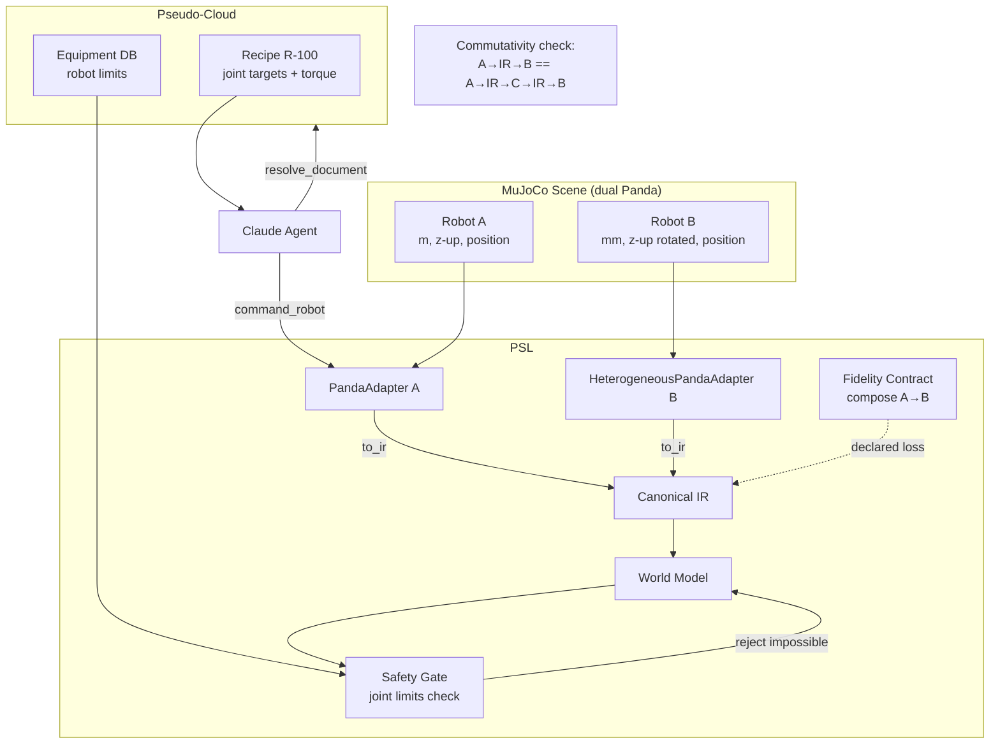
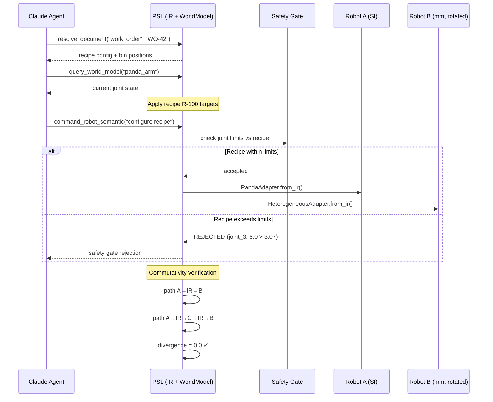

# Scenario 2: Manufacturing Line Changeover (Recipe Switching)

## Business Story

A Manufacturing Execution System (MES) agent pushes a new product recipe to the factory
floor. The recipe specifies target joint positions, torque limits, and tolerances for
multiple robots with different control modes. The robots must reconfigure simultaneously,
and the shared fixture position must agree between them. One of the test recipes
intentionally exceeds a robot's joint limits — the safety gate must catch this before the
dangerous configuration is applied.

## Why This Scenario Matters

This scenario tests the two most mathematically rigorous properties of PSL:

1. **Commutativity (RQ3/H3):** When a recipe is translated to Robot A via one path and to
   Robot B via another, the results must agree. The commutativity divergence
   `‖f(A→IR→B) - f(A→IR→C→IR→B)‖` must stay within a defined threshold. This is the
   "compiler correctness" property — PSL promises that different translation paths
   produce equivalent results.

2. **Safety gate rejection (RQ7):** When a recipe demands physically impossible
   configurations (joint beyond limit, torque exceeding capacity), the physics
   consistency gate must reject the write to the world model. Zero impossible
   configurations may pass. The false-rejection rate on valid configurations must also
   be within tolerance.

## What Actually Runs

| Component | What happens |
|-----------|-------------|
| **MuJoCo** | Loads `sim/scenes/s2_line_changeover/scene.xml` (dual Panda arms with `a_`/`b_` prefixed sensors, shared fixture, target objects). Task controller drives arm A through 4 changeover waypoints. |
| **Cross-adapter R2R** | Two adapters: PandaAdapter (SI, z-up) and HeterogeneousPandaAdapter (1000× unit scaling, 30° frame rotation). Commutativity measured between direct and multi-hop paths. |
| **Safety gate** | Valid recipe: joint targets within limits → gate accepts (no false reject). Impossible recipe: joint_0 set to upper_limit + 0.5 rad → gate rejects with violation detail. |
| **Claude Agent SDK** | Agent calls 3 MCP tools: `resolve_document_to_physical`, `query_world_model`, `ToolSearch`. Cost: $0.081, 4 turns, 20.2s. |
| **Baselines** | B0 handles noiseless transforms correctly (it knows the transform). B1 has zero joint error for unit-only transforms but fails on position information. |

## Breakpoints and Metrics

| Breakpoint | Value | Threshold | Result |
|-----------|-------|-----------|--------|
| Commutativity divergence | 0.0 | ≤ 1e-6 | **PASS** |
| Safety gate rejection | Rejected impossible | ≤ 0.5 | **PASS** |

| Metric | Value |
|--------|-------|
| False reject rate | 0.0 |
| Agent tool calls | 3 |
| Agent cost | $0.081 |

## RQ/Hypothesis Contributions

- **RQ3 / H3 (Commutativity):** Divergence = 0.0 — multi-hop paths agree perfectly for
  noiseless transforms.
- **RQ7 (Safety):** Gate rejected impossible recipe with 100% accuracy, 0% false reject.

## Files

| Purpose | Path |
|---------|------|
| MuJoCo scene | `sim/scenes/s2_line_changeover/scene.xml` |
| Eval module | `eval/scenarios/s2_line_changeover/eval.py` |
| Config | `experiments/scenarios/s2_line_changeover.yaml` |
| Pseudo-cloud | `pseudo_cloud/s2_line_changeover/data.py` (recipes, equipment) |
| Tests | `tests/scenarios/test_all_scenarios.py::TestS2LineChangeover` |

## Architecture Diagram

## Process Workflow

