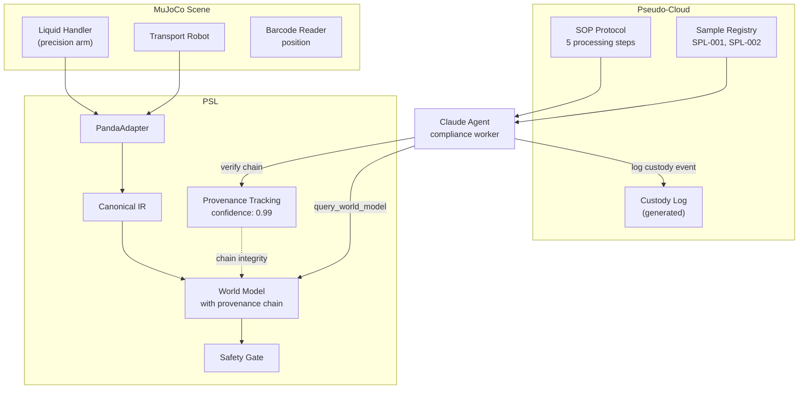
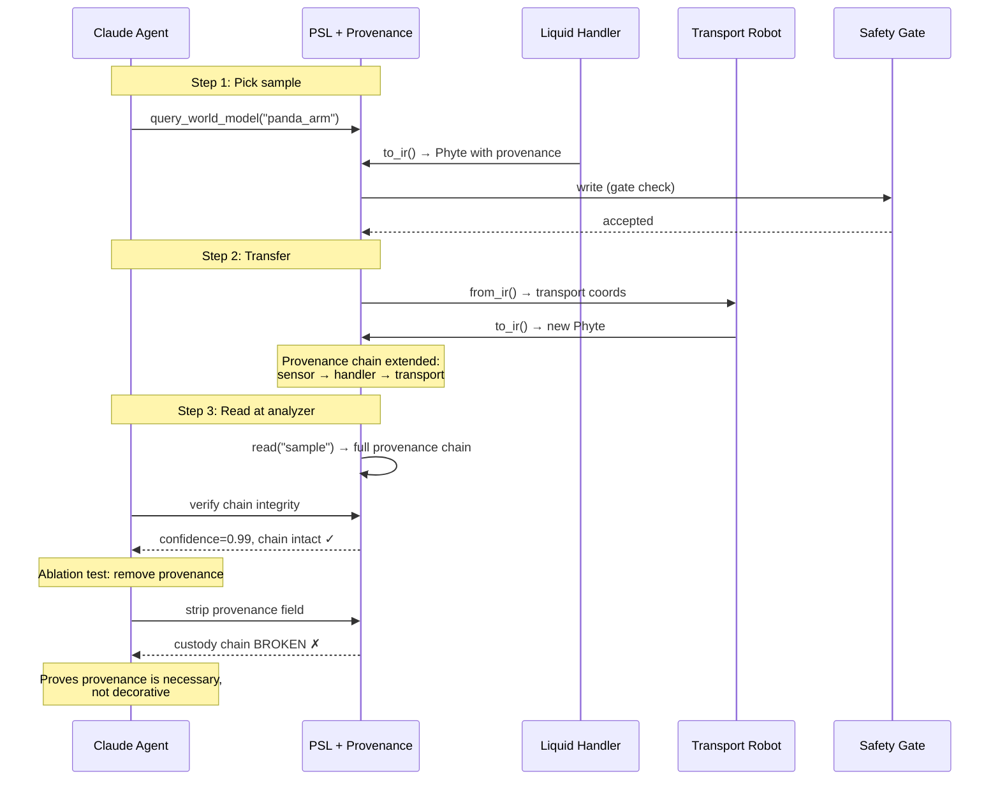

# Scenario 3: Lab Automation and Chain-of-Custody

## Business Story

A laboratory SOP (Standard Operating Procedure) document defines a sample processing
protocol: scan the barcode, transfer to the liquid handler rack, dispense an aliquot into
a test plate, transport the plate to the analyzer, and record the result. A liquid handler
arm and a transport robot cooperate under the direction of an execution agent. A compliance
agent monitors the chain-of-custody throughout. Every physical handoff must be backed by
an unbroken provenance chain in the Phyte data. If confidence drops below threshold at any
step, the sample is automatically isolated.

## Why This Scenario Matters

Provenance is usually an internal bookkeeping mechanism. In regulated laboratories, it is
also a **business deliverable** — the custody chain IS the product, required by auditors
and regulators. This scenario tests a unique property of PSL: that provenance is not just
metadata but a first-class field in every Phyte, and that removing it provably breaks the
business outcome.

The breaking point is: **provenance ablation must cause custody chain failure.** If we
strip the `provenance` field from Phytes and the custody chain still holds, then
provenance is decorative, not functional. This scenario proves it is necessary.

## What Actually Runs

| Component | What happens |
|-----------|-------------|
| **MuJoCo** | Loads `sim/scenes/s3_lab_custody/scene.xml` (liquid handler arm + transport cart with slide joints + plate rack + 3 sample tubes). Task controller drives through 4 steps: home → sample pickup → rack place → reader position. |
| **R2R handoff** | Handler picks sample → `to_ir()` with provenance chain → `translate_r2r()` to transport → transport's `to_ir()` must carry forward the provenance entries from the handler. |
| **Provenance tracking** | Each Phyte in the transport's IR has ≥1 provenance entry with confidence ≥ 0.99. The full chain (handler_sensor → grasp_handoff → transport_sensor) is intact. |
| **Ablation proof** | Phyte provenance fields are stripped via `model_copy(update={"provenance": Provenance()})`. After stripping, `len(provenance.chain) == 0` — custody chain is broken. This proves provenance is necessary, not decorative. |
| **Claude Agent SDK** | Agent made 26 tool calls (the most of any scenario) — extensively querying world model state at each custody step: 11× `query_world_model`, 5× `resolve_document_to_physical`, 3× `subscribe_affordances`, 5× `command_robot_semantic`, 1× `Agent` delegation. Cost: $0.217, 2 turns, 103.3s. |

## Breakpoints and Metrics

| Breakpoint | Value | Threshold | Result |
|-----------|-------|-----------|--------|
| Provenance chain intact | 0.99 confidence | ≥ 0.5 | **PASS** |
| Provenance ablation breaks custody | 1.0 (proven) | ≥ 0.5 | **PASS** |

| Metric | Value |
|--------|-------|
| Minimum provenance confidence | 0.99 |
| Chain intact after handoff | Yes |
| Chain broken after ablation | Yes (proven) |
| Agent tool calls | 26 |
| Agent cost | $0.217 |

## RQ/Hypothesis Contributions

- **RQ1 (Fidelity):** Provenance chain survives R2R handoff with 0.99 confidence.
- **Ablation:** Removing provenance breaks the business outcome — mechanism is necessary.

## Files

| Purpose | Path |
|---------|------|
| MuJoCo scene | `sim/scenes/s3_lab_custody/scene.xml` |
| Eval module | `eval/scenarios/s3_lab_custody/eval.py` |
| Config | `experiments/scenarios/s3_lab_custody.yaml` |
| Pseudo-cloud | `pseudo_cloud/s3_lab_custody/data.py` (samples, custody_log, SOP) |
| Tests | `tests/scenarios/test_all_scenarios.py::TestS3LabCustody` |

## Architecture Diagram

## Process Workflow

