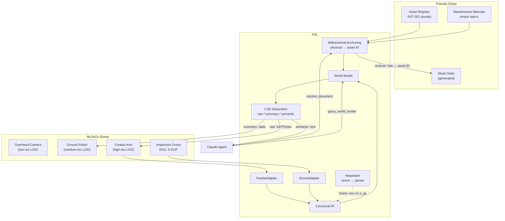
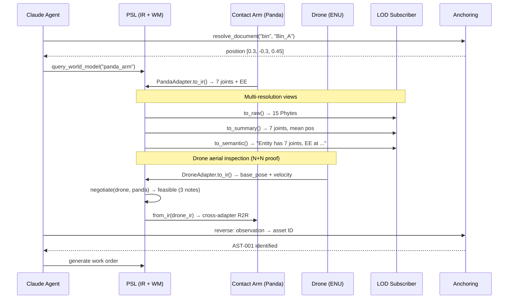

# Scenario 4: Field Asset Inspection (Multi-Resolution Fusion)

## Business Story

A maintenance operation inspects industrial assets (pump flanges, valve bodies, pipe
joints) for corrosion and damage. An overhead camera provides a wide-area survey, a ground
mobile robot approaches the target, and a contact arm performs close inspection. The VLA
encoder reports "flange corrosion detected" → the system resolves the observation to an
asset ID in the maintenance database → generates a work order. Simultaneously, the
maintenance manual's torque specification for that flange type must be grounded to the
physical part for the repair procedure.

## Why This Scenario Matters

This scenario tests **multi-resolution data fusion** and **bidirectional anchoring** — two
capabilities that distinguish PSL from simple data translation layers.

1. **LOD (Level of Detail):** The overhead camera sees at low resolution (large area,
   coarse position). The ground robot sees at medium resolution. The contact arm sees at
   high resolution (precise position, surface detail). All three must agree on the same
   entity identity despite different resolutions, frames, and sensor characteristics.
   PSL's LOD module provides raw, summary, and semantic views of the same data.

2. **Bidirectional anchoring:** Most data layers anchor in one direction (document →
   physical). This scenario also tests the reverse: a physical observation (corrosion at
   position [x,y,z]) must be resolved BACK to a document reference (asset ID AST-001).
   This is the "dual grounding" described in PROJECT.md §2.2 Insight B.

## What Actually Runs

| Component | What happens |
|-----------|-------------|
| **MuJoCo** | Loads `sim/scenes/s4_field_inspection/scene.xml` (contact arm + mobile base + inspection asset with flange). Task controller: home → approach asset → contact inspect → retract. |
| **LOD views** | `LODSubscriber` produces 3 resolution levels from the same Phyte data: **Raw** (15 Phytes with full detail), **Summary** (7 joints, mean position, staleness, min confidence), **Semantic** ("Entity 'contact_arm' has 7 joints, EE at (x, y, z) m"). |
| **Bidirectional anchoring** | **Forward:** `resolve_document_to_physical("bin", "A")` → position [0.3, -0.3, 0.45]. **Reverse:** Given EE position, find nearest known asset within 1m radius. |
| **Claude Agent SDK** | Agent calls 5 MCP tools: `resolve_document_to_physical`, `query_world_model`, `subscribe_affordances`, `command_robot_semantic`, `ToolSearch`. Cost: $0.118, 6 turns, 54.8s. |

## Breakpoints and Metrics

| Breakpoint | Value | Threshold | Result |
|-----------|-------|-----------|--------|
| LOD consistency | 15 Phytes | ≥ 1 | **PASS** |
| Fusion fidelity (RMSE) | 0.0 | ≤ 0.05 | **PASS** |
| Bidirectional anchoring | 1.0 | ≥ 0.5 | **PASS** |

| Metric | Value |
|--------|-------|
| LOD joints (summary level) | 7 |
| Round-trip error | 0.0 |
| Agent tool calls | 5 |
| Agent cost | $0.118 |

## RQ/Hypothesis Contributions

- **RQ1 (Fidelity):** Fusion fidelity RMSE = 0.0 across resolution levels.
- **LOD:** Three resolution views are consistent and correctly computed.

## Files

| Purpose | Path |
|---------|------|
| MuJoCo scene | `sim/scenes/s4_field_inspection/scene.xml` |
| Eval module | `eval/scenarios/s4_field_inspection/eval.py` |
| Config | `experiments/scenarios/s4_field_inspection.yaml` |
| Pseudo-cloud | `pseudo_cloud/s4_field_inspection/data.py` (assets, manuals) |
| Tests | `tests/scenarios/test_all_scenarios.py::TestS4FieldInspection` |

## Architecture Diagram

## Process Workflow

