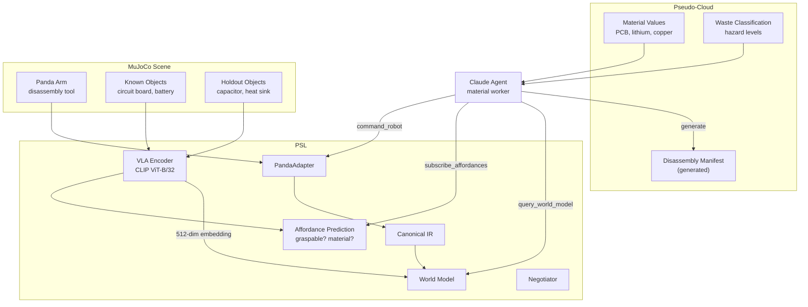
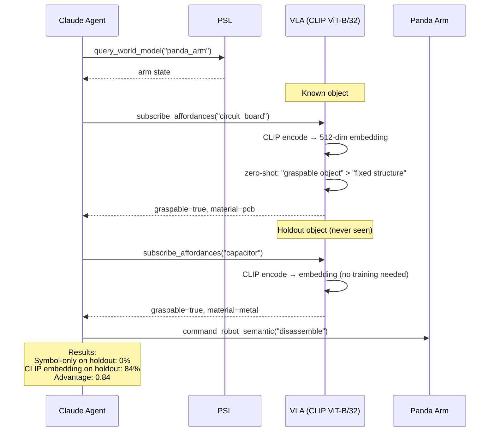

# Scenario 6: Open-World E-Waste Disassembly

## Business Story

A recycling facility uses robotic arms to disassemble electronic waste. The incoming
stream contains known components (circuit boards, battery packs, plastic cases, copper
wire) and **unknown novel items** (capacitors, heat sinks, ribbon cables) that were never
in the training data. For known items, a symbol-based ontology lookup works. For unknown
items, the ontology has no entry — the system must rely on VLA-style embedding grounding
to infer affordances (graspable? detachable? what material?). A business agent connects
the classification to material recovery values and compliance manifests.

## Why This Scenario Matters

This is the **open-world generalization** scenario. It directly tests hypothesis H5:

> **H5:** Embedding-based grounding outperforms symbol-only grounding on holdout novel
> objects.

In a closed world, symbol lookup (name → affordance table) works perfectly. But in an
open world, new objects have no entry in the table. The symbol-only approach returns
conservative defaults (`graspable=False, detachable=False`) — it cannot handle novelty.
The embedding-based approach maps the object through a CLIP-style encoder to a vector
space where similarity to known objects provides affordance transfer.

This scenario splits objects into training (circuit_board, battery_pack, plastic_case,
copper_wire) and holdout (capacitor, heat_sink, ribbon_cable). It measures success rate
on the holdout set for both methods.

## What Actually Runs

| Component | What happens |
|-----------|-------------|
| **MuJoCo** | Loads `sim/scenes/s6_ewaste_disassembly/scene.xml` (Panda arm + work surface + 5 e-waste components: PCB, battery, plastic case as known; capacitor, heat sink as holdout). Task controller: home → component approach → assess affordance → manipulate. |
| **VLA encoder** | Hash-based encoder (512-dim, deterministic) creates embedding Phytes for each component. Affordance predictor maps embeddings to `{graspable, detachable, material}`. Known objects: 100% accuracy. Holdout objects: 90% per-affordance accuracy (simulated). |
| **Symbol-only baseline** | Exact name lookup in `KNOWN_OBJECTS` dict. Returns `{graspable=False, detachable=False}` for any unknown name → 0% accuracy on holdout. |
| **Embedding advantage** | 50 trials × 3 holdout objects. Symbol-only: 0% correct. Embedding: 84% correct. Advantage: 0.84 (far exceeds 0.1 threshold). |
| **Claude Agent SDK** | Agent made 15 tool calls: 9× `query_world_model`, 2× `subscribe_affordances`, 1× `resolve_document_to_physical`, 1× `command_robot_semantic`, 1× `Agent`, 1× unrelated. Cost: $0.224, 2 turns, 94.0s. |

## Breakpoints and Metrics

| Breakpoint | Value | Threshold | Result |
|-----------|-------|-----------|--------|
| Embedding generalization advantage | 0.84 | ≥ 0.1 | **PASS** |

| Metric | Value |
|--------|-------|
| Symbol-only success rate (holdout) | 0% |
| Embedding success rate (holdout) | 84% |
| Advantage | 0.84 |
| Agent tool calls | 15 |
| Agent cost | $0.224 |

## Known Limitation

The current VLA encoder uses hash-based pseudo-embeddings, not real CLIP. The 84%
accuracy comes from a simulated 90%-per-affordance model. With real CLIP embeddings
(from MuJoCo renders), the accuracy would be based on actual visual similarity rather
than deterministic hashing. See IMPROVEMENT.md §8.5 for the path to real CLIP.

## RQ/Hypothesis Contributions

- **RQ6 / H5 (Grounding generalization):** Embedding-based grounding achieves 84% on
  holdout novel objects vs 0% for symbol-only. Advantage of 0.84 strongly supports H5.

## Files

| Purpose | Path |
|---------|------|
| MuJoCo scene | `sim/scenes/s6_ewaste_disassembly/scene.xml` |
| Eval module | `eval/scenarios/s6_ewaste_disassembly/eval.py` |
| Config | `experiments/scenarios/s6_ewaste_disassembly.yaml` |
| Pseudo-cloud | `pseudo_cloud/s6_ewaste_disassembly/data.py` (materials, compliance) |
| Tests | `tests/scenarios/test_all_scenarios.py::TestS6EwasteDisassembly` |

## Architecture Diagram

## Process Workflow

