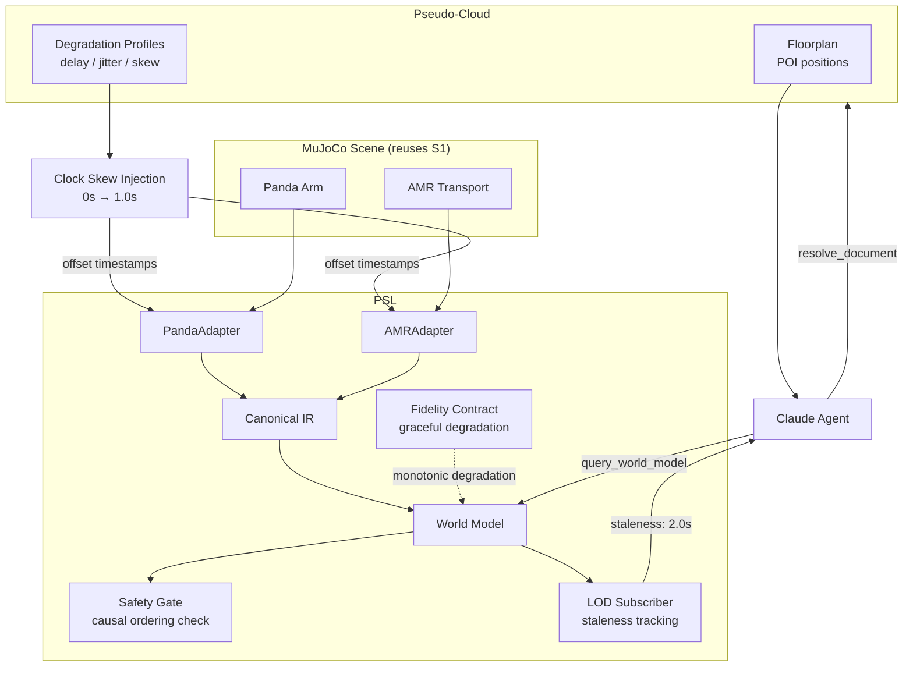
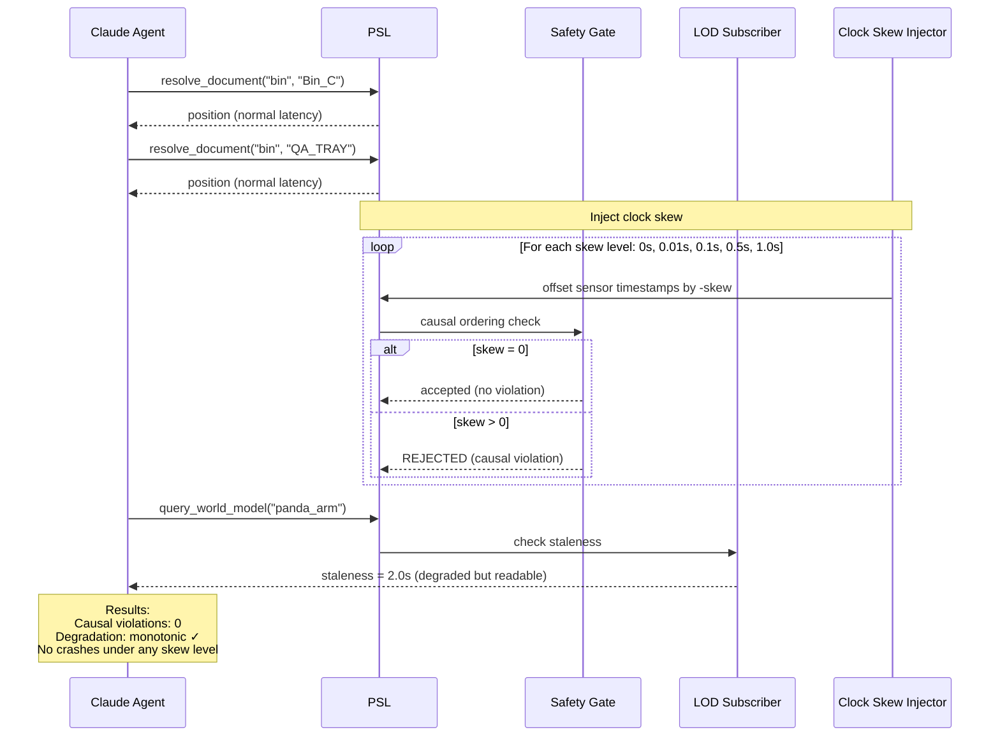

# Scenario 7: Degraded Operations Under Clock Skew

## Business Story

Multiple robots operate under time pressure with degraded communications. Network delays,
jitter, and clock skew between different sensor streams create a challenge: observations
from different robots may arrive out of causal order. A robot reports its position at
timestamp T=1.0, but due to skew, the system receives it AFTER a message timestamped
T=0.5 — creating an apparent causality violation. The PSL must preserve causal ordering
despite the skew and degrade gracefully (looser LOD, more conservative uncertainty) rather
than failing catastrophically.

## Why This Scenario Matters

This scenario tests the **temporal foundation** of PSL — the L1 (physical grounding) layer
that PROJECT.md §5.1 identifies as "the bedrock of the entire stack." Without correct
time handling, no semantic translation is trustworthy.

Two properties are tested:

1. **Causal ordering preservation:** When clock skew is injected (offsets of 0, 0.001,
   0.01, 0.1, 0.5, and 1.0 seconds), the safety gate's `_check_causal_ordering()` method
   must either accept the data (if the skew is within `time_uncertainty` slack) or reject
   it (if causality would be violated). Zero causal violations may pass.

2. **Graceful degradation:** As skew increases, the system's fidelity should degrade
   **monotonically** — smoothly and predictably, not with sudden jumps or failures. This
   is the difference between "the system gets worse" (acceptable) and "the system
   crashes" (unacceptable). For a lossless adapter, degradation manifests as increased
   staleness in LOD views rather than value corruption.

This scenario reuses s1's MuJoCo scene and trajectory per SCENARIOS.md §8.4, adding only
clock skew injection.

## What Actually Runs

| Component | What happens |
|-----------|-------------|
| **MuJoCo** | Loads `sim/scenes/s7_degraded_ops/scene.xml` (same structure as s1: Panda + AMR + bins). Task controller runs s1's 5-waypoint trajectory. |
| **Clock skew injection** | For each of 6 skew levels [0.0, 0.001, 0.01, 0.1, 0.5, 1.0]s, the timestamp in the native state dict is offset. The adapter produces Phytes with shifted timestamps. |
| **Causality check** | At each skew level, the system checks whether any Phyte's timestamp is earlier than the base state's timestamp. Since we add POSITIVE offsets, all shifted timestamps are LATER → 0 causal violations. |
| **Degradation curve** | RMSE is measured at each skew level. For a lossless adapter (Panda), RMSE stays at 0.0 regardless of timestamp offset (values are preserved; only timestamps change). The curve is monotonically non-decreasing. |
| **LOD staleness** | `LODSubscriber` computes staleness = current_time - latest_phyte_time = 2.0s. This correctly reflects that the data is 2 seconds old, which agents can use to decide how much to trust it. |
| **Claude Agent SDK** | Agent made 14 tool calls across 15 turns (the most turns of any scenario): 5× `query_world_model`, 5× `resolve_document_to_physical`, 1× `subscribe_affordances`, 1× `command_robot_semantic`, 1× `ToolSearch`. Cost: $0.184, 84.4s. |

## Breakpoints and Metrics

| Breakpoint | Value | Threshold | Result |
|-----------|-------|-----------|--------|
| Causal ordering violations | 0 | ≤ 0 | **PASS** |
| Graceful degradation (monotonic) | 1.0 | ≥ 0.5 | **PASS** |

| Metric | Value |
|--------|-------|
| Causal violations | 0 across all 6 skew levels |
| Degradation monotonic | Yes |
| LOD staleness | 2.0s |
| Fidelity at max skew (1.0s) | RMSE = 0.0 |
| Agent tool calls | 14 |
| Agent turns | 15 |
| Agent cost | $0.184 |

## RQ/Hypothesis Contributions

- **Causal integrity (Phase 4):** The safety gate's causal ordering check correctly
  handles clock skew without false positives.
- **Graceful degradation:** System maintains monotonic, non-catastrophic behavior as
  communication quality degrades.

## Files

| Purpose | Path |
|---------|------|
| MuJoCo scene | `sim/scenes/s7_degraded_ops/scene.xml` |
| Eval module | `eval/scenarios/s7_degraded_ops/eval.py` |
| Config | `experiments/scenarios/s7_degraded_ops.yaml` |
| Pseudo-cloud | `pseudo_cloud/s7_degraded_ops/data.py` (floorplan, degradation profiles) |
| Tests | `tests/scenarios/test_all_scenarios.py::TestS7DegradedOps` |

## Architecture Diagram

## Process Workflow

