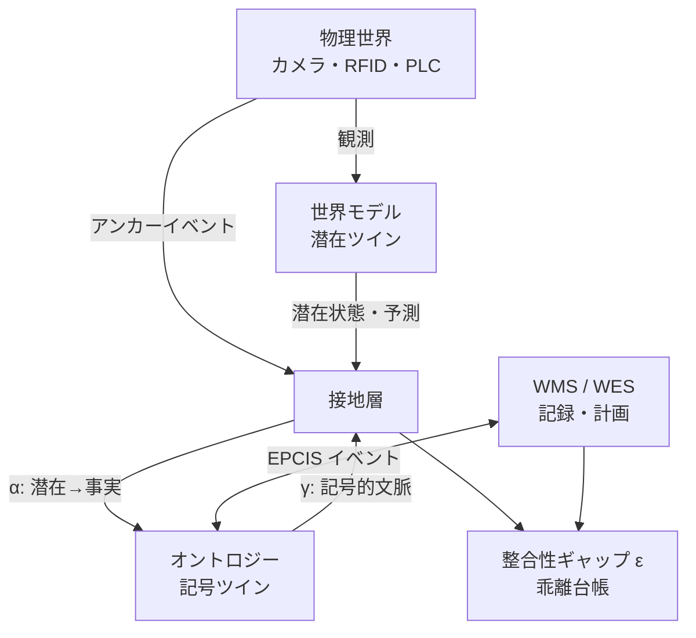

# GTWM

> 世界モデルとオントロジーを使い、物理世界と業務記録のズレを検証する研究 PoC

[English](README.md)

倉庫には、「荷物が実際にどこにあるか」という物理の現実と、
「WMS 上ではどこにあることになっているか」という記録の現実があります。
GTWM は、棚卸しを待たずに両者を継続的に照合できるかを検証するプロジェクトです。

次の3つを組み合わせています。

- シミュレーション映像から物体と動態を学ぶ**潜在ツイン**
- 業務上の事実、出所、制約を表現する**記号ツイン**
- 両者を翻訳し、不一致を測る**接地層**

本リポジトリは研究用の試作であり、本番用の倉庫システムではありません。
本実行した実験の多くは目標値に届きませんでした。その結果も、処置が発動していない、
データ経路がつながっていない、テストが空虚だった、といった問題を再現できる知見として
残しています。

## 中心となる考え方



ホライズン `h` における整合性ギャップを次のように定義します。

```text
ε_h = E_t[ d( α(f^h(z_t)), F^h(α(z_t)) ) ]
```

比較するのは、次の2つの未来です。

1. 潜在空間で未来を予測してから、業務上の事実へ復号した結果
2. 現在を事実へ復号してから、業務記録側のプロセスを進めた結果

スキャン、ゲート通過、秤、PLC 信号などのアンカーを使い、不一致の原因を
「知覚・接地の誤り」「プロセス不遵守」「オントロジーの概念不足」に分けます。

## 実装されているもの

| 領域 | 実装内容 |
|---|---|
| シミュレーション | MuJoCo 倉庫、4カメラ、深度・セグメンテーション、WMS モック、センサ遅延・乖離注入 |
| 世界モデル | 凍結 DINOv2、Slot Attention、複数カメラ融合、Transformer 動態アンサンブル、MPPI 計画器 |
| 記号ツイン | BFO/EPCIS/SOSA/PROV に沿った語彙、RDF 信念ストア、SHACL 制約、時点スナップショット |
| 接地層 | 学習プローブ α、記号条件付け γ、同一性解決、整合性ギャップ ε、乖離台帳 |
| アプリケーション | WHAT-IF、制約シールド、概念発見、Streamlit の例外対応画面 |
| データ空間 | 2拠点間の信念・予測交換、ポリシー検査、監査ログ、漏洩評価 |
| 評価 | 11実験、固定した合格基準、seed 実行、MLflow、盲検境界 |

基本構成はローカルで完結します。既定では SQLite とインプロセスの RDFLib を使い、
Oxigraph と2拠点コネクタだけを任意の Docker プロファイルとして提供しています。

## 現在の実験結果

本実行の結果は、未達を言い換えずに記録しています。詳細は
[docs/status.md](docs/status.md) と [docs/results/](docs/results/) を参照してください。

| 実験 | 検証した問い | 最新の解釈 |
|---|---|---|
| EXP-01 | 潜在状態から業務上の事実を復号できるか | 不合格：位置 F1 0.898、型精度 0.714 |
| EXP-02 | 遮蔽中も同一性を維持できるか | 不合格：ID切替率 0.166。ただし baseline から58%改善 |
| EXP-03 | 記号条件付けで予測が改善するか | 不合格：60秒指標は測定不能、有効ホライズン比1.0 |
| EXP-04 | ε でプロセスドリフトを検知できるか | 未検証：AUROC 0.472だが、ドリフト処置がほぼ発動していなかった |
| EXP-05 | 注入した記録乖離を検知できるか | smoke のみ。本実行の結論なし |
| EXP-06 | 制約シールドが違反を防げるか | 数値上は合格。ただし対照群も違反0件で空虚なテストだった |
| EXP-07 | WHAT-IF 予測が介入後の実測と一致するか | 不合格：相対誤差0.694、区間被覆率0 |
| EXP-08 | 残差から未知概念を発見できるか | 数値上は合格。ただし1つの包括的クラスタが3概念すべてに命中 |
| EXP-09 | 拠点間で安全に予測を交換できるか | 全体は不合格。復元 SSIM 0.193のみ達成 |
| EXP-10 | UI が例外処理を改善するか | ハーネス準備済み。人による評価待ち |
| EXP-11 | 遅延と可用性が本番要件を満たすか | 不合格：p50遅延385.5秒、代理可用性0.717 |

最大の教訓は、指標を計算できることや閾値を満たすことが、意図した機能の検証を
意味するとは限らない点です。そのため GTWM では、効果指標だけでなく、処置件数、
分母、対照群の挙動、解決済み設定も記録します。

## クイックスタート

### 必要な環境

- 動作確認済み環境：Apple Silicon 搭載 macOS
- Python 3.11（`>=3.11,<3.12`）
- [uv](https://docs.astral.sh/uv/)
- ffmpeg
- Docker Desktop（Oxigraph または2拠点コネクタを使う場合のみ）

最初のモデル実行では DINOv2 の重みを取得するため、ネットワーク接続が必要になる場合が
あります。以降はローカルの Hugging Face キャッシュを利用できます。

macOS では、次の手順で準備できます。

```bash
brew install uv ffmpeg
uv sync --all-extras
cp .env.example .env
uv run gtwm doctor
```

`.env` の API キーは任意です。ユニットテストと通常の smoke 実行では、
有料の LLM プロバイダは必要ありません。

### インストールを確認する

```bash
make test
make test-sim
uv run gtwm kg validate
```

統合テストでは、Docker のコアサービスを起動します。

```bash
make up
make test-int
make down
```

### 小さな E2E パイプラインを動かす

30秒の倉庫エピソードを生成します。

```bash
make sim-smoke
```

必要なら小規模学習データを生成し、smoke 用世界モデルを学習します。

```bash
make train-smoke
```

生成したエピソードに接地処理を実行します。

```bash
uv run gtwm ground run --set smoke --episode ep_0000_seed0
```

実験を1件、smoke モードで実行します。

```bash
make exp EXP=EXP-01 SMOKE=1
```

smoke は配線確認と開発用です。レポートの判定は必ず「参考（smoke）」となり、
合格・不合格の根拠には使えません。

### ダッシュボードを開く

```bash
make dashboard
```

Streamlit は既定で `http://localhost:8501` に起動します。乖離対応フローと、
EXP-10 のオペレータ評価画面が含まれます。

## よく使うコマンド

<!-- markdownlint-disable MD013 -->

| コマンド | 用途 |
|---|---|
| `uv run gtwm doctor` | Python、MPS、MuJoCo オフスクリーン描画、ffmpeg、Docker、環境変数を検査 |
| `uv run gtwm sim gen --set demo --episodes 1 --duration 30 --seed 0` | 再現可能なシミュレーションデータを生成 |
| `uv run gtwm wm train --config configs/wm/smoke.yaml` | smoke 用世界モデルを学習 |
| `uv run gtwm wm rollout --config configs/wm/smoke.yaml --horizon 10` | チェックポイントから潜在ロールアウト |
| `uv run gtwm kg validate` | Turtle、SHACL、SPARQL を検証 |
| `uv run gtwm llm ping` | 設定済み LLM とローカル mock の疎通確認 |
| `uv run gtwm llm usage` | 記録された当月の LLM 使用量を集計 |
| `make up-p2` / `make down-p2` | 分離された2拠点コネクタを起動・停止 |
| `make lint` | Ruff と mypy を実行 |

<!-- markdownlint-enable MD013 -->

すべてのオプションは、`uv run gtwm --help` と各コマンドの `--help` で確認できます。

## 実験の実行

各実験は `experiments/EXP-xx/` に README、YAML 設定、薄い runner を持ちます。
共通の合格基準は
[`experiments/criteria.yaml`](experiments/criteria.yaml) だけに定義されています。

```bash
# 安全な開発実行：1 seed、縮小データ
make exp EXP=EXP-04 SMOKE=1

# 本実行：先に設定と結果の注意事項を読むこと
make exp EXP=EXP-04 SMOKE=0
```

本実行には注意してください。実験と資源競合によって、実測時間は数十分から
約118時間まで幅がありました。明示的に有効化した場合は実 LLM を使う実験もあります。
開始前に、対象の `experiments/EXP-xx/`、利用可能なデータ、空き容量、`.env` を
確認してください。

各実行は `runs/EXP-xx/<timestamp>/` に次のファイルを出力します。

- `metrics.json`：seed ごとの値と集計値
- `report.md`：自動生成した結果と判定
- `config_resolved.yaml`：実際にマージされた設定
- `git.txt`：コミットと dirty worktree の状態
- `log.txt`：進捗と所要時間

## データと生成物

次のパスは Git の管理対象外です。

| パス | 内容 |
|---|---|
| `data/sim/` | エピソード映像、姿勢、マスク、深度、イベント |
| `data/injections/` | 非公開の乖離・概念注入台帳 |
| `runs/` | チェックポイント、実験結果、監査ログ、UI 記録 |
| `mlruns/` | ローカル MLflow データ |
| `.data/` | Oxigraph とコネクタの状態 |

生成データの大半は、設定と seed から再生成できます。生エピソード、モデルの
チェックポイント、API キー、注入台帳はコミットしないでください。

## 再現性を守る仕組み

- **基準の固定**：閾値は実験コードではなく `experiments/criteria.yaml` に定義
- **smoke の分離**：smoke 実行は合格・不合格を出せない
- **盲検評価**：注入真値を読めるのは `gtwm.eval.scoring` だけで、AST テストが境界を保護
- **解決済み設定の保存**：本実行の上書き値と正確な Git 状態を結果と一緒に保存
- **乱数の固定**：シミュレーション、学習、注入で分離した seed 経路を使用
- **構造的なデータ最小化**：拠点間交換モデルに生画像・潜在ベクトルのフィールドを持たせず、余分なフィールドも拒否

これらの仕組みだけでは、検証の妥当性を保証できません。処置が本当に行われたこと、
対照条件が失敗し得ることも、別の指標で確認する必要があります。

## 既知の制約

- 現在の根拠は、1台の Apple Silicon マシン上のシミュレーションで得たもので、
  実倉庫での結果ではありません。
- 行動・記号条件付けの入力経路はありますが、報告済みの動態モデルは意味のある
  行動入力で学習されていません。
- いくつかの介入は倉庫業務の代理表現です。数値を解釈する前に、各実験の README を
  確認してください。
- EXP-06 と EXP-08 は数値基準を満たしましたが、意図した主張を実証できていません。
- EXP-11 はバッチパイプラインを測定しており、本番ストリーミングサービスではありません。
- 固定した RDFLib が RDF-star を解釈できないため、信念は標準 RDF 具象化で表現しています。
  詳細は ADR-0001 を参照してください。
- 連合デモでは Eclipse Dataspace Components ではなく、最小 Python HTTP コネクタを
  使用しています。詳細は ADR-0002 を参照してください。
- GS1 CBV は、実装時に機械可読な上流成果物を取得できなかったため、明示的なローカル
  スタブです。

## ディレクトリ構成

```text
src/gtwm/
├── sim/          MuJoCo、センサ、WMS モック、データ生成
├── wm/           エンコーダ、物体スロット、融合、動態、計画
├── kg/           オントロジーストア、EPCIS、SHACL、WHAT-IF
├── grounding/    α/γ、同一性、ε、シールド、概念発見、台帳
├── dataspace/    交換スキーマ、ポリシー検査、監査ログ
├── eval/         指標、統計、実験ロジック、スコアリング
└── ui/           Streamlit ダッシュボード、オペレータ評価

configs/          世界モデル、接地、realism、LLM の設定
experiments/      EXP-01〜EXP-11 のハーネスと評価基準
docs/             計画、進捗、ADR、評価手順、結果レポート
ontology/         拡張語彙、SHACL、クエリ、外部語彙
tests/            unit、simulation、integration テスト
```

## ドキュメント

- [PoC 計画書](docs/poc_plan.md)：仮説、アーキテクチャ、指標、実験設計
- [進捗と実験状況](docs/status.md)：実装メモと最新の実験一覧
- [実験レポート](docs/results/)：実験ごとの根拠と解釈
- [ADR-0001](docs/adr/0001-rdf-reification-instead-of-rdf-star.md)：
  RDF 具象化を採用した理由
- [ADR-0002](docs/adr/0002-minimal-http-connector-instead-of-edc.md)：
  最小コネクタを採用した理由
- [シミュレーション](sim.md)、[世界モデル](world_model.md)、
  [オントロジー](ontology.md)、[LLM ポリシー](llm.md)

## 開発時のチェック

変更前後に、まず高速なチェックを実行します。

```bash
make lint
make test
```

シミュレーションやインフラを変更した場合は、対応するテストも実行します。

```bash
make test-sim
make up
make test-int
make down
```

実験を変更した場合は、設定、結果レポート、`docs/status.md` を一緒に更新してください。
良い結果とは誤差が小さいことだけではありません。どの処置が実行され、対照群がどう動き、
どの条件なら不合格になるのかを説明できる必要があります。
