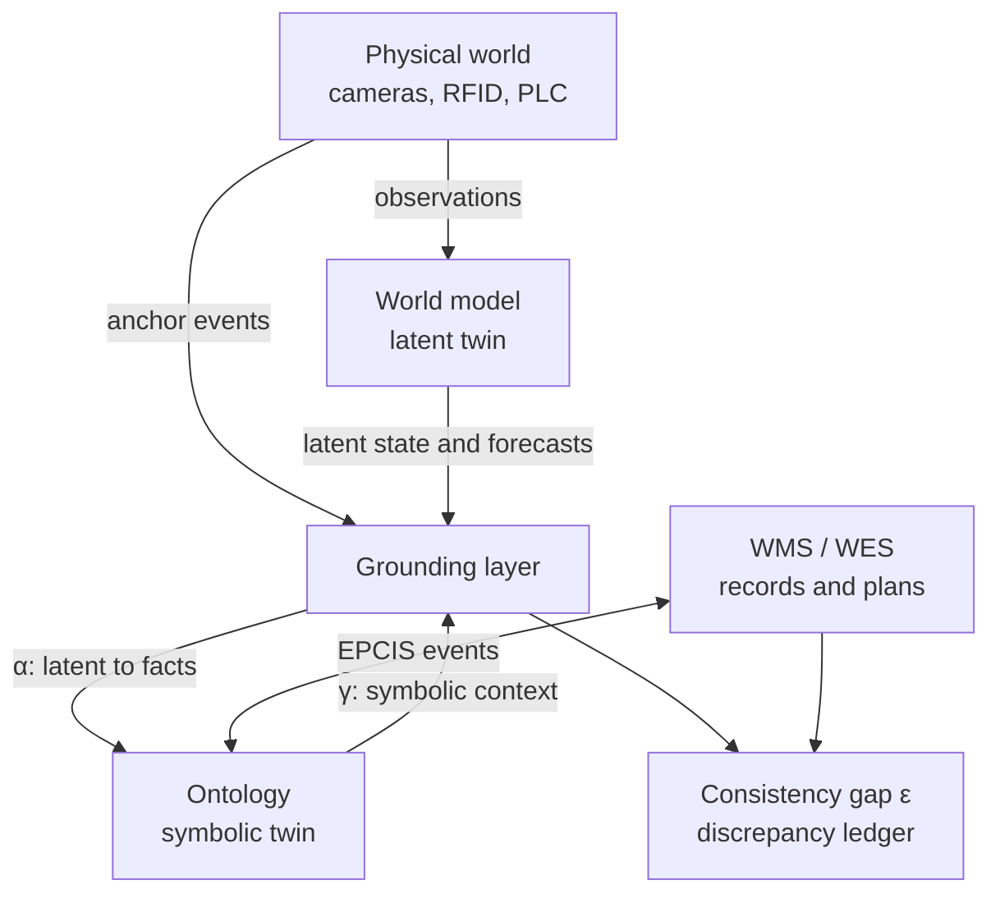

# GTWM

> A research PoC for reconciling the physical world with business records using
> a world model and an ontology.

[日本語](README.ja.md)

Warehouses have two versions of reality: where objects physically are, and
where the WMS says they are. GTWM explores whether those two views can be
compared continuously instead of waiting for a manual inventory count.

The project combines:

- a **latent twin** that learns objects and motion from simulated camera data;
- a **symbolic twin** that represents business facts, provenance, and
  constraints; and
- a **grounding layer** that translates between them and measures their
  disagreement.

This repository is a candid research prototype, not a production warehouse
system. Most full experiments did **not** meet their targets. The failed and
inconclusive results are preserved because they reveal where apparently valid
metrics can hide inactive treatments, unwired data paths, or vacuous tests.

## The core idea



For horizon `h`, the consistency gap is:

```text
ε_h = E_t[ d( α(f^h(z_t)), F^h(α(z_t)) ) ]
```

It compares two futures:

1. predict forward in latent space, then decode the result into facts; and
2. decode the current state, then advance the business-record process.

Anchor events such as scans, gate crossings, scale readings, and PLC signals
help separate three causes of disagreement: perception or grounding errors,
process non-compliance, and missing ontology concepts.

## What is included

<!-- markdownlint-disable MD013 -->

| Area | Implementation |
|---|---|
| Simulation | MuJoCo warehouse, four cameras, depth and segmentation, WMS mock, sensor delay and discrepancy injection |
| World model | Frozen DINOv2 encoder, Slot Attention, multi-camera fusion, Transformer dynamics ensemble, MPPI planner |
| Symbolic twin | BFO/EPCIS/SOSA/PROV-aligned vocabulary, RDF belief store, SHACL constraints, temporal snapshots |
| Grounding | Learned probes α, symbolic conditioning γ, identity resolution, consistency gap ε, discrepancy ledger |
| Applications | WHAT-IF query engine, constraint shield, concept discovery, Streamlit operator workflow |
| Data space | Two-site belief and prediction exchange, policy checks, audit log, leakage evaluation |
| Evaluation | Eleven experiment harnesses, fixed criteria, seeded runs, MLflow output, blind scoring boundary |

<!-- markdownlint-enable MD013 -->

The implementation is intentionally local-first. SQLite and in-process RDFLib
are used by default; Oxigraph and the two-site connectors are optional Docker
profiles.

## Current results

The latest full-run results are intentionally reported without softening failed
outcomes. See [docs/status.md](docs/status.md) and
[docs/results/](docs/results/) for the complete reports.

<!-- markdownlint-disable MD013 -->

| Experiment | Question | Latest interpretation |
|---|---|---|
| EXP-01 | Can latent state be decoded into business facts? | Failed: position F1 0.898 and type accuracy 0.714 |
| EXP-02 | Is identity preserved through occlusion? | Failed: ID-switch rate 0.166, although 58% better than baseline |
| EXP-03 | Does symbolic conditioning improve prediction? | Failed: 60-second metric was not measurable; effective-horizon ratio 1.0 |
| EXP-04 | Does ε detect process drift? | Inconclusive: AUROC 0.472, but the drift treatment was almost inactive |
| EXP-05 | Can injected record discrepancies be detected? | Smoke run only; no full-run conclusion |
| EXP-06 | Does the constraint shield prevent violations? | Mechanical pass, but the control also had zero violations; test was vacuous |
| EXP-07 | Do WHAT-IF forecasts match interventions? | Failed: relative error 0.694 and interval coverage 0 |
| EXP-08 | Can residuals reveal new concepts? | Mechanical pass, but one catch-all cluster matched all three concepts |
| EXP-09 | Can sites exchange predictions safely? | Failed overall; reconstruction SSIM 0.193 passed, calibration and re-identification did not |
| EXP-10 | Does the UI improve exception handling? | Harness ready; human study still required |
| EXP-11 | Are latency and availability production-ready? | Failed: p50 latency 385.5 s and proxy availability 0.717 |

<!-- markdownlint-enable MD013 -->

The most important result is methodological: a metric being computable—or even
passing its threshold—does not prove that the intended mechanism was exercised.
GTWM therefore records treatment counts, denominators, control behavior, and
resolved configuration alongside effect metrics.

## Quick start

### Requirements

- macOS on Apple Silicon is the tested environment;
- Python 3.11 (`>=3.11,<3.12`);
- [uv](https://docs.astral.sh/uv/);
- ffmpeg; and
- Docker Desktop only for Oxigraph or the two-site connector demo.

The first model run may need network access to download DINOv2 weights. Later
runs can use the local Hugging Face cache.

On macOS:

```bash
brew install uv ffmpeg
uv sync --all-extras
cp .env.example .env
uv run gtwm doctor
```

API keys in `.env` are optional. Unit tests and normal smoke runs do not require
a paid LLM provider.

### Verify the installation

```bash
make test
make test-sim
uv run gtwm kg validate
```

Integration tests require the core Docker service:

```bash
make up
make test-int
make down
```

### Run a small end-to-end path

Generate a 30-second warehouse episode:

```bash
make sim-smoke
```

Generate the small training set if needed and train the smoke world model:

```bash
make train-smoke
```

Run grounding on the generated episode:

```bash
uv run gtwm ground run --set smoke --episode ep_0000_seed0
```

Run one experiment in smoke mode:

```bash
make exp EXP=EXP-01 SMOKE=1
```

Smoke mode is for wiring and development checks. Its report is always marked
`参考（smoke）` (reference/smoke) and must not be used as a pass/fail result.

### Open the dashboard

```bash
make dashboard
```

Streamlit serves the dashboard at `http://localhost:8501` by default. It
includes the discrepancy workflow and the prepared EXP-10 operator study.

## Useful commands

<!-- markdownlint-disable MD013 -->

| Command | Purpose |
|---|---|
| `uv run gtwm doctor` | Check Python, MPS, MuJoCo off-screen rendering, ffmpeg, Docker, and environment variables |
| `uv run gtwm sim gen --set demo --episodes 1 --duration 30 --seed 0` | Generate deterministic simulated data |
| `uv run gtwm wm train --config configs/wm/smoke.yaml` | Train the smoke world model |
| `uv run gtwm wm rollout --config configs/wm/smoke.yaml --horizon 10` | Roll out a checkpoint in latent space |
| `uv run gtwm kg validate` | Validate Turtle, SHACL, and SPARQL resources |
| `uv run gtwm llm ping` | Check configured LLM providers and the local mock |
| `uv run gtwm llm usage` | Summarize recorded monthly LLM usage |
| `make up-p2` / `make down-p2` | Start or stop the isolated two-site connectors |
| `make lint` | Run Ruff and mypy |

<!-- markdownlint-enable MD013 -->

Use `uv run gtwm --help` and the command-specific `--help` output for all
options.

## Running experiments

Each experiment has a README, a YAML configuration, and a thin runner under
`experiments/EXP-xx/`. Shared pass/fail criteria live only in
[`experiments/criteria.yaml`](experiments/criteria.yaml).

```bash
# Safe development run: one seed, reduced data
make exp EXP=EXP-04 SMOKE=1

# Full configuration: read its config and result notes first
make exp EXP=EXP-04 SMOKE=0
```

Be careful with full runs. Depending on the experiment and resource contention,
recorded runs took from tens of minutes to roughly 118 hours. Some configurations
also use a real LLM when explicitly enabled. Review the relevant files in
`experiments/EXP-xx/`, available data, disk space, and `.env` before starting.

Every run writes a self-contained directory under `runs/EXP-xx/<timestamp>/`:

- `metrics.json` — per-seed values and aggregates;
- `report.md` — generated result and verdict;
- `config_resolved.yaml` — the actual merged configuration;
- `git.txt` — commit and dirty-worktree state; and
- `log.txt` — progress and duration.

## Data and generated files

The following paths are intentionally ignored by Git:

| Path | Contents |
|---|---|
| `data/sim/` | Rendered episodes, poses, masks, depth, and events |
| `data/injections/` | Hidden discrepancy and concept-injection ledgers |
| `runs/` | Checkpoints, experiment outputs, audit logs, and UI records |
| `mlruns/` | Local MLflow tracking data |
| `.data/` | Oxigraph and connector state |

Most generated data can be rebuilt from configuration and seeds. Do not commit
raw episodes, model checkpoints, API keys, or injection ledgers.

## Reproducibility safeguards

- **Fixed criteria:** thresholds are defined in `experiments/criteria.yaml`, not
  in experiment code.
- **Smoke isolation:** smoke runs cannot emit a pass or fail verdict.
- **Blind scoring:** only `gtwm.eval.scoring` may read injection ground truth;
  an AST-based test protects this boundary.
- **Resolved configuration:** full-run overrides and the exact Git state are
  written beside every result.
- **Deterministic seeds:** simulation, training, and injection randomness use
  separate seeded paths.
- **Structural data minimization:** the cross-site exchange models have no raw
  image or latent-vector field, and reject extra fields.

These safeguards improve trustworthiness, but they do not replace treatment
checks. A valid experiment must also show that the intervention occurred and
that its control condition could fail.

## Known limitations

- The current evidence comes from simulation on one Apple Silicon machine, not
  from a live warehouse.
- Action and symbolic-conditioning input paths exist, but the relevant dynamics
  were not trained with meaningful action inputs in the reported runs.
- Several simulated interventions are proxies for warehouse operations; read
  each experiment README before interpreting its metric.
- EXP-06 and EXP-08 passed their numeric criteria but did not establish the
  intended claims.
- EXP-11 measures a batch pipeline, not a production streaming service.
- RDF beliefs use standard RDF reification because the pinned RDFLib version
  does not parse RDF-star; see ADR-0001.
- The federated demo uses a minimal Python HTTP connector rather than Eclipse
  Dataspace Components; see ADR-0002.
- The GS1 CBV vocabulary is a documented local stub because a machine-readable
  upstream artifact was unavailable during implementation.

## Project layout

```text
src/gtwm/
├── sim/          MuJoCo scene, sensors, WMS mock, and data generation
├── wm/           encoder, object slots, fusion, dynamics, and planning
├── kg/           ontology store, EPCIS ingestion, SHACL, and WHAT-IF
├── grounding/    α/γ, identity, ε, shields, discovery, and ledgers
├── dataspace/    exchange schemas, policy enforcement, and audit log
├── eval/         metrics, statistics, experiment logic, and scoring
└── ui/           Streamlit dashboard and operator-study workflow

configs/          model, grounding, realism, and LLM configuration
experiments/      EXP-01 through EXP-11 harnesses and criteria
docs/             plan, status, ADRs, protocols, and result reports
ontology/         project vocabulary, SHACL shapes, queries, and vendors
tests/            unit, simulation, and integration tests
```

## Documentation

- [PoC plan](docs/poc_plan.md) — hypotheses, architecture, metrics, and study
  design
- [Current status](docs/status.md) — implementation notes and latest experiment
  table
- [Result reports](docs/results/) — evidence and interpretation by experiment
- [ADR-0001](docs/adr/0001-rdf-reification-instead-of-rdf-star.md) — RDF
  reification decision
- [ADR-0002](docs/adr/0002-minimal-http-connector-instead-of-edc.md) — minimal
  connector decision
- [Simulation notes](sim.md), [world-model notes](world_model.md),
  [ontology notes](ontology.md), and [LLM policy](llm.md)

## Development checks

Run the fast checks before submitting a change:

```bash
make lint
make test
```

For simulation or infrastructure changes, add the relevant suites:

```bash
make test-sim
make up
make test-int
make down
```

When an experiment changes, update its configuration, result report, and
`docs/status.md` together. A good result is not merely a small error value: it
must be possible to explain what treatment ran, what the control did, and under
which condition the test would have failed.
